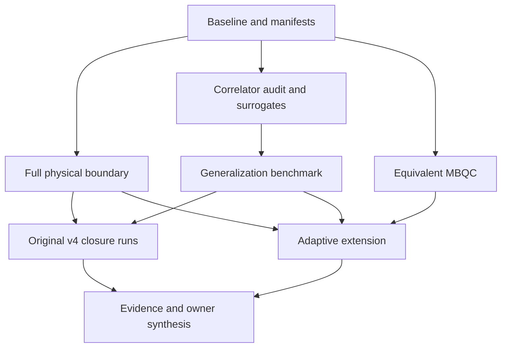

# v4.0 completion and literature extension roadmap

Date: 2026-09-24. Status: **planning delivered; execution not started**. Entry point: [completion audit](../docs/v4-full-completion-audit.md). This is an additive continuation of Phases 26–32, not a declaration that original v4.0 is complete. R0–R7 are work packages, not a renumbering of historical GSD phases.

## Acceptance structure

Track A completes the original 51 active requirements, with `COMM-02` retired. Track B adds correlator/generalization benchmarking, theorem-qualified bosonic diagnostics, MBQC equivalence and an adaptive case study. Track B can deliver useful work while a missing external input blocks Track A; neither track silently closes the other.

Must: preserve historical artifacts; test physical assumptions before scale; meaningful classical baselines; exact-versus-sampled distinctions; all-outcome MBQC semantics; owner-authored interpretation. Should: reproducible sampled intervals and cost curves. Could: broader surrogate families and larger system sizes after pilots. Won't in this registration: hardware purchase/deployment, external outreach, UBQC security, fault tolerance, unrestricted calibration grids, invented missing datasets, or a promised quantum advantage.

Dependencies:

These are dependency opportunities, not authorization to spawn agents or concurrent resource-heavy jobs. No agents were delegated in the documentation pass.

## Revision gates and a bounded first tranche

Findings 1–5 are addressed here and in the linked specifications: non-adaptive M1; owner-authored nulls; restricted advantage claims; GATE-02 control taxonomy; and explicit priorities/caps. Finding 6 was withdrawn. The baseline/unique-fit caution remains binding.

**Proposed planning envelope, not a completed run or a promise of full closure:** 24 focused project hours, with at most 12 hours of local execution, one resource-heavy job at a time, 4 GiB peak process memory and 2 GiB new artifacts. Existing stricter pilot limits still apply. Cap each new simulation pilot at 20 minutes and a full-suite invocation at 30 minutes. Record timeouts, memory stops and incomplete outputs; do not expand automatically. At 12 project hours/week this is approximately two weeks; no owner calendar is assumed. Re-estimate before a second tranche. The historical September 1 deadline is past; this plan makes no claim of meeting it.

| Priority | First-tranche allocation | Concrete stop/deliverable |
|---|---|---|
| P0: R0 | 3 focused hours | Fresh suite and provenance status; unresolved baseline blocker stops new experiment execution |
| P1: R2 then R3 | 7 hours | Null registration, exact fixtures, one target/one selected surrogate pilot; distinct fits required before statistical interpretation |
| P1: R1 | 5 hours | One source-once n=2/3 physical-boundary fixture and qualification report; no large cache |
| P2: R5 | 5 hours | Non-adaptive incidence-graph identity and corruption test at n=1–3; logical-only resource report |
| P2: review/synthesis | 4 hours | Owner interpretation of available evidence and next-tranche decision |

R4 closure sweeps, broader surrogate tournaments, n=6/8 photonic runs and R6 adaptive training remain explicitly in the full backlog, outside this first tranche. Missing original requirements remain open; timeboxing is not scope closure. The two conceptual priorities are physical-model fluency for the photonic case study and the non-adaptive/adaptive distinction for an MBQC discussion. Progress is measured by explainable evidence, not the number of architectures added.

### Null-result gate before R2, R3, R5 and R6

Apply [CLAUDE.md](../CLAUDE.md)'s null-result gate and GATE-02. Before each benchmark/sweep, the **owner** records the closed-form pipeline output if the claimed contribution is absent, names the output columns and tolerance, and supplies or attempts the derivation. Then write a test, demonstrate it fails on missing/known-corrupted output, and passes on the analytic fixture before running the registered experiment. Matching the null is a valid pipeline result, not an experimental discovery. Do not require real data to reject the null to count the experiment as complete.

| Package | Prompt/fixture to support the owner's derivation (not their answer) |
|---|---|
| R2 | Separate same-q reconstruction identity from a fixed no-learned-circuit reference; derive expected moments/residuals for the selected analytic fixture. |
| R3 | Derive unseen-valid occupancy/coverage for the frozen memorizer and known-support generator under the actual sample budget and exclusion rule. |
| R5 | Derive corrected MBIQP=IQP and branch mass; specify an asymmetric fixture where a deliberately wrong output XOR is detected. Equality is the expected null. |
| R6 | Derive the chosen outcome-independent policy's distribution and matched metric contrast; distinguish it from correctness relabeling. |

No owner-null registration or no red-first fixture means no corresponding run. Existing owner answers remain valid within their scope; do not request replacement summaries. Reviewers receive the explicit null question and control classification. Additional R1/R4 sweeps remain subject to the same repository rule.

## R0 — Reestablish the baseline and freeze registrations

**Maps to:** TRAIN/MOD/ADD; REPRO-01/02; SWEEP-01/02. **Dependencies:** none. **Conceptual blocker:** none for read-only inventory and existing checks.

Files: existing `scripts/v4_tcdp/validate_artifacts.py`, `docs/audits/2026-09-10-release-probes.py`, sibling inventory/contracts, and new `configs/v4_completion/` manifests. Preserve the pinned sibling worktree and all unrelated dirty files.

Tasks:

1. Record current commit, relevant source/tree hashes, Python/dependency versions, and canonical evidence files. Inspect each requested sibling row rather than replacing absent inputs with a same-shaped dataset.
2. Run the full suite and explicit sibling integration when permitted and available; record optional skips separately. Resolve the current Perceval log-write environment blocker before claiming a fresh green suite. Ask before environment-variable changes as the user's standing preference requires.
3. Validate committed artifact semantics and release provenance separately from untracked historical outputs.
4. Freeze one machine-readable registration per workstream: exact experiment count, dimensions, seeds, baseline/tuning budgets, target access, hypotheses, tolerances, failure statuses, and maximum resource use.

Finish: fresh baseline report, explicit unavailable-input list, and immutable run manifests. Existing historical 726/37 totals are not copied into a new PASS field.

## R1 — Restore the full physical/source boundary

**Maps to:** CHAN-01..04; DEPLOY-01..05; REFRAME-03; NULL-03..07/09; RING-04; COMPARE-01/02. **Dependencies:** R0; owner resolves expanded D1 for new noisy profiles.

Files: extend `src/merlin_iqp/deploy/fock.py`, `maps.py`, `density.py`, `throughput.py` only as required; tests under `tests/v4_tcdp/`; new registered physical-control runner/config and report. Exact filenames for the new runner are proposed as `scripts/v4_tcdp/run_full_physical_controls.py` and `configs/v4_completion/physical.yaml`.

Run order:

1. Small n=2/3 source-once fixtures with no gate, a bystander and shared gates. Vary asymmetric angles and zero/wrap boundaries. Preserve coherent amplitudes until the measurement actually destroys coherence.
2. Introduce one imperfection at a time, then joint multiphoton/loss; specify photon-sector cutoffs, distinguishability representation and detector model. Show mass convergence as cutoffs increase. A `g2` number alone is not a complete input-state model.
3. Reconstruct absolute gate instruments only when their source/input contract is meaningful; verify Choi/trace inequalities, held-out preparations and independent direct output. Keep source imperfections out of gate maps when they are not local gate effects.
4. Execute the existing NULL-07 source-only intervention with fixed gate/compiler. Write its empirical disposition, not a new prediction in the owner's voice.
5. Establish restricted compositional correctness or an error bound; compare final-only and intermediate projections. Record failed topologies as unsupported. Keep hidden-label correlations across shared gates.
6. Pilot direct n=6 trained ring deployment; then n=8 if feasible. Evaluate both frozen spatial and Hamming checkpoints. A stopped pilot remains a full-scope gap, not an analytic substitute.

Finish: probability and acceptance references pass registered tolerances; complete accepted/rejected/cutoff mass; source-causal report; supported-topology/circuit-size contract; larger-n executed or explicitly blocked. Original .01/.05 TVD bands remain small-n triage, never large-n error bars.

Stop: invalid mass, unsupported physical source semantics, hidden-label reset approximation without validation, or exceeded budget. Do not precompute a large cache until the model is valid.

## R2 — Implement the formalism and surrogate comparisons

**New requirements:** LIT-01 source/version registry; LIT-02 mathematical fixture audit; BENCH-01 correlator diagnostics; BENCH-02 approximation capacity ladder. **Dependencies:** R0; owner sketches the new approximation boundary before conceptual code.

Files proposed: `src/merlin_iqp/experiments/correlator_audit.py`, `surrogates.py`; `tests/v4_completion/test_correlator_audit.py`, `test_surrogates.py`; `scripts/v4_tcdp/benchmark_correlators.py`. Reuse `classical/kernel.py`, `model.py`, `objectives.py` and checkpoint contracts; avoid importing Perceval into training.

Implement B0–B2 from the [benchmark spec](../docs/v4-advantage-benchmark-spec.md): exact Fourier checks, order residuals, signed-reconstruction checks, restricted exact features, random subsets, then separately validated TN/PPS approximations. Exact-target coefficient access is labeled oracle. Different signs/bit conventions and normalization factors get explicit adapter tests.

Finish: exact-vs-surrogate fixed-theta curves, trained-transfer comparison with a best-found exact reference, negative-mass report, runtime/memory by feature/surrogate capacity. Reject any claim that failure of a sufficient dequantization condition proves hardness.

Stop: approximation cannot be independently validated, probability repair is hidden, or candidate baseline requires unavailable/unlicensed code. Record author-code unavailability without blocking an independent fixture-based implementation.

## R3 — Challenge generalization and quantify sampled uncertainty

**New requirements:** BENCH-03 generalization controls; BENCH-04 classical generator comparison; BENCH-05 calibrated sampling intervals. **Original links:** SWEEP-03/04 and COMPARE-03. **Dependencies:** R2 for correlator panels; owner approves validity/objective/primary endpoint definitions for new models.

Files proposed: `src/merlin_iqp/experiments/generalization.py`, `classical_baselines.py`; `tests/v4_completion/test_generalization.py`; `scripts/v4_tcdp/benchmark_generalization.py`; dataset-specific registered configs. If baseline dependencies are needed, isolate optional extras and test existing imports remain available without them.

Tasks: B3 on synthetic known-support fixtures first; empirical memorizer/uniform/oracle controls; then rings and available sibling targets. Preserve source-faithful GEN replication separately from local small-n adaptations. Fit actual classical generators with matched validation budgets. Sample all outcomes, including invalid ones; detect training/test overlap at unique-string level. Fit and sampling RNGs remain separate.

Finish: expected occupancy matches repeated Monte Carlo on exact controls; calibrated intervals; at least one likelihood baseline and TN sampler; loss versus generalization rank/quality panels; five genuinely distinct pilot fits or an explicit smaller count. No main winner is selected on test loss.

Stop: validity defined from model outputs, tuning uses held-out answers, baseline not converged within its declared budget, or intervals fail calibration. A baseline timeout is retained and limits conclusions.

## R4 — Run original closure comparisons, NAT, and bosonic controls

**Maps to:** remaining REPRO/SWEEP/COMPARE/NAT requirements; **new:** BENCH-06 attempt-budget costs; BENCH-07 Haar/structured ensemble diagnostics. **Dependencies:** R1 physical gates, R3 metric gates; exact source inputs for each reproduction row.

Files: existing `experiments/comparison.py`, `nat.py`, sibling runners and validators; proposed `experiments/bosonic_moments.py`, `scripts/v4_tcdp/benchmark_bosonic_moments.py`, matching tests/configs. Extend shared result contracts additively, not by changing historical artifacts.

Tasks:

- Rerun each newly available sibling source row from its pinned source environment. Large-n sampled, Qiskit-dependent, high-weight, grid5000 and genomic profiles need their specific inputs/capabilities; changing generators or data is an adaptation. Keep raw/source proof and new substrate evidence separate.
- Execute fixed-accepted and fixed-attempt comparisons. Record both absolute mass and conditional quality, compilation error and physical-model error independently.
- Reproduce the small Haar reference panel and label trained-IQP concentration separately; do not apply a theorem to post-selected/structured/noisy ensembles without its hypotheses.
- NAT uses the existing movable discrete-pair optimizer, equal-budget continued-ideal control, actual RNG/optimizer state and fixed-pair ablation. Broader noise must change the conditional objective and have R1 validation; uniform loss is the null arm. Lock best/last checkpoint selection before running.

Finish: every registered cell has an artifact or explicit failed/stopped/blocked status; all original required experiment gaps are resolved before a full-original-scope PASS. NAT may meet its stated attempted/stopped criterion without a positive efficacy finding. Missing sibling input cannot be waved through by finishing unrelated benchmark work.

## R5 — Build and validate an equivalent MBQC reference

**New requirements:** MBQC-01 pattern semantics; MBQC-02 compiler equivalence; MBQC-03 resource accounting. **Dependencies:** R0; owner incidence-graph/XOR explanation and null registration. Logical reference need not wait for multiphoton hardware modeling.

Files/modules/tests: specified in the [MBQC plan](../docs/v4-mbqc-adaptivity-plan.md). Add `scripts/v4_tcdp/compare_mbqc.py` only after the reference contract is tested.

Finish: all ideal branches, fixed-basis incidence-graph identity and corrupted-XOR negative control, n=2/3 asymmetric IQP distribution checks, frozen-checkpoint comparison where feasible, clear graph/measurement/depth counts. Explicitly state logical-only status until a physical graph-preparation and measurement model is validated.

Stop: future-outcome dependency, missing branch mass, exponential branch budget exceeded, or optical graph preparation treated as free.

## R6 — Test a minimal adaptive extension

**New requirements:** ADAPT-01 instrument/model contract; ADAPT-02 matched ablations; ADAPT-03 quality/resources evaluation. **Dependencies:** R5, R3 and relevant R1 noise contract; owner chooses graph-basis policy or SI instrument.

Files proposed: `src/merlin_iqp/mbqc/adaptive.py` for the graph route **or** a separate `src/merlin_iqp/deploy/state_injection.py` for SI; corresponding tests and `configs/v4_completion/adaptivity.yaml`. Do not implement both merely to avoid choosing a scientific question.

Finish: a complete new-model definition, branch-complete simulator, training estimator validation, paired open-loop and classical-mixture controls, registered held-out effect and resource report. The case study can conclude that adaptivity offers no useful benefit in the tested regime.

Stop: uncharged photon/feedback costs, policy uses future outcomes, no fair classical comparator, or the apparent gain comes only from extra training/parameters/target access. Do not infer a sampling speedup from the SI paper's distinct probability-estimation task.

## R7 — Synthesize evidence and close the appropriate scope

**Maps to:** WRITE-07..09, REVIEW-02; **new:** LIT-03 assumptions/claim traceability. **Dependencies:** R4 and R6 for the combined case study.

Files: update existing v4 reports/ledger with dated evidence; new `docs/v4-independent-case-study.md` and reproducible figures; mirror only verified findings into README/technical findings/AGENTS. Retain contradictory/negative results and historical corrections.

Proposed report structure:

1. Research question and distinction between learnability, generalization, sampling, and physical implementation.
2. Model/data/access definitions and preregistered hypotheses.
3. Exact controls and surrogate error by correlator order.
4. Generalization and classical baselines.
5. Source/compilation/loss/conditioning and useful-delivery costs.
6. Equivalent MBQC, then separately trained adaptive extension.
7. Owner-written interpretation, failed hypotheses, limitations and reproducibility.

Finish: full suite and configured checks pass; source/manifest/hash/link validation; final-head independent scientific/code review; owner explains new concepts and writes interpretation first. Reviewer must check equations, inaccessible oracle quantities, physical assumptions, baseline quality and uncertainty, not just code style. No claim of full original acceptance while a mandatory original experiment is blocked. External publication or communication remains a separate action.

## Owner decisions: one batch at the implementation boundary

These are not unanswered prerequisites to finish today's documentation. They identify exactly what conceptual implementation must wait for.

| Decision | Already settled | Still to choose or explain | Work that can proceed first |
|---|---|---|---|
| Expanded D1 | Fixed-n, uniform-loss bounded model and its null behavior | New source/detector/distinguishability contract and physical budget | Existing evidence validation, mathematical fixtures |
| Generalization | MMD alone does not certify unseen-valid performance | Population validity for new rings, training objective variants, primary useful endpoint/effect size | Known-distribution control specifications |
| MBQC | Current code is not MBQC; equivalent reference is explicitly proposed | Owner incidence-graph/XOR attempt; physical resource model | Source and small-matrix derivation review |
| Adaptive research | Correctness feed-forward and model-changing adaptation differ | Graph-policy or SI first; owner hypothesis and falsifier | M1 equivalence plan |
| Scope/compute | Full original and extension tracks remain separate | Total pilot/main budget; any explicit amendments for inaccessible source rows | Bounded read-only source inventory |

Ask once at the relevant checkpoint with these concrete documents available. Do not require the owner to repeat historical NULL-03–06/08 answers or WRITE-07 just because the project resumes.

## Immediate next execution slice

Start R0. Only after a fresh baseline passes, begin the registered B0 fixtures in R2 with the owner null and approximation-boundary checkpoint satisfied. They require no hardware, source-mixture choice, or missing genomic data. Then use measured costs and the owner decisions to schedule R1/R3/R5. This keeps full v4 completion visible while ensuring the literature extension produces falsifiable evidence rather than only a new narrative.

## Planning-pass verification record

- Source facts: local primary PDF hashes recorded; BU/BS/GEN relevant theorem pages visually checked; supplied slides/notes consulted; primary MBQC/SI references verified at stated read depth.
- Full suite: attempted 2026-09-24; **environment blocked during collection**, Perceval default log-write permission denied. No environment configuration changed. Historical clean-checkout results are explicitly historical.
- TypeScript/npm checks: not applicable; this is a Python repository with no package.json or tsconfig. No configured Python lint/type-check command was found in pyproject.toml.
- Requirement coverage: all 51 active IDs occur exactly once in the audit's mapping; no missing/extra/duplicate IDs. Retired COMM-02 is separate. Five new documents and their 19 local links passed existence/fence checks; tracked changes pass `git diff --check`.
- Existing artifact validator: PASS, 579 JSON files, 72 JSONL rows, 19 embedded payload hashes, zero failures. This working-directory scan includes historical untracked artifacts and is not a clean-checkout count.
- Independent committed-evidence probe: PASS, 99 committed evidence files and 64 sibling payload hashes; ring fit/support and sibling costs recalculated from stored arrays. No new training or optical experiment was run.
- Independent mathematical fixtures: Fourier inversion, Parseval and normalized Gaussian-Hamming spectral identity at n=1–5, plus both J-gadget branches at four angles, PASS with maximum absolute residual 5.56e-17. These are equation checks, not a complete MBQC implementation or experimental replication. No new MBQC backend or advantage result was produced in this turn.

### Audit-revision verification

The documentation revision replaces generic adaptive compilation with non-adaptive M1, adds explicit null/control gates and a finite first tranche, and narrows the benchmark claim. The earlier full-suite environment blocker remains unresolved; no fresh suite PASS is asserted. Revised equation/link checks are reported separately from historical experiment evidence.

Revision checks: direct graph-state projection at n=1–3 passed all 26 ancilla branches against the stated joint-probability identity (maximum absolute residual 5.56e-17); five documents passed 21 local-link and balanced-fence checks; `git diff --check` passed. These checks establish the proposed equation and document integrity, not an implemented backend or owner null sign-off.
