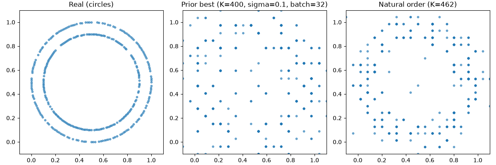

# MerLin Photonic Generative Modeling

[GitHub repo](https://github.com/alejack312/merlin-photonic-generative-modeling)

A two-milestone project built on Quandela's MerLin photonic framework: an MMD-trained generative model that learns a two-ring dataset from a single quantum circuit (v1.0), and a follow-on study of that circuit family's trainability and sampling-hardness-under-photon-loss (v3.0).

**How this was built:** I used Claude Code assistance under a rule I hold myself to. I verify every AI-assisted component against my own unaided explanation before it ships. Full framing in [Process & AI Use](#process--ai-use) below.

## Headline results

### v1.0: Photonic Generative Model

Held-out MMD² for the trained generator is 0.0125 ± 0.0003, close to the 0.0114 floor you'd get from comparing real data against itself (untrained baseline: 0.0360 ± 0.0048). With that being said, `ring_mass`, the fraction of generated probability mass that actually lands on the two target rings instead of the gap between them, sits at 0.68 to 0.69, not near 1.0. **GEN-07 ("generator's samples recognizably form two rings") is not met.** The generated distribution is better than earlier checkpoints, but it still doesn't look like two distinct rings.

`ring_mass` moved from 0.609 to 0.691 after fixing how the circuit's raw output indices map onto the 2D spatial bins (K=462, radius-sorted bins — see [docs/raster-order.md](docs/raster-order.md) for the mechanism). A low MMD² number doesn't by itself mean the shape is right. That's the main lesson of this project, and it's why both numbers are reported together instead of leading with the one that looks better. See [results/v1_generator/phase4_summary.md](results/v1_generator/phase4_summary.md) and [results/v1_generator/phase5_summary.md](results/v1_generator/phase5_summary.md) for the full evidence trail.

#### Problem & approach

A photonic `QuantumLayer` (from MerLin) is trained as a generator. Its output is a full probability distribution `q` over a fixed set of K spatial bins, and training minimizes the closed-form MMD² between `q` and `p_real`, the same kind of distribution computed once from the real `circles` data. There's no sampling step and no discriminator. Each forward pass already produces an exact, differentiable probability vector, so gradients flow straight from the MMD² loss back into the circuit's parameters (θ).

This design was chosen over two alternatives: collapsing `q` to a single weighted-average point (which lands in the empty gap between the two rings whenever the circuit hedges between them), and discrete `shots`-based sampling (not differentiable through standard autograd without an extra estimator). The full rationale in [DESIGN_DECISIONS.md](DESIGN_DECISIONS.md).

### v3.0: IQP Circuit Study

After the v1.0 generator above, this project extended into a v3.0 milestone that studies the same circuit family (an IQP-style photonic ansatz) from two angles: trainability (does it show barren-plateau-style gradient behavior as it scales?) and hardness-under-loss (does the sampling-hardness argument survive realistic photon loss?) — plus a continuously-tunable weight-2 gate and an independent Julia-based numeric verification path.

**Trainability.** An exponential gradient-variance-decay signature looked real at one kernel bandwidth (weight1/uniform-init R²=0.999, mixed/uniform-init R²=0.910), but a follow-up sweep across six bandwidths showed the signature is not robust to that choice. That's a genuine negative result, reported here as measured.

**Hardness under loss.** First, a scope point that governs how to read everything else: IQP's conjectured sampling hardness comes from the correlations the ZZ (weight-2) terms create between qubits. Strip those out and hardness disappears completely — by construction, the weight-1 circuit is classically easy. The weight-1 circuit here has no entangling gate, so its output is *exactly* a product distribution (verified analytically to 2.2e-16 at every size tested), samplable classically in O(n). Only the weight-2/mixed scope is a hardness candidate at all. Since its known closed form is what makes the loss channel independently checkable, the weight-1 sweep is a control, and a useful one. TVD-to-lossless and TVD-to-both-classical-baselines all converge toward the same ~0.50 ceiling as photon loss increases. That convergence is mostly an artifact of the metric itself — it compares a shrinking surviving signal against fixed, fully-normalized reference points. Among shots that do land correctly, the distribution's shape is exactly preserved under loss. Anticoncentration tells the same story from a second angle. Measured conditioned on detection, it is *exactly invariant* under loss, holding steady across the full eta grid regardless of how much photon loss is applied. That last point corrects an earlier version of this write-up, which reported anticoncentration increasing under loss. That turned out to be an artifact of an un-normalized calculation rather than a real effect, found by re-checking the shipped numbers against the metric's own definition and fixed in code, data, and docs. No photon-loss-to-depolarizing-rate translation was attempted — that boundary was set at the start, before any attempt was made.

Supporting this pair of findings: a continuously-tunable weight-2 gate (ARB-01/ARB-02), verified to ~1e-7 against measurement, and four independently-built Julia cross-checks against the Python results, all four GO.

## Results

### v1.0: Photonic Generative Model

**Training loss** (Phase 3, 300 epochs, MMD² against real data):


**Generated vs. real** (Phase 4, final GEN-07 checkpoint, natural-order correspondence, K=462):



**Benchmark numbers** (Phase 5, held-out data, σ=0.1, N=20 latent draws):


| Metric                                      | Value                                                    |
| ------------------------------------------- | -------------------------------------------------------- |
| **Held-out MMD² (trained generator)**       | **0.0125 ± 0.0003** (mean±std, N=20 latent draws, σ=0.1) |
| Held-out MMD² (untrained baseline)          | 0.0360 ± 0.0048 (mean±std, N=20 latent draws, σ=0.1)     |
| Held-out MMD² (real-vs-real floor)          | 0.0114 (deterministic, no generator)                     |
| ring_mass (trained, re-measured this phase) | 0.6833 ± 0.0073                                          |
| gap_mass (trained, re-measured this phase)  | 0.0514 ± 0.0035                                          |
| Wall-clock training time                    | 425.93 s (≈ 7.1 min, 300 epochs, batch=32)               |
| Parameter count                             | 220                                                      |


Source: [results/v1_generator/phase5_summary.md](results/v1_generator/phase5_summary.md).

### v3.0: IQP Circuit Study

Full result tables, plots, and per-study methodology live in the linked docs rather than duplicated here: [docs/trainability-study.md](docs/trainability-study.md), [docs/hardness-under-loss-study.md](docs/hardness-under-loss-study.md), and [docs/julia-cross-check-study.md](docs/julia-cross-check-study.md).

## Package layout

`src/merlin_iqp/` is the reusable library: the shared IQP-to-photonic encodings (`encoding/`), the v1.0 MMD generator (`generator/`), and the v3.0 trainability/hardness studies (`trainability/`, `hardness/`). It has no dependency on anything outside itself and is what this project could publish as its own package later.

`scripts/` holds the phase-tagged, provenance-documented experiment CLIs that produced this project's actual results (sweeps, analysis, de-risking probes) — one-off runnable scripts, not library code, each importing from the installed `merlin_iqp` package. Both `scripts/` and `results/` are grouped into per-milestone subfolders (`v1_generator/`, `v2_encoding/`, `v3_trainability/`, `v3_hardness/`, `v3_arb_gate/`, `v3_forge_formal/`, plus `v3_julia_verify/` under `results/`), matching the same milestone breakdown these docs use.

See [CONTRIBUTING.md](CONTRIBUTING.md) for setup and conventions.

## How to run

```bash
pip install -r requirements.txt   # pinned, reproducible environment
pip install -e .                  # editable-installs the merlin_iqp package
```

Requires Python 3.12 (MerLin caps at 3.10–3.12) in a venv, `torch<2.13`, `perceval-quandela>=1.2.1`.

Train the generator (the GEN-07 checkpoint variant, K=462, radius-sorted bins):

```bash
python scripts/v1_generator/natural_order_train.py
```

`scripts/v1_generator/train.py` reproduces the K=400 baseline used for comparison. `merlin_iqp.generator.train` is the library module it imports from (`build_generator`, `train_step`), not an independently runnable script. Run the test suite as the runnable-code check:

```bash
python -m pytest -q
```

`scripts/v1_generator/quickstart.py` is MerLin's own bundled classifier example, not part of this project's deliverable. Don't run it expecting the generator.

## Errors/Bugs

No open bugs. `python -m pytest -q` is green (296 tests) as of the last packaging pass. Known, deliberately-scoped limitations are documented below as findings — see the [Headline result](#headline-result) above (GEN-07's `ring_mass` shortfall) and the [v3.0 IQP Circuit Study](#v30-iqp-circuit-study) section below (the trainability signature's bandwidth-sensitivity, and the scope boundary on which circuits are hardness candidates at all). [NOTES.md](NOTES.md) and [DESIGN_DECISIONS.md](DESIGN_DECISIONS.md) record the investigation dead-ends encountered along the way, including ones where an initial explanation was wrong and corrected in place.

## Links out

- [DESIGN_DECISIONS.md](DESIGN_DECISIONS.md): full architecture and tuning rationale, including the three-entry log of the natural-order-correspondence fix
- [docs/mmd-loss.md](docs/mmd-loss.md): how this project's MMD² implementation compares to a prior IQP (gate-model) project's Hamming-distance version
- [docs/raster-order.md](docs/raster-order.md): why radius-sorting the spatial bins fixes ring fragmentation, mechanism and measurements
- [results/v1_generator/phase4_summary.md](results/v1_generator/phase4_summary.md): full Phase 4 (Generative Quality) evidence and the GEN-07 verdict
- [results/v1_generator/phase5_summary.md](results/v1_generator/phase5_summary.md): full Phase 5 (Benchmarking) evidence
- [.planning/phases/](.planning/phases/): phase-by-phase execution summaries
- [Full case study](https://alejandrojackson.dev/case-studies/merlin-quantum) — the complete external-facing story
- [docs/technical-findings.md](docs/technical-findings.md) — the full internal write-up, every number traceable to its source script/CSV/test
- Source docs: [docs/trainability-study.md](docs/trainability-study.md), [docs/hardness-under-loss-study.md](docs/hardness-under-loss-study.md), [docs/iqp-photonic-encoding.md](docs/iqp-photonic-encoding.md), [docs/julia-cross-check-study.md](docs/julia-cross-check-study.md)

## Process & AI Use

Claude Code assisted with implementation and verification throughout this project, under a rule I hold myself to. I verify every AI-assisted component against my own unaided explanation before it ships. If I can't explain how a piece works without help, it isn't done, and it gets re-explained until I can. That rule is written into this repo's own `CLAUDE.md`, and it shows up in the commit history and in `DESIGN_DECISIONS.md`, where design tradeoffs are recorded along with the reasoning behind them.

The underlying practice follows Brown's [Agentic Studio](https://cs.brown.edu/courses/csci1970kf/agentic-spr-2026/index.html) course (Kathi Fisler, Shriram Krishnamurthi, and Michael Littman, Brown's Associate Provost for AI), which studies how to use agentic coding tools without losing the understanding behind the code. Two ideas from it run through this repo: treating AI use as *offloading* (the tool does legwork, I still do the thinking) rather than *outsourcing* (the tool does the thinking), and running a Gibbs' Reflective Cycle pass after non-trivial decisions — describing what happened, evaluating what worked, and stating the actual lesson, rather than letting a decision pass unexamined.

The paper trail is left candid rather than cleaned up for presentation. [NOTES.md](NOTES.md) includes a case where my first attempt at explaining the training loop's batch-averaging step was wrong, and that correction stays on the record. [DESIGN_DECISIONS.md](DESIGN_DECISIONS.md) documents the investigation into why the generated ring structure was fragmenting (a mismatch between the circuit's raw output indices and the spatial bins). It includes the point where a proposed fix, just making the circuit bigger, was flagged as counterproductive before anyone touched the code, and it states the honest limits of the fix that was used instead. That trail is what shows the understanding behind this project is mine.

### v3.0: IQP Circuit Study

The same self-explanation rule was applied throughout v3.0. See the case study for a concrete example. The trainability write-up's literature cross-reference is a transcript of my own reasoning as I worked through the literature myself.

## License

[MIT](LICENSE)