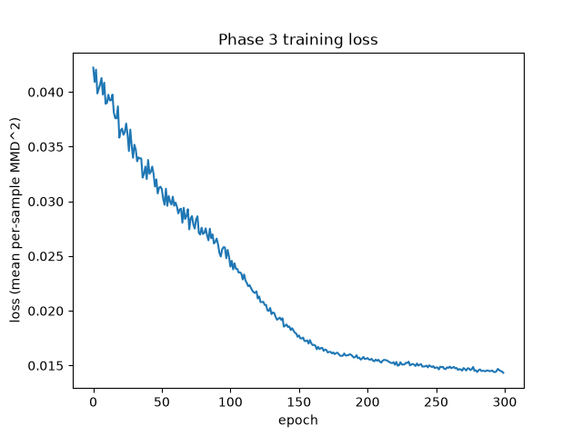

# MerLin Photonic Generative Modeling

An MMD-trained photonic generative model, built on Quandela's MerLin framework, that learns the two-ring `circles` dataset from a single quantum circuit. No discriminator, no adversarial loss.

**How this was built:** implemented with Claude Code assistance under a rule I hold myself to: I verify every AI-assisted component against my own unaided explanation before it ships. Full framing in [Process & AI Use](#process--ai-use) below.

## Headline result

Held-out MMD² for the trained generator is 0.0125 ± 0.0003, close to the 0.0114 floor you'd get from comparing real data against itself (untrained baseline: 0.0360 ± 0.0048). That part looks good. But `ring_mass`, the fraction of generated probability mass that actually lands on the two target rings instead of the gap between them, sits at 0.68 to 0.69, not near 1.0. **GEN-07 ("generator's samples recognizably form two rings") is not met.** The generated distribution is better than earlier checkpoints, but it still doesn't look like two distinct rings.

The improvement is real and measured, not just a claim: `ring_mass` moved from 0.609 to 0.691 after fixing how the circuit's raw output indices map onto the 2D spatial bins (K=462, radius-sorted bins; mechanism in [`docs/raster-order.md`](docs/raster-order.md)). A low MMD² number doesn't by itself mean the shape is right. That's the main lesson of this project, and it's why both numbers are reported together instead of leading with the one that looks better. See [`results/phase4_summary.md`](results/phase4_summary.md) and [`results/phase5_summary.md`](results/phase5_summary.md) for the full evidence trail.

## Problem & approach

A photonic `QuantumLayer` (from MerLin) is trained as a generator. Its output is a full probability distribution `q` over a fixed set of K spatial bins, and training minimizes the closed-form MMD² between `q` and `p_real`, the same kind of distribution computed once from the real `circles` data. There's no sampling step and no discriminator: each forward pass already produces an exact, differentiable probability vector, so gradients flow straight from the MMD² loss back into the circuit's parameters (θ).

This design was chosen over two alternatives: collapsing `q` to a single weighted-average point (which lands in the empty gap between the two rings whenever the circuit hedges between them), and discrete `shots`-based sampling (not differentiable through standard autograd without an extra estimator). Full rationale in [`DESIGN_DECISIONS.md`](DESIGN_DECISIONS.md).

## Results

**Training loss** (Phase 3, 300 epochs, MMD² against real data):



**Generated vs. real** (Phase 4, final GEN-07 checkpoint, natural-order correspondence, K=462):


**Benchmark numbers** (Phase 5, held-out data, σ=0.1, N=20 latent draws):

| Metric | Value |
|---|---|
| **Held-out MMD² (trained generator)** | **0.0125 ± 0.0003** (mean±std, N=20 latent draws, σ=0.1) |
| Held-out MMD² (untrained baseline) | 0.0360 ± 0.0048 (mean±std, N=20 latent draws, σ=0.1) |
| Held-out MMD² (real-vs-real floor) | 0.0114 (deterministic, no generator) |
| ring_mass (trained, re-measured this phase) | 0.6833 ± 0.0073 |
| gap_mass (trained, re-measured this phase) | 0.0514 ± 0.0035 |
| Wall-clock training time | 425.93 s (≈ 7.1 min, 300 epochs, batch=32) |
| Parameter count | 220 |

Source: [`results/phase5_summary.md`](results/phase5_summary.md).

## How to run

```bash
pip install -r requirements.txt
```

Requires Python 3.12 (MerLin caps at 3.10–3.12) in a venv, `torch<2.13`, `perceval-quandela>=1.2.1`.

Train the generator (the GEN-07 checkpoint variant, K=462, radius-sorted bins):

```bash
python natural_order_train.py
```

Earlier variants (`train.py`, `generator/train.py`) reproduce the K=400 baseline used for comparison. Run the test suite as the runnable-code check:

```bash
python -m pytest -q
```

`quickstart.py` is MerLin's own bundled classifier example, not part of this project's deliverable. Don't run it expecting the generator.

## Links out

- [`DESIGN_DECISIONS.md`](DESIGN_DECISIONS.md): full architecture and tuning rationale, including the three-entry log of the natural-order-correspondence fix
- [`docs/mmd-loss.md`](docs/mmd-loss.md): how this project's MMD² implementation compares to a prior IQP (gate-model) project's Hamming-distance version
- [`docs/raster-order.md`](docs/raster-order.md): why radius-sorting the spatial bins fixes ring fragmentation, mechanism and measurements
- [`results/phase4_summary.md`](results/phase4_summary.md): full Phase 4 (Generative Quality) evidence and the GEN-07 verdict
- [`results/phase5_summary.md`](results/phase5_summary.md): full Phase 5 (Benchmarking) evidence
- [`.planning/phases/`](.planning/phases/): phase-by-phase execution summaries

## Process & AI Use

Claude Code assisted with implementation and verification throughout this project, under a rule I hold myself to: I verify every AI-assisted component against my own unaided explanation before it ships. If I can't explain how a piece works without help, it isn't done. It gets re-explained until I can. That rule is written into this repo's own `CLAUDE.md`, and it shows up in the commit history and in `DESIGN_DECISIONS.md`, where design tradeoffs are recorded along with the reasoning behind them, not just the outcome.

The paper trail is left candid rather than cleaned up for presentation. [`NOTES.md`](NOTES.md) includes a case where my first attempt at explaining the training loop's batch-averaging step was wrong, and the correction is recorded instead of quietly fixed. [`DESIGN_DECISIONS.md`](DESIGN_DECISIONS.md) documents the investigation into why the generated ring structure was fragmenting (a mismatch between the circuit's raw output indices and the spatial bins). It includes the point where a proposed fix, just making the circuit bigger, was flagged as counterproductive before anyone touched the code, and it states the honest limits of the fix that was used instead. That trail is what shows the understanding behind this project is mine, not just the code.

## License

[MIT](LICENSE)
