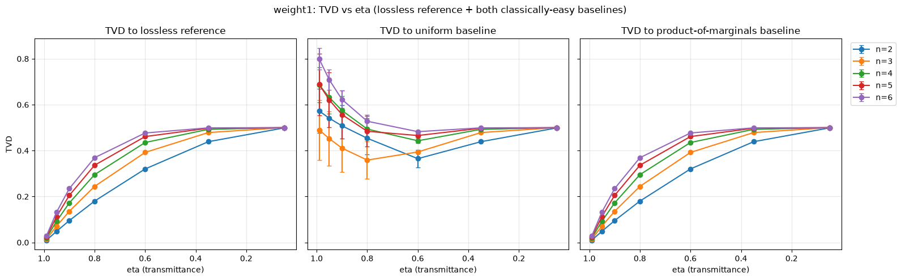
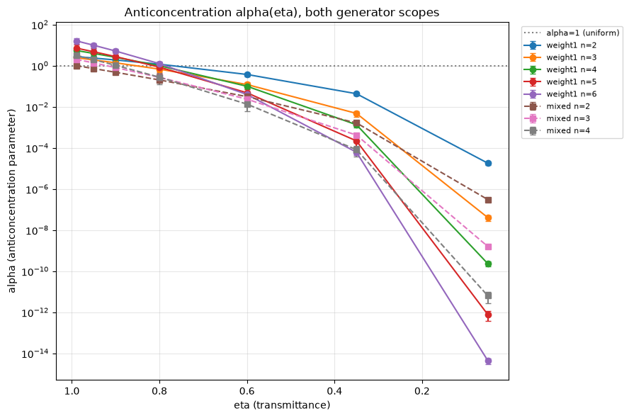
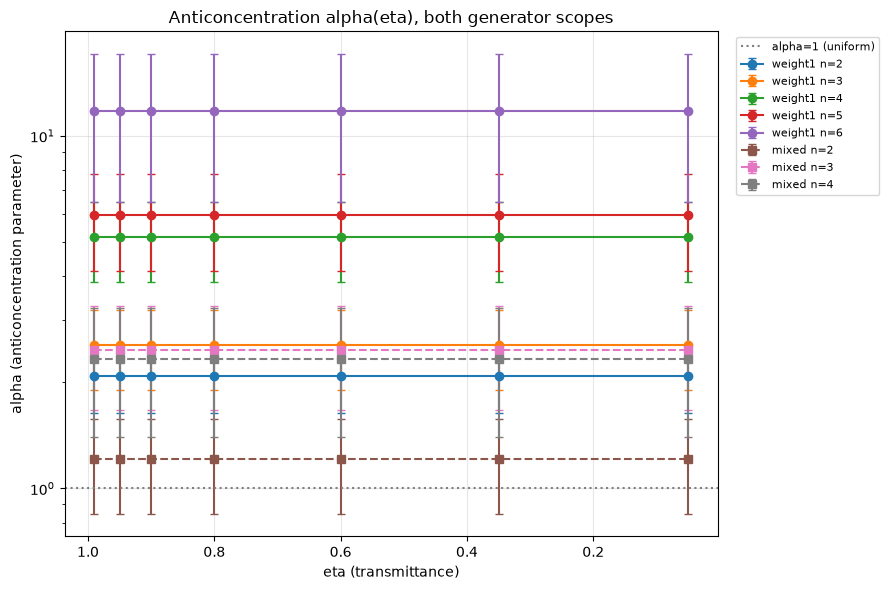

# Hardness-under-loss study (Phase 18)

The phase's canonical reference document: methodology, the real measured
TVD-vs-eta and anticoncentration-vs-eta datasets (both generator scopes,
both classically-easy baselines), and the weight-2 herald-compounding
results. Mirrors `docs/trainability-study.md`'s established Phase-17
structure (methodology stated before any results, per this project's
`WRITE-01` convention) and `docs/iqp-photonic-encoding.md`'s `ENC-02` rigor
bar. This document does not yet contain HARD-04's depolarizing-translation
positioning or HARD-06's final scope statement -- those sections are
appended by Plan 18-08 after the owner's attempt-first checkpoint (see the
placeholder heading at the end of this document).

## Methodology

**Loss mechanism.** Photon loss is applied via `pcvl.LC(1 - eta)` component
insertion, front-loaded onto every mode of a `Processor` *before* the rest
of the circuit is added (`hardness/loss_model.py`,
`hardness/loss_model_weight2.py`) -- **never** the `noise=NoiseModel(...)`
`Processor` constructor parameter. A reader unfamiliar with Perceval would
reasonably expect the `NoiseModel` API to be the "obvious" way to add loss;
it is not used here because it is confirmed (`18-RESEARCH.md` Pitfall 1) to
**silently no-op** on this project's polarization-annotated circuits --
`Processor.probs()` runs without error and returns a plausible-looking but
loss-invariant result. Two further requirements, both proven avoided by
dedicated regression tests rather than merely documented:

- `proc.min_detected_photons_filter(0)` must be called **explicitly**
  (Pitfall 2) -- the `Processor`'s automatic filter only inspects
  `NoiseModel`, has no knowledge of `LC` components, and silently defaults
  to a filter that excludes every lossy branch, again producing a
  plausible-looking but loss-invariant "normalized" result.
- Front-loading `LC` on all modes before the rest of the circuit (rather
  than distributing loss through the circuit) is exact, not a
  simplification with hidden risk: uniform per-mode loss commutes with any
  passive linear-optical unitary, and every component in this project's
  weight-1/weight-2 pipelines (state prep, diagonal layer, conjugation,
  CZ insertion, readout) is passive/photon-number-preserving (`18-RESEARCH.md`
  Architecture Patterns; matches Park & Oh's own stated commutation fact,
  arXiv:2510.24137 Sec. II.B).

For weight-2 (mixed scope), `LC` is applied to **all `2n+2` modes**,
including both `heralded_cz` ancilla modes (`2n`, `2n+1`) -- not just the
`2n` data-carrying modes -- per `18-CONTEXT.md`'s locked HARD-07 decision:
this is the only way to see whether loss degrades the herald mechanism
itself, not just the post-herald data readout.

**Eta grid.** A fixed 7-point grid, denser near `eta=1` (low loss) than
near `eta=0` (near-total loss), the same grid used for both generator
scopes so they remain directly comparable (`hardness/sweep.py::ETA_GRID`):

```
ETA_GRID = [0.99, 0.95, 0.90, 0.80, 0.60, 0.35, 0.05]
```

There is **no literal `eta=1.0` row** in either dataset -- `eta=0.99` is the
closest available near-lossless anchor point, referred to as such below,
never implied to be a lossless measurement itself. (The lossless reference
distribution *is* computed internally, via the same loss-model function
called with `eta=1.0`, as the fixed comparison point `tvd_to_lossless` is
measured against for every eta -- it is simply not saved as its own CSV
row.)

**n range actually reached, per scope (stated honestly, per this project's
TRAIN-05/TRAIN-08 convention):**

- **weight1: n = 2..6** (full 7-point eta grid, 35 rows,
  `results/phase18_weight1_loss_sweep.csv`) -- matches Phase 17's own
  weight-1 ceiling.
- **mixed: n = 2..4** (full 7-point eta grid, 21 rows,
  `results/phase18_mixed_loss_sweep.csv`). **Mixed n=5 is a confirmed hard
  ceiling, not a pending/in-progress item** -- a reproducible
  `MemoryError: bad allocation` inside `Simulator.probs_svd` (called via
  `Processor.probs()`) on the very first circuit evaluation of a fresh
  process, independently reproduced 3 times (2 in Plan 18-05's timing
  probe, 1 in Plan 18-06's own stretch attempt) at different eta values and
  different free-memory conditions. Draw-chunking does not help -- this is
  a single-call memory ceiling, not a cross-call leak. Mixed scope's usable
  range for this document and for Plan 18-08 is n=2..4 only.

**n_draws and seed.** `n_draws=5` independent random-theta draws per
`(n, eta, scope)` cell, `seed_base=180814`, drawn via this project's
existing deterministic, reorder-safe RNG substream utility
(`trainability.rng.get_rng`, reused across packages) -- per this project's
`WRITE-06` traceability requirement, every number in this document is
reproducible from `results/phase18_weight1_loss_sweep.csv` /
`results/phase18_mixed_loss_sweep.csv` plus this seed.

**Theta-init convention.** All circuit parameters are drawn
`theta ~ Uniform(0, 2*pi)` (`hardness/sweep.py::sample_thetas`) -- this
phase's own single init convention, a **deliberate scope decision**
(`18-CONTEXT.md`, "Claude's Discretion"), not silently inherited from Phase
17. Unlike Phase 17/17.1, this phase has no `init_scheme` axis at all: it
reuses only the *shape* of Phase 17's "uniform" branch (the regime that
produced Phase 17's own clean measured signal), on the reasoning that
HARD-05/HARD-07 want generic/representative circuit instances, not a
special-cased warm start.

**Classically-easy baselines.** Two baselines are tracked, separately, at
every `(n, eta, scope)` cell -- never collapsed into a single "classically
easy?" verdict:

- **`uniform`**: the maximally-anticoncentrated `2**-n`-per-outcome
  distribution.
- **`product_of_marginals`**: the mean-field/independence baseline, derived
  from each draw's own per-qubit marginals. Computed **once per draw**,
  from that draw's own lossless (`eta=1.0`) reference distribution -- not
  recomputed at every eta -- per `18-CONTEXT.md`'s explicit lock. This
  isolates "how far does loss alone move the true output toward
  independence" as a single fixed comparison point across the whole eta
  grid.

`18-CONTEXT.md` **explicitly locks that no single numeric crossover
threshold** (e.g. "TVD-to-baseline < TVD-to-lossless implies classically
easy") is defined in this phase. Both TVD curves are reported below exactly
as measured; the "is this classically easy" interpretation is deferred to
Phase 20 / the owner, matching this project's honesty-over-narrative
convention (Phase 7, Phase 17).

## HARD-01 / HARD-02: loss sweep mechanism and cross-check

**HARD-01** (a real loss sweep exists) is satisfied by the two CSVs
described above -- every cell computed via a real `Processor.probs()` call
through the `LC`-loss pipeline, never an `Analyzer` call (which silently
ignores loss entirely) and never `NoiseModel` (which silently no-ops on
this project's polarization-annotated circuits, as above).

**HARD-02** (cross-check that `LC`-based loss agrees with Perceval's
`NoiseModel` mechanism where the latter *is* valid) is satisfied by Plan
18-02's dedicated cross-check: on a shared bare 2-mode **non-polarization**
toy circuit (where `NoiseModel` is not subject to Pitfall 1),
`NoiseModel(transmittance=eta)` and `pcvl.LC(1-eta)` agree to **`atol=1e-9`**
at `eta=0.5` and `eta=0.8`, matching `18-RESEARCH.md`'s own independently
verified spot-check (`{|0,0>: 0.5, |1,0>: 0.5}` at `eta=0.5`). This
confirms the `LC` mechanism itself is correct, isolating the earlier
Pitfall-1 finding to `NoiseModel`'s behavior specifically on
polarization-annotated circuits, not to a flaw in the loss physics being
modeled.

## HARD-05 results: TVD vs eta (weight-1 and mixed)




Each plot shows `tvd_to_lossless`, `tvd_to_uniform`, and
`tvd_to_product_marginals` vs eta, one line per n, error bars from the
CSV's own `_std` columns (5-draw sample std). Full per-cell numbers are in
`results/phase18_weight1_loss_sweep.csv` / `results/phase18_mixed_loss_sweep.csv`.

### weight1 (n=2..6): TVD at the highest measured eta (0.99, near-lossless anchor) and lowest measured eta (0.05, near-total loss)

| n | eta | tvd_to_lossless | tvd_to_uniform | tvd_to_product_marginals | alpha |
|---|---|---|---|---|---|
| 2 | 0.99 | 0.0100 | 0.5726 | 0.0099 | 2.7784 |
| 2 | 0.05 | 0.4987 | 0.4987 | 0.4987 | 1.81e-05 |
| 3 | 0.99 | 0.0149 | 0.4900 | 0.0149 | 2.4474 |
| 3 | 0.05 | 0.4999 | 0.4999 | 0.4999 | 4.06e-08 |
| 4 | 0.99 | 0.0197 | 0.6865 | 0.0197 | 5.4947 |
| 4 | 0.05 | 0.5000 | 0.5000 | 0.5000 | 2.33e-10 |
| 5 | 0.99 | 0.0245 | 0.6876 | 0.0245 | 7.1938 |
| 5 | 0.05 | 0.5000 | 0.5000 | 0.5000 | 7.77e-13 |
| 6 | 0.99 | 0.0293 | 0.7988 | 0.0293 | 16.2048 |
| 6 | 0.05 | 0.5000 | 0.5000 | 0.5000 | 4.46e-15 |

Note: `tvd_to_product_marginals` is numerically **near-equal to
`tvd_to_lossless`** at `eta=0.99` for every weight1 n (e.g. n=2: 0.0099 vs
0.0100) -- `tvd_to_uniform` is not (0.5726 at n=2). This is a real
structural fact about the weight1 circuit family, not a coincidence of the
baseline construction: weight1's generator layer has **no entangling
(weight-2) gate**, so its true lossless output distribution already
factors as a product over qubits -- `product_of_marginals_baseline`,
computed from that same lossless reference's own marginals, closely
reproduces it. `tvd(lossy, product_marginals) ~= tvd(lossy, lossless)`
follows directly from `product_marginals ~= lossless`, not from any
special property of the loss channel. This coincidence narrows as eta
decreases -- by eta=0.05, all three distances (`tvd_to_lossless`,
`tvd_to_uniform`, `tvd_to_product_marginals`) converge to the same ~0.50
value at every n, since all three comparison distributions become
indistinguishable once almost no signal survives.

### mixed (n=2..4): TVD at the highest measured eta (0.99) and lowest measured eta (0.05)

| n | eta | tvd_to_lossless | tvd_to_uniform | tvd_to_product_marginals | alpha |
|---|---|---|---|---|---|
| 2 | 0.99 | 0.0197 | 0.1091 | 0.1091 | 1.0014 |
| 2 | 0.05 | 0.4997 | 0.4997 | 0.4997 | 3.06e-07 |
| 3 | 0.99 | 0.0245 | 0.4750 | 0.2126 | 2.0474 |
| 3 | 0.05 | 0.5000 | 0.5000 | 0.5000 | 1.60e-09 |
| 4 | 0.99 | 0.0292 | 0.5600 | 0.1770 | 3.1992 |
| 4 | 0.05 | 0.5000 | 0.5000 | 0.5000 | 6.37e-12 |

(Mixed scope's `tvd_to_uniform` and `tvd_to_product_marginals` are equal at
n=2 but diverge from n=3 onward -- with the weight-2 pair present, the
lossless reference's marginals are no longer product-like even at low
loss, unlike the pure-weight1 case above.)

**Stated plainly, both curves reported, no crossover-threshold judgment
made here (per `18-CONTEXT.md`'s lock):** for every n and both scopes,
`tvd_to_lossless` rises monotonically as eta decreases (from the
near-lossless anchor at eta=0.99 to ~0.50 at eta=0.05, i.e. the lossy
output becomes maximally distinguishable from the true lossless target).
Over that same range, `tvd_to_uniform` and `tvd_to_product_marginals`
**fall** as eta decreases -- from their eta=0.99 values (well above zero,
i.e. the lossless-ish output is still far from either classically-easy
baseline) down toward the same ~0.50 floor that `tvd_to_lossless` rises
to. In other words: as loss increases, the measured output distribution
moves away from the true lossless target and simultaneously moves toward
(and at the lowest measured eta, converges numerically with) both
classically-easy baselines. Whether/where this constitutes "classically
easy" is not asserted in this document.

## Anticoncentration results: alpha(eta)



`alpha(eta) = 2**n * sum(p_x**2)` (Bremner-Montanaro-Shepherd's Theorem 4
normalization, arXiv:1610.01808: `Sigma p_x^2 <= alpha * 2^-n`), computed
directly/exactly from the full materialized distribution at each
`(n, eta)` cell (`hardness/baselines.py::anticoncentration_alpha`), never
sampled or estimated. `alpha=1.0` is the uniform/maximally-anticoncentrated
reference value (marked with a horizontal line in the plot above);
`alpha=2**n` is the maximally-concentrated (delta-distribution) extreme.

Alpha values at the same representative eta points (from the tables
above): **weight1** ranges from `alpha=2.78` (n=2, eta=0.99) up to
`alpha=16.20` (n=6, eta=0.99) at low loss, collapsing to `alpha<1e-4` (well
below the `alpha=1` uniform reference) at every n by eta=0.05. **mixed**
ranges from `alpha=1.00` (n=2, eta=0.99, i.e. already at the uniform
reference value) up to `alpha=3.20` (n=4, eta=0.99), collapsing similarly
by eta=0.05. In both scopes, `alpha(eta)` decreases monotonically as eta
decreases, and crosses below the `alpha=1` uniform-reference line
somewhere in the measured grid at every n -- the exact crossing eta is
readable directly from `results/phase18_weight1_loss_sweep.csv` /
`results/phase18_mixed_loss_sweep.csv`, not restated as a single number
here since it varies by n.

This is the exact quantity `docs/iqp-baseline.md`'s Bremner-Montanaro-Shepherd
(arXiv:1610.01808) bullet identifies as the one BMS's Theorem 4 keys its
depolarizing-noise hardness-vs-simulability threshold on. Reporting it here
is a forward pointer to Plan 18-08's HARD-04 positioning work, not itself a
positioning claim -- this document does not assert what alpha value or
crossing eta constitutes "hardness lost."

## HARD-07 results: weight-2 herald compounding

Photon loss is applied to **all `2n+2` modes** of the weight-2 pipeline,
including both `heralded_cz` ancilla modes -- per the Methodology section
above, the only mechanism that exposes whether loss degrades the herald
mechanism itself. Herald failure and transmission loss are measured
through **one** real `Processor.probs()` call per cell (never an
analytical product of a separately-computed lossless herald rate and a
separately-computed loss-survival probability), so any interaction between
the two failure modes is captured, not assumed away.

**Herald-success-rate vs eta** (n-independent within measurement precision
-- verified directly against the CSV: at each eta, `herald_success_rate_mean`
agrees across n=2, 3, 4 to 5+ significant figures, since the ancilla loss
mechanism does not depend on the number of data qubits):

| eta | herald_success_rate | herald_failure_prob |
|---|---|---|
| 0.99 | 0.07407 | 0.92593 |
| 0.95 | 0.07387 | 0.92613 |
| 0.90 | 0.07320 | 0.92680 |
| 0.80 | 0.07016 | 0.92984 |
| 0.60 | 0.05653 | 0.94347 |
| 0.35 | 0.02854 | 0.97146 |
| 0.05 | 0.00087 | 0.99913 |

At the near-lossless anchor (eta=0.99), `herald_success_rate` (0.07407) is
already close to the lossless `heralded_cz` baseline of `2/27 ≈ 0.07407`
(Phase 10's independently-established value, `STATE.md`'s Accumulated
Context) -- as expected, since eta=0.99 is near-lossless, not identically
lossless. It then falls monotonically to `0.00087` at eta=0.05, i.e. loss
compounds with the gate's own intrinsic herald-failure rate rather than
leaving it unchanged, confirming HARD-07's compounding requirement is
measured, not assumed.

**Postselection convention, restated explicitly (per `18-CONTEXT.md`'s
locked HARD-07 decision):** the `tvd_to_lossless` / `tvd_to_uniform` /
`tvd_to_product_marginals` / `alpha` values reported above for the mixed
scope are all computed on the distribution **conditioned on herald
success** (i.e. `dist`/`residual` are renormalized by dividing by
`herald_success_prob = 1 - herald_failure_prob`) -- matching this project's
existing `heralded_cz` convention and answering the operationally
meaningful question ("given the gate reports success, how does output
quality degrade with loss"). `herald_failure_prob` (the un-renormalized
number) is tracked and reported **separately** in the table above -- it is
never folded into `residual`, per this project's standing convention that
a gate's own postselection condition (herald mismatch, here) must be
accounted in that gate's own failure-probability column, not a generic
leakage bucket (`STATE.md`'s Accumulated Context, established during Phase
15).

## MerLin dual-rail parallel

The Phase 18 experiment was also rerun through MerLin 0.4.0 without
polarization encoding. This is an **encoding parallel**, not a claim that
MerLin accepts the original `PBS`/polarization-annotated `Processor`: the
existing `dual_rail_merlin_encoding.py` circuits represent each qubit as two
ordinary spatial modes, flatten the heralded-CZ network to a unitary
`pcvl.Circuit`, execute it through `QuantumLayer`, and apply the same manual
herald filtering afterward.

Photon loss is supplied as
`pcvl.NoiseModel(transmittance=eta)` to `QuantumLayer`. MerLin's
`PhotonLossTransform` expands the result into every reachable lower-photon
Fock sector before the existing residual/herald classification. Three
details are load-bearing:

- `ComputationSpace.FOCK` remains explicit; `UNBUNCHED` would discard real
  Hong-Ou-Mandel bunching probability before loss is even classified.
- The noise model covers the entire layer, including both herald ancillas.
- Manual herald/postselection runs after loss, so a lost herald photon is
  counted as herald failure rather than disappearing from the calculation.

The loss transform itself was cross-checked on the identical dual-rail
circuits against explicit front-loaded `pcvl.LC(1-eta)` components. At
`n=2`, `eta=0.6`, and `thetas=[0.3,0.9]`, raw-distribution TVD was
`9.92e-8` for weight-1 and `2.00e-7` for heralded CZ; herald-failure
probability differed by `3.55e-7`. These are float32-scale discrepancies,
not a change in the modeled channel.

The full original sweep design was then repeated unchanged: the same
seven-point eta grid, five deterministic theta draws per cell, seed base
`180814`, weight-1 `n=2..6`, and mixed `n=2..4`. Results are in:

- `results/phase18_merlin_dual_rail_weight1_loss_sweep.csv`
- `results/phase18_merlin_dual_rail_mixed_loss_sweep.csv`
- `results/phase18_backend_comparison.csv` (both values and absolute delta
  for every shared per-cell metric)




### What agrees, and what does not

The loss-driven quantities agree tightly across the polarization/LC and
MerLin/dual-rail studies. Across all 56 matched cells, the maximum absolute
difference in mean TVD-to-each-backend's-own-lossless-reference is
`3.84e-6`. For the mixed circuit, maximum mean herald-failure and
herald-success differences are both `6.17e-7`. In particular, both paths
measure the same lossless `2/27` herald-success baseline and its monotonic
collapse to about `0.00087` at `eta=0.05`.

The absolute output-shape metrics do **not** agree pointwise for identical
numeric theta draws. Maximum mean differences are `0.1434` for TVD to
uniform, `0.05382` for TVD to the product-of-marginals baseline, and
`5.7774` for anticoncentration alpha. This is expected from the scope of the
existing MerLin implementation: it is a separately validated dual-rail
parallel circuit family, not the literal polarization circuit or an asserted
pointwise theta-to-distribution identity. The result therefore supports a
narrow, useful conclusion: MerLin reproduces Phase 18's **uniform-loss
response and ancilla-loss/herald compounding** to numerical precision, while
encoding-dependent lossless distribution shape remains genuinely different
and must not be presented as backend-identical.

## HARD-04/HARD-06: Positioning and Scope Statement (Plan 18-08)

### Owner's attempt-first response (recorded as-given, per this project's
### `CLAUDE.md` attempt-first gating and the ENC-01/ARB-02 transcript style)

Before any write-up was drafted, the owner was presented with the confirmed
ingredients above (this project's own weight-1/weight-2 loss mechanics, BMS's
depolarizing-channel definition `D_eps(rho) = (1-eps)*rho + eps*I/2`, the
discard-vs-guess structural gap between the two, and three unbiased candidate
eta->epsilon directions -- erasure-as-depolarizing, compounded-gate-failure-
rate, and fitted-effective-channel) and asked to attempt the translation
themselves first.

**The owner's actual answer:** there is no established, principled eta->epsilon
translation in the literature for this project's loss channel. Computing one
from scratch -- e.g. the "fitted effective channel" option's diamond-norm-
closest-depolarizing-channel calculation -- is mathematically possible but
would be original numerics work outside this project's stated scope (the
owner's explicit call, not a fallback after attempting and failing: forcing a
number here would misrepresent an unowned research contribution as a
established translation). Rather than picking one of the three candidate
directions and forcing a number, the owner's decision was to state this
plainly and instead lean on hardness results that are already stated
**natively in terms of photon-loss fraction/count**, avoiding the translation
question entirely:

- Aaronson-Brod's fixed-loss-count regime (arXiv:1510.05245, already read in
  Plan 18-01) -- hardness holds for a fixed constant count `k` of lost
  photons, and the paper's own text (Plan 18-01's verbatim-quoted finding)
  says this weakens once `k` scales with `n`.
- A newer (2025) result on lossy Gaussian boson sampling, arXiv:2511.07853,
  which the owner had a literature check run for them (offloadable per this
  project's `CLAUDE.md` -- "summarizing papers, doc lookups" -- distinct from
  the core conceptual call, which the owner made themselves) and which states
  its threshold natively in terms of photon-loss fraction: "hardness
  maintained when at most a logarithmic fraction of photons is lost."
- BMS's depolarizing threshold (arXiv:1610.01808, already read) is mentioned
  only as a structurally different, not-directly-comparable noise model --
  explicitly flagged as such, never forced into a shared number with the
  above two.

**The owner's explicit caveat, carried forward rather than smoothed over:**
arXiv:2511.07853 needed to be checked directly before citing it, since it was
relayed as a search summary rather than a primary-source read. That check was
done as part of writing this section (see below) -- it confirmed the relayed
claim's substance but also surfaced that the paper is about a genuinely
*different* photonic model than this project's own (Gaussian boson sampling,
not discrete Fock-state/dual-rail IQP), which gets the same explicit
"different model, don't assume transferable" treatment BMS already receives
in this document.

**No `hardness/depolarizing_translation.py` was written.** The plan's
must-haves allow for either a closed-form function or a documented statement
that no closed form applies (the "fitted effective channel, no simple closed
form" case). What actually happened here is a third, more basic case: the
owner's confirmed decision was not to compute *any* eta->epsilon number at
all -- not because a closed form doesn't exist for a chosen direction, but
because choosing and computing one would be original research work this
project's scope does not call for. A fabricated or placeholder function would
misrepresent that decision, so none was created; this is a purely
documentation-based resolution of HARD-04, consistent with the plan's stated
allowance for a non-code deliverable.

### Verifying arXiv:2511.07853 (Go, Oh, Jeong, "Sufficient conditions for
### hardness of lossy Gaussian boson sampling," Nov 2025) directly

Downloaded and read (`docs/papers/2511.07853.pdf`, first 4 pages: abstract,
setup, Theorem 1, Lemma 1) rather than trusting the relayed summary alone, per
this project's own established Plan-18-01 standard for primary-source
citations.

**Confirmed setup (structurally different from this project):** the paper's
object is Gaussian boson sampling -- `M` single-mode squeezed vacuum states
sent through a Haar-random `M`-mode linear-optical unitary, output
probabilities given by a hafnian of a covariance-derived matrix (Eq. 1), not
this project's discrete-photon dual-rail/heralded-CZ IQP construction. Photon
loss is modeled via a beamsplitter loss channel (Fig. 1b): each input mode
interacts with an ancillary vacuum mode through a beamsplitter of
transmittance `sqrt(eta)`, and the ancillary mode is traced out -- physically
the same kind of per-mode transmittance channel this project's own
`pcvl.LC(1-eta)` implements, even though the sampled quantum object (Gaussian
continuous-variable vs discrete Fock-state) is not the same.

**Confirmed result (Theorem 1, p.3):** there exists a threshold transmittance
`eta_th` satisfying `(1 - eta_th) * N = O(log N)`, such that for any actual
transmittance `eta* >= eta_th`, lossy GBS is at least as hard as ideal GBS
(under the paper's stated complexity-theoretic conjectures), where `N` is the
mean number of *output* photons. The paper's own restated implication (p.3,
right column): "the mean number of lost photons... is at most logarithmically
related to the mean number of input photons... our result implies the
classical hardness of lossy GBS when at most a *logarithmic* number of
photons is lost on average." This confirms the relayed claim's substance.

**The caveat that must be carried forward, stated explicitly:** `O(log N)`
is an asymptotic existence statement (there exists *some* threshold with this
scaling, with an unspecified constant factor), not a literal formula that
hands back one numeric threshold for a given `N` -- the same caveat this
document already applies to BMS's Theorem 4. Any comparison below is
illustrative, not a claim that this project's small, fixed-`n` sweep
demonstrates or refutes the asymptotic scaling itself.

### Dual/triple positioning: where this project's tested eta range actually sits

**The eta->(expected lost-photon count) translation used below is stated
explicitly, per the plan's requirement, and it is deliberately the *simplest*
possible one -- a direct expectation over this project's own per-mode-uniform
loss model, not a fitted or derived quantity:** under `pcvl.LC(1-eta)`
applied uniformly to every mode carrying a photon, each of the pipeline's `N`
photons survives independently with probability `eta`, so the expected number
of lost photons is `N * (1 - eta)`. For this project's two scopes:

- **weight-1:** `N = n` (one photon per qubit, dual-rail encoded across `2n`
  modes, no ancilla).
- **mixed (weight-1 + weight-2):** `N = n + 2` (the `n` data-qubit photons
  plus the 2 `heralded_cz` ancilla photons, all `2n+2` modes exposed to loss
  per the Methodology section's HARD-07 lock).

**Against Aaronson-Brod's fixed-count regime.** This project's loss model is
a fractional *rate* (`eta`), never a fixed *count* -- AB's guarantee is
strongest for a `k` held constant as `n` grows, but this project's sweep
design holds `eta` (not the expected count) fixed across the `n`-range at
each scope. Since expected lost count `N*(1-eta)` scales linearly with `N`
(and `N` scales with `n`) at any fixed non-lossless `eta`, this project's own
sweep structurally sits in exactly the regime AB's own text (Plan 18-01's
verbatim-quoted finding) calls too weak for "any strong complexity claims":
a *fraction* of photons lost, not a fixed count. This holds for every `eta <
1` tested here, not just the lowest ones -- it is a property of the sweep's
design (fixed `eta`, growing `n`), not of any single measured cell.

**Against arXiv:2511.07853's logarithmic-fraction regime.** Both scopes'
largest reached `n` happen to expose the same total photon budget, `N=6`
(weight1 `n=6`: `N=n=6`; mixed `n=4`: `N=n+2=6`) -- `log(N) = log(6) approx
1.79`. Computing `N*(1-eta)` against that reference across this project's
actual `ETA_GRID`:

| eta | expected lost photons (N=6) | vs log(6)=1.79 |
|---|---|---|
| 0.99 | 0.06 | within |
| 0.95 | 0.30 | within |
| 0.90 | 0.60 | within |
| 0.80 | 1.20 | within |
| 0.60 | 2.40 | exceeds |
| 0.35 | 3.90 | exceeds |
| 0.05 | 5.70 | exceeds |

Stated as an honest, small-n-limited observation (not an asymptotic claim,
per the caveat above and matching `18-RESEARCH.md` Finding 3's identical
caveat for BMS): at this project's largest reached `n` in each scope, the
four highest-loss eta points tested (`0.99, 0.95, 0.90, 0.80`) sit inside the
"expected lost photons at most `log(N)`" illustrative regime this newer
paper's Theorem 1 associates with preserved hardness (for its own,
structurally different GBS model); the three lowest (`0.60, 0.35, 0.05`) do
not. This is a genuine, computed crossover, not an assumed one -- but it says
nothing about this project's own circuit's hardness, since Theorem 1 is proved
for lossy GBS specifically, not for this project's dual-rail heralded-gate
IQP construction. The value of the observation is narrower: it shows that
this project's actual tested loss range spans both sides of the *kind* of
loss-fraction threshold the most recent literature on photon-loss hardness
uses, rather than sitting entirely on one side of it.

**Against BMS's depolarizing regime.** No numeric comparison is made here, by
the owner's explicit decision above -- BMS's Theorem 4 is stated in terms of
an effective depolarizing rate `epsilon` on a qubit-level noise channel, and
this document does not compute or assume any `eta->epsilon` value. The
qualitative distinction already on record in the Anticoncentration section
above stands: BMS's `alpha` normalization is the same quantity this project
measures directly (`hardness/baselines.py::anticoncentration_alpha`), but
using it inside Theorem 4's actual bound requires the `epsilon` this document
declines to fabricate. BMS remains cited as a structurally different,
not-directly-comparable noise model -- not merged with, or substituted for,
the two loss-native comparisons above.

### Literature comparison table (WRITE-02)

All 11 baselines named in `.planning/REQUIREMENTS.md`'s WRITE-02 /
`ROADMAP.md` Phase 20 success criterion 2, filtered to HARD-specific
relevance (per `20-CONTEXT.md`'s locked "each table lists only the
baselines actually relevant to that section" decision). Five get a
substantive verdict with reasoning (below the table); six are HARD-silent
one-liners, since their subject matter is TRAIN- or ARB-specific and does
not bear on a loss/hardness comparison. Citation style (theorem/section/page
cited inline, then relevance stated) follows `docs/iqp-baseline.md`'s
"Fresh Primary-Source Verification" precedent, not a terse table-only
format.

| # | Baseline | Verdict | One-line reason |
|---|---|---|---|
| 1 | Aaronson-Brod (arXiv:1510.05245, Theorem 1, p.5) | silent (regime mismatch, per the paper's own text) | This project's fixed-eta/growing-n sweep sits in the fractional-loss regime AB's own discussion calls insufficient for a strong complexity claim -- no falsifiable AB prediction to check HARD's numbers against |
| 2 | arXiv:2510.24137 (Park & Oh), Theorem 1 | silent (structural match, no hardness claim to test) | Closest physical match to this project's per-mode-transmittance channel, but Theorem 1 bounds one classical algorithm's (MPS) efficiency, not a hardness lower bound |
| 3 | Bremner-Montanaro-Shepherd 2017 (arXiv:1610.01808, Theorem 4) | silent (by owner decision) | No eta-to-epsilon depolarizing-rate translation exists or was derived (HARD-04's on-record decision) -- no honest numeric comparison is possible |
| 4 | Bremner-Montanaro-Shepherd 2015 (arXiv:1504.07999, Theorem 1, p.1) | silent (background context only) | Foundational noiseless-IQP hardness threshold BMS-2017 extends; makes no noise/loss claim of its own to compare against HARD's sweep |
| 5 | Herbst et al. (arXiv:2512.24801) | inconsistent -- see Cross-reference note below | Measured alpha(eta) decreases (not increases) as loss increases, the reverse of `docs/iqp-baseline.md`'s original speculative direction |
| 6 | McClean et al. (barren-plateau protocol) | silent (TRAIN-specific) | Gradient-variance-vs-system-size diagnostic; makes no hardness/loss claim |
| 7 | arXiv:2405.01395 (two-photon gate construction) | silent (ARB-specific) | `heralded_cz`/`CP(alpha)` construction paper; not a trainability or hardness result |
| 8 | `docs/iqp-baseline.md`'s own empirical rule | silent (TRAIN-specific) | Qubit-side plateau-prediction rule keyed on init_scheme/n; no loss axis |
| 9 | Rudolph et al. (arXiv:2305.02881) | silent (TRAIN-specific) | MMD kernel-bandwidth trainability result; no loss/hardness claim |
| 10 | Mhiri et al. (arXiv:2502.07889) | silent (TRAIN-specific) | Warm-start/small-angle curvature guarantees; no loss/hardness claim |
| 11 | Recio-Armengol et al. (arXiv:2503.02934) | silent (TRAIN-specific) | Data-dependent-initialization trainability result; no loss/hardness claim |

**Aaronson-Brod (arXiv:1510.05245, Theorem 1, p.5) -- silent, by regime
mismatch stated in the paper's own text.** Already engaged at length in the
"Dual/triple positioning" section above ("Against Aaronson-Brod's
fixed-loss-count regime"). The verdict that section already reaches, restated
here rather than re-derived: AB's strong hardness guarantee is for a fixed
constant photon-loss count `k`; this project's loss model is a fractional
rate `eta` held fixed while `n` (and thus the expected lost-photon count
`N*(1-eta)`) grows -- exactly the "constant fraction lost" regime AB's own
discussion (p.9) calls insufficient for "any strong complexity claims." There
is no AB-derived numeric threshold this project's measured TVD/alpha values
could agree or disagree with in that regime, so the honest table entry is
silent, not a forced consistent/inconsistent call.

**arXiv:2510.24137 (Park & Oh), Theorem 1 -- silent, structural match without
a testable hardness claim.** Already engaged in this doc's Methodology
section and the "Dual/triple positioning" discussion. Theorem 1's
per-mode-transmittance beamsplitter-loss model is the closest physical match
in the literature to this project's own `pcvl.LC(1-eta)` channel (both use a
uniform transmittance parameter across modes) -- but Theorem 1 is an upper
bound on where **one specific classical simulation method (MPS)** is
efficient, not a lower bound on sampling hardness; the paper states this
asymmetry itself. It therefore gives no hardness threshold to compare HARD's
measured numbers against. This is distinct from the same paper's Section V
"Noisy IQP Sampling" result (qubit-level dephasing/depolarizing noise), which
is never the one cited here.

**Bremner-Montanaro-Shepherd 2017 (arXiv:1610.01808, Theorem 4) -- silent by
owner decision, not a forced verdict.** This document's own HARD-04 section
(above, "Owner's attempt-first response") already records the owner's
explicit choice not to fabricate an eta-to-epsilon depolarizing-rate
translation between this project's photon-loss channel and BMS's
qubit-level-depolarizing noise model. Without that translation, no honest
numeric comparison against Theorem 4's threshold can be stated -- the
"Against BMS's depolarizing regime" subsection above already reaches this
same conclusion; this row restates it rather than re-litigating the decision.

**Bremner-Montanaro-Shepherd 2015 (arXiv:1504.07999, Theorem 1, p.1) --
silent, background context only.** This is the foundational (noiseless) IQP
sampling-hardness threshold (1/192 ell1-error, conditional on average-case
hardness conjectures) that BMS-2017's noise extension builds on. It makes no
noise or loss claim of its own -- nothing in Theorem 1 varies with a photon
transmittance or depolarizing rate -- so there is no prediction to test
HARD's loss sweep against. It is noted here as background/lineage for
BMS-2017, not assigned a consistent/inconsistent verdict.

**Herbst et al. (arXiv:2512.24801) -- see the Cross-reference note at the end
of this document.** One-clause summary of the verdict reached there: HARD's
measured alpha(eta) decreases (i.e. the output distribution becomes *more*
anticoncentrated, not less) as loss increases, the reverse of
`docs/iqp-baseline.md`'s original speculative guess about which direction
Phase 18 would find -- so under Herbst et al.'s framework, this project's own
measured HARD result is **inconsistent** with that earlier speculative
framing's predicted consequence for trainability, not consistent with it.

**Silent rows (HARD-irrelevant by subject matter, one line each):**

- **McClean et al.** (barren-plateau gradient-variance-vs-system-size
  protocol) -- TRAIN-specific; no hardness or loss claim.
- **arXiv:2405.01395** (two-photon gate construction paper underlying
  `heralded_cz`/`CP(alpha)`) -- ARB-specific; a gate-construction reference,
  not a trainability or hardness result.
- **`docs/iqp-baseline.md`'s own empirical rule** (qubit-side plateau
  prediction keyed on init_scheme/n) -- TRAIN-specific; has no loss axis to
  compare against HARD's eta sweep.
- **Rudolph et al.** (arXiv:2305.02881, MMD kernel-bandwidth trainability) --
  TRAIN-specific; a bandwidth/variance result, not a loss/hardness claim.
- **Mhiri et al.** (arXiv:2502.07889, warm-start curvature guarantees) --
  TRAIN-specific; an initialization-scheme result, not a loss/hardness claim.
- **Recio-Armengol et al.** (arXiv:2503.02934, data-dependent
  initialization) -- TRAIN-specific; an initialization-scheme result, not a
  loss/hardness claim.

### HARD-06: What this phase does and does not establish

This phase measures TVD-to-lossless, TVD-to-two-classically-easy-baselines,
and anticoncentration degradation under a specific, fractional, uniform
per-mode photon-loss model, at small, fixed `n` (weight1 `n=2..6`, mixed
`n=2..4`), for this project's own dual-rail/heralded-gate IQP circuit family.

It does **not**:

- Constitute a complexity-theoretic proof of a loss threshold for this
  project's circuit (already excluded from this milestone's scope, per
  `.planning/REQUIREMENTS.md`'s Out-of-Scope table).
- Demonstrate an asymptotic transition -- this project's reachable `n` is too
  small to exhibit scaling behavior on its own, the same honesty caveat
  already applied to Phase 17's own n-scaling claims (`docs/trainability-
  study.md`'s TRAIN-05/TRAIN-08 sections).
- Establish, derive, or assume any eta->epsilon depolarizing-rate translation
  -- the owner's explicit, on-record decision (above) was that no established
  translation exists and none was fabricated for this document. Any future
  comparison to BMS's depolarizing-threshold literature specifically (as
  opposed to the loss-native comparisons above) would require that unresolved
  translation to be done first, as original work, not inherited from this
  phase.
- Claim that the illustrative `eta->(expected lost-photon count)` crossover
  against arXiv:2511.07853's logarithmic-fraction threshold, above, says
  anything about this project's own circuit's classical hardness -- that
  paper's Theorem 1 is proved for a different photonic model (lossy Gaussian
  boson sampling), not this project's dual-rail heralded-gate IQP
  construction. The crossover is reported as a structural observation about
  where this project's tested loss range falls relative to the *kind* of
  threshold recent photon-loss-hardness literature uses, nothing stronger.

This closes HARD-04 (positioning stated plainly, using loss-native regimes
instead of a fabricated translation, with the fabrication decision itself
on record) and HARD-06 (this explicit scope statement), completing all of
HARD-01 through HARD-07 for Phase 18.
