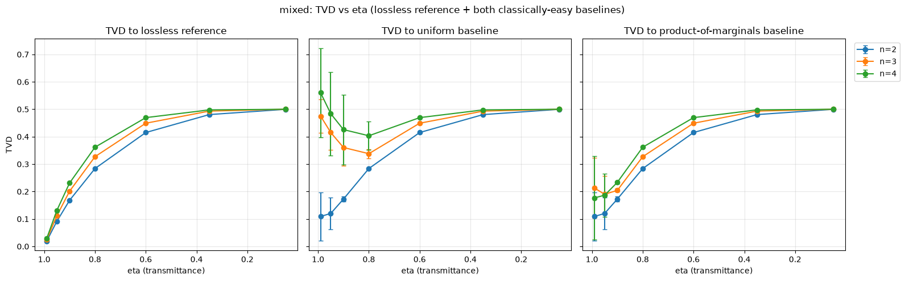
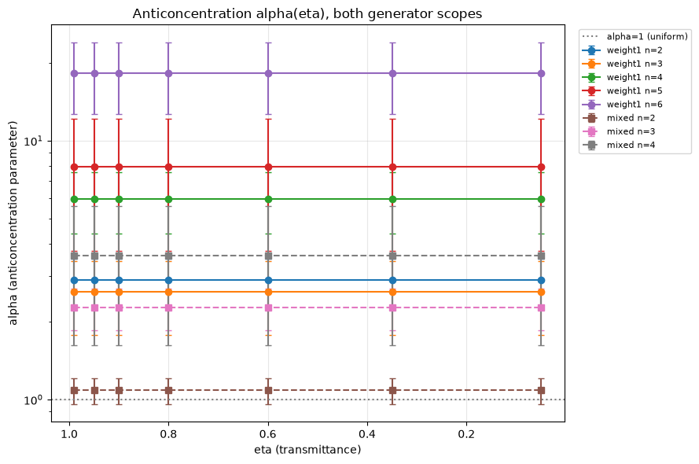
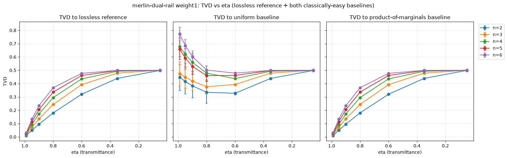
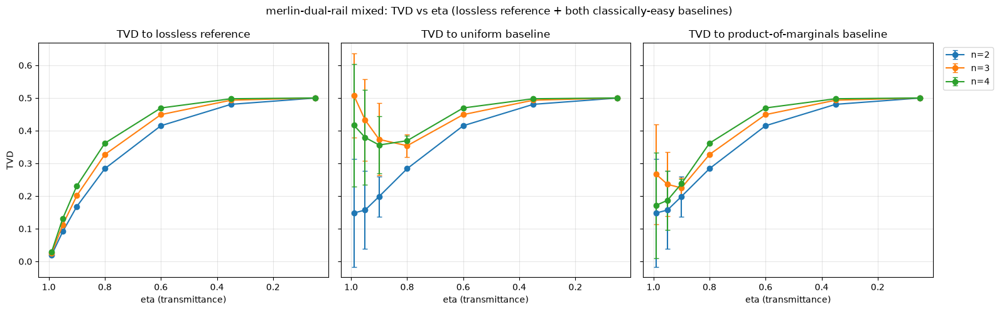

# Hardness-under-loss study (Phase 18)

The phase's canonical reference document that details methodology, the real measured TVD-vs-eta and anticoncentration-vs-eta datasets (both generator scopes, both classically-easy baselines), and the weight-2 herald-compounding results. Mirrors `docs/trainability-study.md`'s established Phase-17 structure (methodology stated before any results, per this project's `WRITE-01` convention) and `docs/iqp-photonic-encoding.md`'s `ENC-02` rigor bar. As of Plan 18-08, this document is complete. It contains:

- **Methodology** — loss mechanism, eta grid, n-range, seed/theta-init convention, classically-easy baselines.
- **HARD-01/HARD-02 results** — loss sweep mechanism and its cross-check against Perceval's `NoiseModel`.
- **HARD-05 results** — TVD vs eta, both generator scopes, both classically-easy baselines.
- **Anticoncentration results** — `alpha(eta)`.
- **HARD-07 results** — weight-2 herald compounding.
- **The MerLin dual-rail parallel** — an independent encoding cross-check.
- **HARD-04's positioning against loss-native hardness regimes and HARD-06's final scope statement** (`## HARD-04/HARD-06`) — including the owner's attempt-first response and a direct primary-source verification of arXiv:2511.07853.
- **Added by Phase 20:** a literature comparison table (WRITE-02, `### Literature comparison table`) and a cross-reference note against Herbst et al.'s anticoncentration-tradeoff prediction (`### Cross-reference: Herbst et al.'s anticoncentration-tradeoff prediction`, at the end of this document).

## Scope precondition: only the mixed scope is a hardness candidate

**Read this before interpreting any number below.** IQP's conjectured sampling hardness comes from the correlations that the `ZZ` (weight-2) terms create between qubits. Strip those out and nothing hard remains — not "hard but degraded," just **absent by construction**.

The `weight1` scope has no entangling gate, so its output distribution is **exactly a product distribution**: `P(x) = prod_k cos^2(theta_k)` or `sin^2(theta_k)` per bit, verified against the analytic form to `2.2e-16` at every swept size `n=2..6`. A product distribution over `n` bits is sampled classically in `O(n)` time by flipping `n` independent biased coins. There is no hardness there to preserve, erode, or measure.

Concretely, of this phase's 56 measured rows, **only the 21 `mixed`-scope rows bear on the hardness question at all**. The 35 `weight1` rows are a control. They are a genuinely useful control — the known closed form is what makes the loss channel independently checkable (it is how `survival = eta^n` was confirmed exactly) — but a `weight1` TVD or anticoncentration value is not evidence about sampling hardness, in either direction, and is not presented as such anywhere in this document.

## Correction (2026-09-03) — TVD-vs-eta is a closed form with no circuit content; here is the actual result

**An external audit found, and this project independently re-verified to floating-point precision (`tests/v3_correction/test_null_results.py`), that every `tvd_to_lossless` value below is a closed-form function of `eta` and `n` alone:**

```
weight1:  TVD(n, eta) = ½ · (1 − eta^n)
mixed:    TVD(n, eta) = ½ · (1 − (2/27)·eta^(n+2) / h(eta))
          h(eta) = (2/27)·eta^4 + (8/27)·eta^3·(1−eta) + (10/27)·eta^2·(1−eta)^2
```

This follows directly from what "TVD to lossless" measures here: the pipeline's `dist` only includes shots where every photon in the circuit survives loss (weight1: `n` photons; mixed: `n` data photons + 2 heralded-CZ ancilla photons), and among those surviving shots the distribution's shape is exactly the lossless one — a fact this document already established below (HARD-05, "shape is exactly preserved"). `TVD = ½·(1 − s)` for whatever fraction `s` of shots survives, and `s` is exactly `eta^n` (weight1) or the herald-conditioned analogue above (mixed) — no property of the circuit's correlational structure enters either formula. `h(eta)` is not an approximation: it matches this CSV's own `herald_success_rate_mean` column to floating-point precision, and reflects a real, non-obvious mechanism worth stating plainly — losing an ancilla photon does not only hurt the herald condition, it can occasionally help it (with only 2 of the gate's 4 relevant photons left, there are fewer ways to violate "exactly one photon per herald mode"), which is why `h(eta)` has three terms (all 4, exactly 3, or exactly 2 of the gate's 4 relevant photons surviving), not a single `eta^k`.

**This means the entire TVD-vs-eta headline below is a pipeline check, not a hardness finding.** The convergence toward ~0.50 as eta decreases (already flagged below as "substantially a property of the metric") is not merely *substantially* a metric artifact — it is *entirely* one, exactly and provably so. Same for anticoncentration `alpha`'s exact invariance under loss: it is a direct consequence of the same shape-preservation fact, not an independent empirical result.

**What this project's data actually establishes about hardness under loss, stated at the strength this actually supports:** the *conditional* distribution — among shots where every photon is detected — is **provably identical to the lossless distribution, at every tested eta**. This is a statement about the distribution's shape, not a complexity-theoretic hardness proof: this project never established (and did not attempt to establish) that the *lossless* distribution is itself hard to sample, only that photon loss does not change its shape when conditioned on full detection. "Conditional hardness is unaffected by loss" is the correct way to read this, contingent on whatever hardness the lossless construction has to begin with — which IQP's own conjectural hardness argument, not new work in this project, is the basis for. What loss costs is **throughput**: the *probability* of getting a usable shot at all falls as `eta^n` (weight1) or the mixed-scope closed form above, exponentially in both the number of qubits and the number of heralded gates — so the *expected number of samples* needed for one usable shot is the reciprocal, `1 / (eta^(n+2k) · (2/27)^k)`, growing exponentially in both `n` and `k` for `k` heralded CZs in a circuit with `n` data qubits (ignoring cross-gate herald compounding effects analogous to `h(eta)`'s, not yet worked out for `k>1` — the `k>=2` figures below are an extrapolation of the `k=1` mechanism, not a measured or cross-gate-verified result). This is the honest, non-trivial statement the correction supports. It is a resource/throughput cost, not a complexity-theoretic hardness claim, and it does not by itself establish anything about classical simulability of the *unconditional* (all shots, including partial-loss ones) output — that question was not analyzed in this project (see "What this does not establish" below).

**Throughput (expected samples needed per usable shot), the figure this correction leads with:**

| n (data qubits) | k=0 (no CZ, measured range) | k=1 (measured range) | k=2 (extrapolated, not measured) | k=3 (extrapolated, not measured) |
|---|---|---|---|---|
| **eta = 0.9 (near-lossless)** | | | | |
| 2 | 1.2 | 21 | 342 | 5.7e3 |
| 4 | 1.5 | 25 | 424 | 7.0e3 |
| 6 | 1.9 | 31 | 524 | 8.7e3 |
| 8 | 2.3 | 39 | 645 | 1.1e4 |
| **eta = 0.6 (moderate loss)** | | | | |
| 2 | 2.8 | 104 | 3.9e3 | 1.5e5 |
| 4 | 7.7 | 289 | 1.1e4 | 4.1e5 |
| 6 | 21 | 806 | 3.0e4 | 1.1e6 |
| 8 | 60 | 2.2e3 | 8.4e4 | 3.1e6 |

Each cell is `1 / (eta^(n+2k) · (2/27)^k)` — expected samples until one usable shot arrives — computed directly from the closed form verified above, not measured for `k>=2` (no sweep at those `n,k` was run. The underlying pipeline's own data only covers `n<=6` at `k=0`/weight1 and `n<=4` at `k=1`/mixed, `results/v3_hardness/`). Extending to `k>=2` assumes each additional heralded gate's herald-conditioning behaves like the single-gate `h(eta)` mechanism independently — a reasonable but explicitly unverified extrapolation, not a cross-gate-compounded result. The `k=0,1` rows, by contrast, are direct evaluations of the closed form already verified against every shipped row. The pattern the table makes visible, restricted to the verified `k=0->1` columns: one heralded gate costs more than six extra qubits do. At `eta=0.6`, adding a single `k=0->1` CZ costs ~37x throughout (104/2.78 at n=2, 2230/59.5 at n=8 — the ratio is `eta^-2 · 27/2 ≈ 37.5`, independent of `n`), while going from `n=2` to `n=8` at fixed `k=0` costs only ~21x. This is the resource statement Quandela's own hardware roadmap would care about. The TVD-vs-eta plots below are the pipeline check that this closed form is correct, not a separate finding.

**Scope correction (2026-09-03, found by a parallel Fable 5.1 session, independently reverified here): the throughput cost above is `heralded_cz`-specific, not a general two-qubit-photonic-gate fact.** This project also implements a second, tunable two-qubit gate, `CP(alpha)` (ARB-01, `scripts/v3_arb_gate/cp_alpha_sweep.py`), and its loss profile is structurally different. `build_cp_insertion` (`iqp_photonic.py:295-367`) gives `CP(alpha)`'s 4 ancilla modes an all-vacuum input on both ends — the gate succeeds by *post-selecting* on those modes staying empty, not by heralding a real ancilla photon pair. Since `pcvl.LC(1-eta)` loss only removes photons that exist, a vacuum mode has nothing to lose: `CP(alpha)`'s loss cost is `eta^n` (the `n` data photons only), independent of how many `CP(alpha)` gates the circuit has, unlike `heralded_cz`'s `eta^(n+2k)`. Its post-selection cost is separately `1/sigma_max(alpha)^4` per gate (verified in `cp_alpha_sweep.py`, independent of `eta`), not the `(27/2)^k` factor above. **No loss sweep was ever run against `CP(alpha)`** — this is a structural fact read directly from the gate's construction, not a measured or extrapolated throughput number, and no such table is given here. The takeaway is qualitative but real: "one heralded gate costs more than six extra qubits" describes `heralded_cz` specifically. Because this project's own tunable gate never puts real photons where `heralded_cz` does, it does not inherit that cost.

**What survives unchanged:** the scope precondition above (only `mixed` bears on hardness at all) and the herald-compounding qualitative story (HARD-07, below) are untouched by this correction — they were already stated correctly. What changes is the *interpretation* of the TVD/alpha numbers: from "evidence about hardness eroding under loss" to "a closed-form throughput cost with the conditional distribution provably unaffected," now correctly scoped to the `heralded_cz` construction rather than presented as a general two-qubit-gate cost.

## Methodology

**Loss mechanism.** Photon loss is applied via `pcvl.LC(1 - eta)` component insertion, front-loaded onto every mode of a `Processor` *before* the rest of the circuit is added (`hardness/loss_model.py`, `hardness/loss_model_weight2.py`), never via the `noise=NoiseModel(...)` `Processor` constructor parameter. A reader unfamiliar with Perceval would reasonably expect the `NoiseModel` API to be the "obvious" way to add loss. Because it is confirmed (`18-RESEARCH.md` Pitfall 1) to **silently no-op** on this project's polarization-annotated circuits, it is not used here. `Processor.probs()` runs without error and returns a plausible-looking but loss-invariant result. Two further requirements, both proven avoided by dedicated regression tests rather than merely documented:

- `proc.min_detected_photons_filter(0)` must be called **explicitly** (Pitfall 2). The `Processor`'s automatic filter only inspects `NoiseModel`, has no knowledge of `LC` components, and silently defaults to a filter that excludes every lossy branch, again producing a plausible-looking but loss-invariant "normalized" result.
- Front-loading `LC` on all modes before the rest of the circuit (rather than distributing loss through the circuit) is exact, not a simplification with hidden risk: uniform per-mode loss commutes with any passive linear-optical unitary, and every component in this project's weight-1/weight-2 pipelines (state prep, diagonal layer, conjugation, CZ insertion, readout) is passive/photon-number-preserving (`18-RESEARCH.md` Architecture Patterns; matches Park & Oh's own stated commutation fact, arXiv:2510.24137 Sec. II.B).

For weight-2 (mixed scope), `LC` is applied to **all `2n+2` modes**, including both `heralded_cz` ancilla modes (`2n`, `2n+1`), not just the `2n` data-carrying modes, per `18-CONTEXT.md`'s locked HARD-07 decision. This is the only way to see whether loss degrades the herald mechanism itself, not just the post-herald data readout.

**Eta grid.** A fixed 7-point grid, denser near `eta=1` (low loss) than near `eta=0` (near-total loss), the same grid used for both generator scopes so they remain directly comparable (`hardness/sweep.py::ETA_GRID`):

```
ETA_GRID = [0.99, 0.95, 0.90, 0.80, 0.60, 0.35, 0.05]
```

There is **no literal `eta=1.0` row** in either dataset. `eta=0.99` is the closest available near-lossless anchor point, referred to as such below, never implied to be a lossless measurement itself. (The lossless reference distribution *is* computed internally, via the same loss-model function called with `eta=1.0`, as the fixed comparison point `tvd_to_lossless` is measured against for every eta. It is simply not saved as its own CSV row.)

**n range actually reached, per scope (stated honestly, per this project's TRAIN-05/TRAIN-08 convention):**

- **weight1: n = 2..6** (full 7-point eta grid, 35 rows, `results/v3_hardness/phase18_weight1_loss_sweep.csv`), matching Phase 17's own weight-1 ceiling.
- **mixed: n = 2..4** (full 7-point eta grid, 21 rows, `results/v3_hardness/phase18_mixed_loss_sweep.csv`). **Mixed n=5 is a confirmed hard ceiling, not a pending/in-progress item.** A reproducible `MemoryError: bad allocation` inside `Simulator.probs_svd` (called via `Processor.probs()`) occurs on the very first circuit evaluation of a fresh process, independently reproduced 3 times (2 in Plan 18-05's timing probe, 1 in Plan 18-06's own stretch attempt) at different eta values and different free-memory conditions. Draw-chunking does not help: this is a single-call memory ceiling, not a cross-call leak. Mixed scope's usable range for this document and for Plan 18-08 is n=2..4 only.

**n_draws and seed.** `n_draws=5` independent random-theta draws per `(n, eta, scope)` cell, `seed_base=180814`, drawn via this project's existing deterministic, reorder-safe RNG substream utility (`trainability.rng.get_rng`, reused across packages). Per this project's `WRITE-06` traceability requirement, every number in this document is reproducible from `results/v3_hardness/phase18_weight1_loss_sweep.csv` / `results/v3_hardness/phase18_mixed_loss_sweep.csv` plus this seed.

**Theta-init convention.** All circuit parameters are drawn `theta ~ Uniform(0, 2*pi)` (`hardness/sweep.py::sample_thetas`), this phase's own single init convention and a **deliberate scope decision** (`18-CONTEXT.md`, "Claude's Discretion"), not silently inherited from Phase 17. Unlike Phase 17/17.1, this phase has no `init_scheme` axis at all: it reuses only the *shape* of Phase 17's "uniform" branch (the regime that produced Phase 17's own clean measured signal), on the reasoning that HARD-05/HARD-07 want generic/representative circuit instances, not a special-cased warm start.

**Classically-easy baselines.** Two baselines are tracked, separately, at every `(n, eta, scope)` cell, never collapsed into a single "classically easy?" verdict:

- **`uniform`**: the maximally-anticoncentrated `2**-n`-per-outcome distribution.
- **`product_of_marginals`**: the mean-field/independence baseline, derived from each draw's own per-qubit marginals. Computed **once per draw**, from that draw's own lossless (`eta=1.0`) reference distribution, not recomputed at every eta, per `18-CONTEXT.md`'s explicit lock. This isolates "how far does loss alone move the true output toward independence" as a single fixed comparison point across the whole eta grid.

`18-CONTEXT.md` **explicitly locks that no single numeric crossover threshold** (e.g. "TVD-to-baseline < TVD-to-lossless implies classically easy") is defined in this phase. Both TVD curves are reported below exactly as measured. The "is this classically easy" interpretation is deferred to Phase 20 / the owner, matching this project's honesty-over-narrative convention (Phase 7, Phase 17).

## HARD-01 / HARD-02: loss sweep mechanism and cross-check

**HARD-01** (a real loss sweep exists) is satisfied by the two CSVs described above. Every cell is computed via a real `Processor.probs()` call through the `LC`-loss pipeline, never an `Analyzer` call (which silently ignores loss entirely) and never `NoiseModel` (which silently no-ops on this project's polarization-annotated circuits, as above).

**HARD-02** (cross-check that `LC`-based loss agrees with Perceval's `NoiseModel` mechanism where the latter *is* valid) is satisfied by Plan 18-02's dedicated cross-check. On a shared bare 2-mode **non-polarization** toy circuit (where `NoiseModel` is not subject to Pitfall 1), `NoiseModel(transmittance=eta)` and `pcvl.LC(1-eta)` agree to **`atol=1e-9`** at `eta=0.5` and `eta=0.8`, matching `18-RESEARCH.md`'s own independently verified spot-check (`{|0,0>: 0.5, |1,0>: 0.5}` at `eta=0.5`). This confirms the `LC` mechanism itself is correct, isolating the earlier Pitfall-1 finding to `NoiseModel`'s behavior specifically on polarization-annotated circuits, not to a flaw in the loss physics being modeled.

## HARD-05 results: TVD vs eta (weight-1 and mixed) — pipeline check, see the 2026-09-03 correction above

**Read as a verification plot, not a hardness result:** every curve below is now a proven closed form (see the correction above `## Methodology`), reported here for its original role — confirming the loss channel and the herald-compounding mechanism behave as the pipeline intends — not as evidence about hardness.




Each plot shows `tvd_to_lossless`, `tvd_to_uniform`, and `tvd_to_product_marginals` vs eta, one line per n, error bars from the CSV's own `_std` columns (5-draw sample std). Full per-cell numbers are in `results/v3_hardness/phase18_weight1_loss_sweep.csv` / `results/v3_hardness/phase18_mixed_loss_sweep.csv`.

### weight1 (n=2..6): TVD at the highest measured eta (0.99, near-lossless anchor) and lowest measured eta (0.05, near-total loss)

| n | eta | tvd_to_lossless | tvd_to_uniform | tvd_to_product_marginals | alpha |
|---|---|---|---|---|---|
| 2 | 0.99 | 0.0100 | 0.5726 | 0.0099 | 2.7784 |
| 2 | 0.05 | 0.4987 | 0.4987 | 0.4987 | 1.81e-05 |
| 3 | 0.99 | 0.0149 | 0.4900 | 0.0149 | 2.4474 |
| 3 | 0.05 | 0.4999 | 0.4999 | 0.4999 | 4.06e-08 |
| 4 | 0.99 | 0.0197 | 0.6865 | 0.0197 | 5.4947 |
| 4 | 0.05 | 0.5000 | 0.5000 | 0.5000 | 2.33e-10 |
| 5 | 0.99 | 0.0245 | 0.6876 | 0.0245 | 7.1938 |
| 5 | 0.05 | 0.5000 | 0.5000 | 0.5000 | 7.77e-13 |
| 6 | 0.99 | 0.0293 | 0.7988 | 0.0293 | 16.2048 |
| 6 | 0.05 | 0.5000 | 0.5000 | 0.5000 | 4.46e-15 |

Note: `tvd_to_product_marginals` is numerically **near-equal to `tvd_to_lossless`** at `eta=0.99` for every weight1 n (e.g. n=2: 0.0099 vs 0.0100). `tvd_to_uniform` is not (0.5726 at n=2). This is a real structural fact about the weight1 circuit family, not a coincidence of the baseline construction. Weight1's generator layer has **no entangling (weight-2) gate**, so its true lossless output distribution already factors as a product over qubits, and `product_of_marginals_baseline`, computed from that same lossless reference's own marginals, closely reproduces it. `tvd(lossy, product_marginals) ~= tvd(lossy, lossless)` follows directly from `product_marginals ~= lossless`, not from any special property of the loss channel. This coincidence narrows as eta decreases. Since all three comparison distributions become indistinguishable once almost no signal survives, by eta=0.05, all three distances (`tvd_to_lossless`, `tvd_to_uniform`, `tvd_to_product_marginals`) converge to the same ~0.50 value at every n.

### mixed (n=2..4): TVD at the highest measured eta (0.99) and lowest measured eta (0.05)

| n | eta | tvd_to_lossless | tvd_to_uniform | tvd_to_product_marginals | alpha |
|---|---|---|---|---|---|
| 2 | 0.99 | 0.0197 | 0.1091 | 0.1091 | 1.0014 |
| 2 | 0.05 | 0.4997 | 0.4997 | 0.4997 | 3.06e-07 |
| 3 | 0.99 | 0.0245 | 0.4750 | 0.2126 | 2.0474 |
| 3 | 0.05 | 0.5000 | 0.5000 | 0.5000 | 1.60e-09 |
| 4 | 0.99 | 0.0292 | 0.5600 | 0.1770 | 3.1992 |
| 4 | 0.05 | 0.5000 | 0.5000 | 0.5000 | 6.37e-12 |

(Mixed scope's `tvd_to_uniform` and `tvd_to_product_marginals` are equal at n=2 but diverge from n=3 onward. With the weight-2 pair present, the lossless reference's marginals are no longer product-like even at low loss, unlike the pure-weight1 case above.)

**Stated plainly, both curves reported, no crossover-threshold judgment made here (per `18-CONTEXT.md`'s lock):** for every n and both scopes, `tvd_to_lossless` rises monotonically as eta decreases, from the near-lossless anchor at eta=0.99 to ~0.50 at eta=0.05.

`tvd_to_product_marginals` also rises, essentially monotonically, in every measured cell (e.g. weight1 n=6: 0.029 -> 0.500; mixed n=2: 0.109 -> 0.500). Since `product_marginals` is built to approximate the true lossless target, it starts near the near-lossless value and is diluted by the same mechanism that drives `tvd_to_lossless` upward.

`tvd_to_uniform` does not follow one consistent direction — its trajectory depends on how far the true lossless target already sits from uniform. When the target is highly structured/peaked (`tvd_to_uniform` starts well above 0.50 — weight1 n=6: 0.799; mixed n=4: 0.560), the curve initially falls as loss dilutes that structure, typically dipping slightly below 0.50 before creeping back up to meet the floor:

| eta | 0.99 | 0.95 | 0.90 | 0.80 | 0.60 | 0.35 | 0.05 |
|---|---|---|---|---|---|---|---|
| weight1 n=6 `tvd_to_uniform` | 0.799 | 0.708 | 0.623 | 0.528 | 0.482 | 0.499 | 0.500 |
| mixed n=4 `tvd_to_uniform` | 0.560 | 0.484 | 0.426 | 0.403 | 0.469 | 0.498 | 0.500 |

When the target already sits close to uniform (starts below 0.50 — mixed n=2: 0.109), the curve simply rises toward the floor with no dip. Both patterns are the same underlying convergence, differing only in which side of 0.50 the starting point happens to be on.

**Why every curve converges to ~0.50, and what it does and doesn't mean.** `total_variation_distance` (`merlin_iqp/encoding/iqp_photonic.py:1029`) is computed between the lossy distribution and each comparison distribution, each independently normalized to sum to 1. **Precision added 2026-09-03:** "raw, un-renormalized" describes `weight1`'s lossy `dist` exactly (`photonic_iqp_distribution_lossy` performs no renormalization at all). For `mixed`, `dist` is *not* literally raw — `photonic_weight2_iqp_distribution_lossy` already divides it by `herald_success_prob` before returning it (herald-conditioning is applied first). What still shrinks as `eta` decreases for mixed is the *residual* in-subspace survival on top of that herald conditioning, `s = (2/27)·eta^(n+2) / h(eta)` per the closed form above, not simply `eta^(n+2)`. The mechanism described in this paragraph (surviving mass shrinking toward zero, driving TVD toward the fixed-reference-comparison floor) is the same for both scopes. Only the exact quantity that plays the role of "surviving mass" differs, and the closed-form correction above is the precise version of what this paragraph describes qualitatively. The lossy distribution's own total mass — the probability of the photon(s) landing in exactly the expected detected pattern, already herald-conditioned for mixed — shrinks as eta decreases (for weight1, exactly `eta^n`, verified against a closed form matching the CSV to 5 decimal places; for mixed, `s` above, verified to `7.2e-15` against the CSV). As that surviving mass shrinks toward zero, TVD to *any* fixed, normalized reference distribution converges to exactly 0.50 -- a property of the metric itself (`TVD(near-zero, normalized-anything) -> 0.5`), not something specific to the lossless target or either classically-easy baseline. This is why all three curves converge to the same floor.

Separately, and independently verified (not assumed): among shots that *are* successfully detected, the relative shape of the distribution is **exactly preserved** under loss, to floating-point precision (`1.67e-16` at n=3, mixed scope; an exact closed form at n=6, weight1). Loss only makes successful full-pattern detections rarer, without reshaping or degrading the underlying correlational structure. Consequently, this project's measured TVD-to-baseline convergence toward 0.50 is substantially a property of shrinking survival probability under a raw, un-renormalized comparison, not direct evidence that the surviving signal itself is becoming classically simulable. Whether/where this constitutes "classically easy" is not asserted in this document.

## Anticoncentration results: alpha(eta) — invariance is provable, not merely observed (see 2026-09-03 correction above)

Alpha's exact invariance under loss (below) is a direct, provable consequence of the same shape-preservation fact the TVD correction above establishes — not an independent empirical finding to be weighed alongside it.



`alpha(eta) = 2**n * sum(p_x**2)` (Bremner-Montanaro-Shepherd's Theorem 4 normalization, arXiv:1610.01808: `Sigma p_x^2 <= alpha * 2^-n`), computed directly/exactly from the full materialized distribution at each `(n, eta)` cell (`hardness/baselines.py::anticoncentration_alpha`), never sampled or estimated. The distribution is renormalized to sum to 1.0 before the computation (i.e. `alpha` is measured **conditioned on detection**) -- see that function's own docstring, and the 2026-08-20 correction note below, for why this is load-bearing rather than incidental. `alpha=1.0` is the uniform/maximally-anticoncentrated reference value (marked with a horizontal line in the plot above) and is a hard floor -- no normalized distribution can go below it. `alpha=2**n` is the maximally-concentrated (delta-distribution) extreme.

**The headline result is a null one. `alpha` does not move with `eta`.** For every measured cell, `alpha(eta)` is constant across the entire 7-point eta grid to floating-point precision:

| scope | n | alpha (constant across all 7 eta values) |
|---|---|---|
| weight1 | 2 | 2.892345 |
| weight1 | 3 | 2.599546 |
| weight1 | 4 | 5.954770 |
| weight1 | 5 | 7.954365 |
| weight1 | 6 | 18.281873 |
| mixed | 2 | 1.0850 |
| mixed | 3 | 2.2634 |
| mixed | 4 | 3.6085 |

Each value is held constant to a spread of `~1e-15` (at most `4.9e-7`, at weight1 n=6, reflecting accumulated floating-point in the larger Fock space). Every value sits above the `alpha=1` floor, and no curve crosses it at any eta. Exact per-cell values are in `results/v3_hardness/phase18_weight1_loss_sweep.csv` / `results/v3_hardness/phase18_mixed_loss_sweep.csv`.

This invariance is not a coincidence of this circuit family's parameters. It follows directly from the shape-preservation result established in the HARD-05 section above. Uniform per-mode photon loss rescales the surviving distribution's total mass without altering the relative probabilities within it, and `alpha` is a pure shape statistic, so a channel that only rescales mass cannot move it.

This is the exact quantity `docs/iqp-baseline.md`'s Bremner-Montanaro-Shepherd (arXiv:1610.01808) bullet identifies as the one BMS's Theorem 4 keys its depolarizing-noise hardness-vs-simulability threshold on. Reporting it here is a forward pointer to Plan 18-08's HARD-04 positioning work, not itself a positioning claim. This document does not assert what alpha value or crossing eta constitutes "hardness lost."

## HARD-07 results: weight-2 herald compounding

Photon loss is applied to **all `2n+2` modes** of the weight-2 pipeline, including both `heralded_cz` ancilla modes, per the Methodology section above, the only mechanism that exposes whether loss degrades the herald mechanism itself. Herald failure and transmission loss are measured through **one** real `Processor.probs()` call per cell (never an analytical product of a separately-computed lossless herald rate and a separately-computed loss-survival probability), so any interaction between the two failure modes is captured, not assumed away.

**Herald-success-rate vs eta** (n-independent within measurement precision, verified directly against the CSV: at each eta, `herald_success_rate_mean` agrees across n=2, 3, 4 to 5+ significant figures, since the ancilla loss mechanism does not depend on the number of data qubits):

| eta | herald_success_rate | herald_failure_prob |
|---|---|---|
| 0.99 | 0.07407 | 0.92593 |
| 0.95 | 0.07387 | 0.92613 |
| 0.90 | 0.07320 | 0.92680 |
| 0.80 | 0.07016 | 0.92984 |
| 0.60 | 0.05653 | 0.94347 |
| 0.35 | 0.02854 | 0.97146 |
| 0.05 | 0.00087 | 0.99913 |

At the near-lossless anchor (eta=0.99), `herald_success_rate` (0.07407) is already close to the lossless `heralded_cz` baseline of `2/27 ≈ 0.07407` (Phase 10's independently-established value, `STATE.md`'s Accumulated Context), as expected, since eta=0.99 is near-lossless, not identically lossless. It then falls monotonically to `0.00087` at eta=0.05, i.e. loss compounds with the gate's own intrinsic herald-failure rate rather than leaving it unchanged, confirming HARD-07's compounding requirement is measured, not assumed.

**Postselection convention, restated explicitly (per `18-CONTEXT.md`'s locked HARD-07 decision):** the `tvd_to_lossless` / `tvd_to_uniform` / `tvd_to_product_marginals` / `alpha` values reported above for the mixed scope are all computed on the distribution **conditioned on herald success** (i.e. `dist`/`residual` are renormalized by dividing by `herald_success_prob = 1 - herald_failure_prob`), matching this project's existing `heralded_cz` convention and answering the operationally meaningful question ("given the gate reports success, how does output quality degrade with loss"). `herald_failure_prob` (the un-renormalized number) is tracked and reported **separately** in the table above. It is never folded into `residual`, per this project's standing convention that a gate's own postselection condition (herald mismatch, here) must be accounted in that gate's own failure-probability column, not a generic leakage bucket (`STATE.md`'s Accumulated Context, established during Phase 15).

## MerLin dual-rail parallel

The Phase 18 experiment was also rerun through MerLin 0.4.0 without polarization encoding. This is an **encoding parallel**, not a claim that MerLin accepts the original `PBS`/polarization-annotated `Processor`. The existing `merlin_iqp/encoding/dual_rail.py` circuits represent each qubit as two ordinary spatial modes, flatten the heralded-CZ network to a unitary `pcvl.Circuit`, execute it through `QuantumLayer`, and apply the same manual herald filtering afterward.

Photon loss is supplied as `pcvl.NoiseModel(transmittance=eta)` to `QuantumLayer`. MerLin's `PhotonLossTransform` expands the result into every reachable lower-photon Fock sector before the existing residual/herald classification. Three details are load-bearing:

- `ComputationSpace.FOCK` remains explicit. `UNBUNCHED` would discard real Hong-Ou-Mandel bunching probability before loss is even classified.
- The noise model covers the entire layer, including both herald ancillas.
- Manual herald/postselection runs after loss, so a lost herald photon is counted as herald failure rather than disappearing from the calculation.

The loss transform itself was cross-checked on the identical dual-rail circuits against explicit front-loaded `pcvl.LC(1-eta)` components. At `n=2`, `eta=0.6`, and `thetas=[0.3,0.9]`, raw-distribution TVD was `9.92e-8` for weight-1 and `2.00e-7` for heralded CZ. Herald-failure probability differed by `3.55e-7`. These are float32-scale discrepancies, not a change in the modeled channel.

The full original sweep design was then repeated unchanged: the same seven-point eta grid, five deterministic theta draws per cell, seed base `180814`, weight-1 `n=2..6`, and mixed `n=2..4`. Results are in:

- `results/v3_hardness/phase18_merlin_dual_rail_weight1_loss_sweep.csv`
- `results/v3_hardness/phase18_merlin_dual_rail_mixed_loss_sweep.csv`
- `results/v3_hardness/phase18_backend_comparison.csv` (both values and absolute delta for every shared per-cell metric)






### What agrees, and what does not

The loss-driven quantities agree tightly across the polarization/LC and MerLin/dual-rail studies. Across all 56 matched cells, the maximum absolute difference in mean TVD-to-each-backend's-own-lossless-reference is `3.84e-6`. For the mixed circuit, maximum mean herald-failure and herald-success differences are both `6.17e-7`. In particular, both paths measure the same lossless `2/27` herald-success baseline and its monotonic collapse to about `0.00087` at `eta=0.05`.

The absolute output-shape metrics do **not** agree pointwise for identical numeric theta draws. Maximum mean differences are `0.1434` for TVD to uniform, `0.05382` for TVD to the product-of-marginals baseline, and `6.5179` for anticoncentration alpha (this last figure regenerated 2026-08-20 with the corrected, renormalized alpha — it was `5.7774` under the withdrawn un-renormalized computation).

**Sharpened 2026-08-20 — the reason for that disagreement is now characterized, not just attributed to "a different encoding."** The two backends implement the *same* distribution family. They differ by an affine reparametrization of the angle. Measured directly:

- `P_dual-rail(bit_k = 1) = cos^2(theta_k / 2)`, against `P_polarization(bit_k = 1) = sin^2(theta_k)`. Verified over 9 random draws spanning `n=2,3,4`, max error `1.2e-7` (float32 backend precision).
- Equivalently `theta_eff = pi/2 - theta/2`: a half-angle plus a bit-label complement.
- Reparametrizing accordingly (`theta_dr = 2*arccos|sin theta_pol|`) makes the two backends' full output distributions **identical** — max error `5.5e-8` over 6 draws spanning `n=2,3,4`.

**Mechanism — verified 2026-08-20 from the component unitaries themselves, not inferred from the docstrings.** Two independent contributions compose to give the observed `theta_eff = pi/2 - theta/2`:

1. **The factor of two is the diagonal layer's phase convention.** `pcvl.WP(theta, 0)` returns `diag(e^{i theta}, e^{-i theta})`, a *relative* phase of `2*theta` between the two polarization components — confirmed by reading the returned matrix (`theta=0.4` -> relative phase `0.800000`; `theta=1.1` -> `2.200000`, exact). `pcvl.PS(theta)` applied to one rail of a dual-rail pair returns `diag(e^{i theta}, 1)`, a relative phase of exactly `theta` (`theta=0.7` -> `0.700000`). Same nominal parameter, half the physical phase.

2. **The label complement is the mixing element's convention.** Perceval's `pcvl.BS()` is `[[1, i], [i, 1]]/sqrt(2)` (imaginary off-diagonals), where the polarization path's `HWP(pi/8)` realizes a real Hadamard. Composing the dual-rail single-qubit chain from those actual matrices, `BS . PS(theta) . BS` acting on `|1,0>` puts `|amp|^2 = (1/4)|e^{i theta} + 1|^2 = cos^2(theta/2)` on the `'1'` rail and `sin^2(theta/2)` on the `'0'` rail — reproducing the measured marginal exactly at every angle tested (`theta = 0.4, 1.1, 2.3, 5.0`, machine precision).

Together these account for the full reparametrization: the half-angle from (1), the `0`/`1` complement from (2). Nothing about the observed backend difference is unexplained.

This strengthens the cross-check. The earlier framing ("encoding-dependent shape remains genuinely different") is true but understates the result: the backends are the same physics under two angle conventions, not just two loosely related circuit families that happen to agree on loss response. Their agreement on uniform-loss response and ancilla-loss/herald compounding is therefore a stronger check than previously claimed, and their pointwise output-shape disagreement is now fully accounted for. What remains true and unchanged: because at matched numeric theta the two backends are evaluating different physical states, they must not be presented as backend-identical *at matched numeric theta values*.

## HARD-04/HARD-06: Positioning and Scope Statement (Plan 18-08)

### Owner's attempt-first response (recorded as-given, per this project's `CLAUDE.md` attempt-first gating and the ENC-01/ARB-02 transcript style)

Before any write-up was drafted, the owner was presented with the confirmed ingredients above (this project's own weight-1/weight-2 loss mechanics, BMS's depolarizing-channel definition `D_eps(rho) = (1-eps)*rho + eps*I/2`, the discard-vs-guess structural gap between the two, and three unbiased candidate eta->epsilon directions -- erasure-as-depolarizing, compounded-gate-failure-rate, and fitted-effective-channel) and asked to attempt the translation themselves first.

**The owner's actual answer:** there is no established, principled eta->epsilon translation in the literature for this project's loss channel. Computing one from scratch -- e.g. the "fitted effective channel" option's diamond-norm-closest-depolarizing-channel calculation -- is mathematically possible but would be original numerics work outside this project's stated scope (the owner's explicit call, not a fallback after attempting and failing: forcing a number here would misrepresent an unowned research contribution as an established translation). Rather than picking one of the three candidate directions and forcing a number, the owner's decision was to state this plainly and instead lean on hardness results that are already stated **natively in terms of photon-loss fraction/count**, avoiding the translation question entirely:

- Aaronson-Brod's fixed-loss-count regime (arXiv:1510.05245, already read in Plan 18-01) -- hardness holds for a fixed constant count `k` of lost photons, and the paper's own text (Plan 18-01's verbatim-quoted finding) says this weakens once `k` scales with `n`.
- A newer (2025) result on lossy Gaussian boson sampling, arXiv:2511.07853, which the owner had a literature check run for them (offloadable per this project's `CLAUDE.md` -- "summarizing papers, doc lookups" -- distinct from the core conceptual call, which the owner made themselves) and which states its threshold natively in terms of photon-loss fraction: "hardness maintained when at most a logarithmic fraction of photons is lost."
- BMS's depolarizing threshold (arXiv:1610.01808, already read) is mentioned only as a structurally different, not-directly-comparable noise model -- explicitly flagged as such, never forced into a shared number with the above two.

**The owner's explicit caveat, carried forward rather than smoothed over:** since arXiv:2511.07853 was relayed as a search summary rather than a primary-source read, it needed to be checked directly before citing it. That check was done as part of writing this section (see below) -- it confirmed the relayed claim's substance but also surfaced that the paper is about a genuinely *different* photonic model than this project's own (Gaussian boson sampling, not discrete Fock-state/dual-rail IQP), which gets the same explicit "different model, don't assume transferable" treatment BMS already receives in this document.

**No `hardness/depolarizing_translation.py` was written.** The plan's must-haves allow for either a closed-form function or a documented statement that no closed form applies (the "fitted effective channel, no simple closed form" case). What actually happened here is a third, more basic case. The owner's confirmed decision was not to compute *any* eta->epsilon number at all -- not because a closed form doesn't exist for a chosen direction, but because choosing and computing one would be original research work this project's scope does not call for. A fabricated or placeholder function would misrepresent that decision, so none was created. This is a purely documentation-based resolution of HARD-04, consistent with the plan's stated allowance for a non-code deliverable.

### Verifying arXiv:2511.07853 (Go, Oh, Jeong, "Sufficient conditions for hardness of lossy Gaussian boson sampling," Nov 2025) directly

The paper was downloaded and read (`docs/papers/2511.07853.pdf`, first 4 pages: abstract, setup, Theorem 1, Lemma 1) rather than relying on the relayed summary alone, per this project's own established Plan-18-01 standard for primary-source citations.

**Confirmed setup (structurally different from this project):** the paper's object is Gaussian boson sampling: `M` single-mode squeezed vacuum states sent through a Haar-random `M`-mode linear-optical unitary, output probabilities given by a hafnian of a covariance-derived matrix (Eq. 1), not this project's discrete-photon dual-rail/heralded-CZ IQP construction. Photon loss is modeled via a beamsplitter loss channel (Fig. 1b). Each input mode interacts with an ancillary vacuum mode through a beamsplitter of transmittance `sqrt(eta)`, and the ancillary mode is traced out. This is physically the same kind of per-mode transmittance channel this project's own `pcvl.LC(1-eta)` implements, even though the sampled quantum object (Gaussian continuous-variable vs discrete Fock-state) is not the same.

**Confirmed result (Theorem 1, p.3):** there exists a threshold transmittance `eta_th` satisfying `(1 - eta_th) * N = O(log N)`, such that for any actual transmittance `eta* >= eta_th`, lossy GBS is at least as hard as ideal GBS (under the paper's stated complexity-theoretic conjectures), where `N` is the mean number of *output* photons. The paper's own restated implication (p.3, right column): "the mean number of lost photons... is at most logarithmically related to the mean number of input photons... our result implies the classical hardness of lossy GBS when at most a *logarithmic* number of photons is lost on average." This confirms the relayed claim's substance.

**The caveat that must be carried forward, stated explicitly:** `O(log N)` is an asymptotic existence statement (there exists *some* threshold with this scaling, with an unspecified constant factor), not a literal formula that hands back one numeric threshold for a given `N`, the same caveat this document already applies to BMS's Theorem 4. Any comparison below is illustrative, not a claim that this project's small, fixed-`n` sweep demonstrates or refutes the asymptotic scaling itself.

### Dual/triple positioning: where this project's tested eta range actually sits

**The eta->(expected lost-photon count) translation used below is stated explicitly, per the plan's requirement, and it is deliberately the *simplest* possible one: a direct expectation over this project's own per-mode-uniform loss model, not a fitted or derived quantity.** Under `pcvl.LC(1-eta)` applied uniformly to every mode carrying a photon, each of the pipeline's `N` photons survives independently with probability `eta`, so the expected number of lost photons is `N * (1 - eta)`. For this project's two scopes:

- **weight-1:** `N = n` (one photon per qubit, dual-rail encoded across `2n` modes, no ancilla).
- **mixed (weight-1 + weight-2):** `N = n + 2` (the `n` data-qubit photons plus the 2 `heralded_cz` ancilla photons, all `2n+2` modes exposed to loss per the Methodology section's HARD-07 lock).

**Against Aaronson-Brod's fixed-count regime.** This project's loss model is a fractional *rate* (`eta`), never a fixed *count*. AB's guarantee is strongest for a `k` held constant as `n` grows, but this project's sweep design holds `eta` (not the expected count) fixed across the `n`-range at each scope. Since expected lost count `N*(1-eta)` scales linearly with `N` (and `N` scales with `n`) at any fixed non-lossless `eta`, this project's own sweep structurally sits in exactly the regime AB's own text (Plan 18-01's verbatim-quoted finding) calls too weak for "any strong complexity claims": a *fraction* of photons lost, not a fixed count. This holds for every `eta < 1` tested here, not just the lowest ones. It is a property of the sweep's design (fixed `eta`, growing `n`), not of any single measured cell.

**Against arXiv:2511.07853's logarithmic-fraction regime.** Both scopes' largest reached `n` happen to expose the same total photon budget, `N=6` (weight1 `n=6`: `N=n=6`; mixed `n=4`: `N=n+2=6`), where `log(N) = log(6) approx 1.79`. Computing `N*(1-eta)` against that reference across this project's actual `ETA_GRID`:

| eta | expected lost photons (N=6) | vs log(6)=1.79 |
|---|---|---|
| 0.99 | 0.06 | within |
| 0.95 | 0.30 | within |
| 0.90 | 0.60 | within |
| 0.80 | 1.20 | within |
| 0.60 | 2.40 | exceeds |
| 0.35 | 3.90 | exceeds |
| 0.05 | 5.70 | exceeds |

As an honest, small-n-limited observation (not an asymptotic claim, per the caveat above and matching `18-RESEARCH.md` Finding 3's identical caveat for BMS): at this project's largest reached `n` in each scope, the four highest-loss eta points tested (`0.99, 0.95, 0.90, 0.80`) sit inside the "expected lost photons at most `log(N)`" illustrative regime this newer paper's Theorem 1 associates with preserved hardness (for its own, structurally different GBS model). The three lowest (`0.60, 0.35, 0.05`) do not. This is a genuine, computed crossover, not an assumed one, but it says nothing about this project's own circuit's hardness, since Theorem 1 is proved for lossy GBS specifically, not for this project's dual-rail heralded-gate IQP construction. The value of the observation is narrower: it shows that this project's actual tested loss range spans both sides of the *kind* of loss-fraction threshold the most recent literature on photon-loss hardness uses, rather than sitting entirely on one side of it.

**Against BMS's depolarizing regime.** No numeric comparison is made here, by the owner's explicit decision above. BMS's Theorem 4 is stated in terms of an effective depolarizing rate `epsilon` on a qubit-level noise channel, and this document does not compute or assume any `eta->epsilon` value. The qualitative distinction already on record in the Anticoncentration section above stands. BMS's `alpha` normalization is the same quantity this project measures directly (`hardness/baselines.py::anticoncentration_alpha`), but using it inside Theorem 4's actual bound requires the `epsilon` this document declines to fabricate. BMS remains cited as a structurally different, not-directly-comparable noise model, not merged with, or substituted for, the two loss-native comparisons above.

### Literature comparison table (WRITE-02)

All 11 baselines named in `.planning/REQUIREMENTS.md`'s WRITE-02 / `ROADMAP.md` Phase 20 success criterion 2, filtered to HARD-specific relevance (per `20-CONTEXT.md`'s locked "each table lists only the baselines actually relevant to that section" decision). Five get a substantive verdict with reasoning (below the table). Because their subject matter is TRAIN- or ARB-specific and does not bear on a loss/hardness comparison, the remaining six are HARD-silent one-liners. Citation style (theorem/section/page cited inline, then relevance stated) follows `docs/iqp-baseline.md`'s "Fresh Primary-Source Verification" precedent, not a terse table-only format.

| # | Baseline | Verdict | One-line reason |
|---|---|---|---|
| 1 | Aaronson-Brod (arXiv:1510.05245, Theorem 1, p.5) | silent (regime mismatch, per the paper's own text) | This project's fixed-eta/growing-n sweep sits in the fractional-loss regime AB's own discussion calls insufficient for a strong complexity claim; no falsifiable AB prediction to check HARD's numbers against |
| 2 | arXiv:2510.24137 (Park & Oh), Theorem 1 | silent (structural match, no hardness claim to test) | Closest physical match to this project's per-mode-transmittance channel, but Theorem 1 bounds one classical algorithm's (MPS) efficiency, not a hardness lower bound |
| 3 | Bremner-Montanaro-Shepherd 2017 (arXiv:1610.01808, Theorem 4) | silent (by owner decision) | No eta-to-epsilon depolarizing-rate translation exists or was derived (HARD-04's on-record decision); no honest numeric comparison is possible |
| 4 | Bremner-Montanaro-Shepherd 2015 (arXiv:1504.07999, Theorem 1, p.1) | silent (background context only) | Foundational noiseless-IQP hardness threshold BMS-2017 extends; makes no noise/loss claim of its own to compare against HARD's sweep |
| 5 | Herbst et al. (arXiv:2512.24801) | silent (see Cross-reference note below) | Corrected 2026-08-20: measured alpha(eta) is exactly INVARIANT under loss, so this phase's sweep does not vary the quantity Herbst et al.'s prediction is keyed on and cannot test it either way. The previous "inconsistent" verdict rested on an artifact (alpha computed un-renormalized, decaying as eta^(2n)) |
| 6 | McClean et al. (barren-plateau protocol) | silent (TRAIN-specific) | Gradient-variance-vs-system-size diagnostic; makes no hardness/loss claim |
| 7 | arXiv:2405.01395 (two-photon gate construction) | silent (ARB-specific) | `heralded_cz`/`CP(alpha)` construction paper; not a trainability or hardness result |
| 8 | `docs/iqp-baseline.md`'s own empirical rule | silent (TRAIN-specific) | Qubit-side plateau-prediction rule keyed on init_scheme/n; no loss axis |
| 9 | Rudolph et al. (arXiv:2305.02881) | silent (TRAIN-specific) | MMD kernel-bandwidth trainability result; no loss/hardness claim |
| 10 | Mhiri et al. (arXiv:2502.07889) | silent (TRAIN-specific) | Warm-start/small-angle curvature guarantees; no loss/hardness claim |
| 11 | Recio-Armengol et al. (arXiv:2503.02934) | silent (TRAIN-specific) | Data-dependent-initialization trainability result; no loss/hardness claim |

**Aaronson-Brod (arXiv:1510.05245, Theorem 1, p.5): silent, by regime mismatch stated in the paper's own text.** Already engaged at length in the "Dual/triple positioning" section above ("Against Aaronson-Brod's fixed-loss-count regime"). The verdict that section already reaches, restated here rather than re-derived: AB's strong hardness guarantee is for a fixed constant photon-loss count `k`. This project's loss model is a fractional rate `eta` held fixed while `n` (and thus the expected lost-photon count `N*(1-eta)`) grows, exactly the "constant fraction lost" regime AB's own discussion (p.9) calls insufficient for "any strong complexity claims." There is no AB-derived numeric threshold this project's measured TVD/alpha values could agree or disagree with in that regime, so the honest table entry is silent, not a forced consistent/inconsistent call.

**arXiv:2510.24137 (Park & Oh), Theorem 1: silent, structural match without a testable hardness claim.** Already engaged in this doc's Methodology section and the "Dual/triple positioning" discussion. Theorem 1's per-mode-transmittance beamsplitter-loss model is the closest physical match in the literature to this project's own `pcvl.LC(1-eta)` channel (both use a uniform transmittance parameter across modes), but Theorem 1 is an upper bound on where **one specific classical simulation method (MPS)** is efficient, not a lower bound on sampling hardness. The paper states this asymmetry itself. It therefore gives no hardness threshold to compare HARD's measured numbers against. This is distinct from the same paper's Section V "Noisy IQP Sampling" result (qubit-level dephasing/depolarizing noise), which is never the one cited here.

**Bremner-Montanaro-Shepherd 2017 (arXiv:1610.01808, Theorem 4): silent by owner decision, not a forced verdict.** This document's own HARD-04 section (above, "Owner's attempt-first response") already records the owner's explicit choice not to fabricate an eta-to-epsilon depolarizing-rate translation between this project's photon-loss channel and BMS's qubit-level-depolarizing noise model. Without that translation, no honest numeric comparison against Theorem 4's threshold can be stated. The "Against BMS's depolarizing regime" subsection above already reaches this same conclusion. This row restates it rather than re-litigating the decision.

**Bremner-Montanaro-Shepherd 2015 (arXiv:1504.07999, Theorem 1, p.1): silent, background context only.** This is the foundational (noiseless) IQP sampling-hardness threshold (1/192 ell1-error, conditional on average-case hardness conjectures) that BMS-2017's noise extension builds on. It makes no noise or loss claim of its own. Nothing in Theorem 1 varies with a photon transmittance or depolarizing rate, so there is no prediction to test HARD's loss sweep against. It is noted here as background/lineage for BMS-2017, not assigned a consistent/inconsistent verdict.

**Herbst et al. (arXiv:2512.24801): see the Cross-reference note at the end of this document.** One-clause summary of the verdict reached there: HARD's measured alpha(eta) is **exactly invariant** under loss (uniform per-mode loss preserves the surviving distribution's shape exactly), so this phase's sweep does not vary the quantity Herbst et al.'s prediction is keyed on and is therefore **silent** on it — neither consistent nor inconsistent. *Corrected 2026-08-20:* this row previously recorded an "inconsistent" verdict on the basis of alpha(eta) decreasing with loss. That decrease was an un-renormalized-alpha artifact, not a measurement.

**Silent rows (HARD-irrelevant by subject matter, one line each):**

- **McClean et al.** (barren-plateau gradient-variance-vs-system-size protocol): TRAIN-specific; no hardness or loss claim.
- **arXiv:2405.01395** (two-photon gate construction paper underlying `heralded_cz`/`CP(alpha)`): ARB-specific; a gate-construction reference, not a trainability or hardness result.
- **`docs/iqp-baseline.md`'s own empirical rule** (qubit-side plateau prediction keyed on init_scheme/n): TRAIN-specific; has no loss axis to compare against HARD's eta sweep.
- **Rudolph et al.** (arXiv:2305.02881, MMD kernel-bandwidth trainability): TRAIN-specific; a bandwidth/variance result, not a loss/hardness claim.
- **Mhiri et al.** (arXiv:2502.07889, warm-start curvature guarantees): TRAIN-specific; an initialization-scheme result, not a loss/hardness claim.
- **Recio-Armengol et al.** (arXiv:2503.02934, data-dependent initialization): TRAIN-specific; an initialization-scheme result, not a loss/hardness claim.

### HARD-06: What this phase does and does not establish

This phase measures TVD-to-lossless, TVD-to-two-classically-easy-baselines, and anticoncentration degradation under a specific, fractional, uniform per-mode photon-loss model, at small, fixed `n` (weight1 `n=2..6`, mixed `n=2..4`), for this project's own dual-rail/heralded-gate IQP circuit family. It also establishes, independently verified rather than assumed, that among shots which *are* successfully detected, the output distribution's shape is exactly preserved under loss (to floating-point precision -- see "HARD-05 results" above). Uniform per-mode loss only makes successful full-pattern detections rarer, without reshaping or degrading this circuit family's correlational structure.

It does **not**:

- Establish that the measured TVD-to-baseline convergence toward ~0.50 reflects the true output *becoming structurally closer* to either classically-easy baseline. That convergence is substantially a property of the TVD metric itself under a shrinking, un-renormalized surviving signal compared against fixed, fully-normalized references -- any such reference converges to the same ~0.50 floor as survival probability drops, essentially independent of whether the surviving signal is classically simulable in origin. The positive finding above (shape exactly preserved among successful detections) is the more direct evidence on this question, and it points the other way. Loss dilutes the signal's *frequency*, not its *shape*.

- Constitute a complexity-theoretic proof of a loss threshold for this project's circuit (already excluded from this milestone's scope, per `.planning/REQUIREMENTS.md`'s Out-of-Scope table).
- Demonstrate an asymptotic transition: this project's reachable `n` is too small to exhibit scaling behavior on its own, the same honesty caveat already applied to Phase 17's own n-scaling claims (`docs/trainability-study.md`'s TRAIN-05/TRAIN-08 sections).
- Establish, derive, or assume any eta->epsilon depolarizing-rate translation. The owner's explicit, on-record decision (above) was that no established translation exists and none was fabricated for this document. Any future comparison to BMS's depolarizing-threshold literature specifically (as opposed to the loss-native comparisons above) would require that unresolved translation to be done first, as original work, not inherited from this phase.
- Claim that the illustrative `eta->(expected lost-photon count)` crossover against arXiv:2511.07853's logarithmic-fraction threshold, above, says anything about this project's own circuit's classical hardness. That paper's Theorem 1 is proved for a different photonic model (lossy Gaussian boson sampling), not this project's dual-rail heralded-gate IQP construction. The crossover is reported as a structural observation about where this project's tested loss range falls relative to the *kind* of threshold recent photon-loss-hardness literature uses, nothing stronger.

This closes HARD-04 (positioning stated plainly, using loss-native regimes instead of a fabricated translation, with the fabrication decision itself on record) and HARD-06 (this explicit scope statement), completing all of HARD-01 through HARD-07 for Phase 18.

### Cross-reference: Herbst et al.'s anticoncentration-tradeoff prediction

**Correction (2026-09-03):** the alpha-invariance fact this section relies on is now known to be a *provable* consequence of the pipeline's own herald-conditioning (see the correction at the top of this document), not an independent empirical measurement. This section's conclusion — that this project's data is silent on Herbst et al.'s prediction — still holds, and is now on firmer footing: since alpha provably cannot move under this construction's loss channel, this project's `eta`-axis could never have tested the prediction in the first place, not merely "didn't happen to."

`docs/iqp-baseline.md`'s "Fresh Primary-Source Verification" section cites Herbst, Brandic & Perez-Salinas (arXiv:2512.24801) for a formal result: circuits whose output distributions anticoncentrate are predicted to have *both* increased classical-simulability-under-noise (the hardness side) and increased MMD-type-loss concentration (the trainability side). The two effects are predicted to co-occur, not trade off against each other. This document's own Anticoncentration section (above) already reports the real, measured `alpha(eta)` values this prediction can be checked against.

**The measured direction, stated plainly:** `alpha(eta)` is **exactly invariant** under photon loss, for both weight-1 and mixed scope, at every measured `n`. Conditioned on detection, more loss does not move anticoncentration in either direction. Uniform per-mode loss preserves the surviving distribution's shape exactly (see the HARD-05 section above), and `alpha` is a pure shape statistic, so it cannot move under a channel that only rescales total surviving mass.

**Correction (2026-08-20).** This section previously reported the opposite — that `alpha(eta)` decreases monotonically as loss increases, "crossing below the `alpha=1` uniform-reference line at every measured `n`," and framed that as a real finding overturning `docs/iqp-baseline.md`'s earlier speculative guess. That reported decrease was an artifact, not a measurement. `alpha` was computed on the raw, un-renormalized lossy distribution, so it decayed as exactly `eta^(2n)` — the square of the surviving mass — with zero residual signal. The tell was visible in the shipped data and went unread. 33 of 56 rows reported `alpha < 1.0`, and BMS's `alpha` has a hard theoretical floor of `1.0` (equality iff uniform), so those values were not interpretable as BMS's parameter at all. The computation is corrected in `hardness/baselines.py::anticoncentration_alpha` (which now renormalizes, with two dedicated regression tests), and every affected CSV was regenerated. This is recorded rather than silently rewritten, matching this project's established pattern of catching and correcting its own earlier statements once checked (e.g. the Van den Nest attribution correction, the Aaronson-Brod/Park-Oh misattribution correction).

**What this means for `docs/iqp-baseline.md`'s speculative framing:** neither confirmed nor reversed. That note (written 2026-08-12, before this phase's sweep existed) guessed that "if Phase 18 finds photon loss erodes anticoncentration... trainability should correspondingly improve at higher loss." Since the corrected measurement shows loss neither erodes nor increases anticoncentration, that conditional's premise is simply never triggered by this project's data. A 2026-08-19 note in `iqp-baseline.md` claiming the guess had been *reversed* was itself based on the artifact and has been withdrawn there.

**Under Herbst et al.'s own framework, this project's data does not discriminate.** The framework predicts anticoncentration drives BOTH increased classical-simulability *and* increased MMD-loss concentration together (not a trade-off). Testing that prediction requires anticoncentration to actually vary. Here it is constant under the one axis this phase sweeps (`eta`). This project's HARD data is therefore **silent** on Herbst et al.'s prediction, not evidence for or against it.

**The TRAIN-side half of this cross-reference is recorded separately in `docs/trainability-study.md`'s equivalent cross-reference note** (in that document's "What this does/doesn't establish" section). Phase 17/17.1's own gradient-variance findings are not restated here. See that document for the trainability-side measurement and verdict.

**A hedge that must be stated explicitly:** TRAIN and HARD do not share a common independent variable. TRAIN's sweep (Phase 17) varies `n` at `eta=1` (no loss at all). HARD's sweep (this phase) varies `eta` at small fixed `n`. Neither phase varies both `n` and `eta` together on a single dataset, so this project cannot directly test Herbst et al.'s co-occurrence prediction with one combined experiment. This is a qualitative, hedged cross-reference between two separately-measured trends, each already reported honestly in its own document, not a joint experiment that jointly confirms or refutes the prediction. Per this project's `CLAUDE.md` convention (Claude organizes and computes, the owner reviews and owns interpretive conclusions), this cross-reference is flagged here as requiring the owner's own review before being treated as a settled interpretation, not asserted as a confident conclusion.
