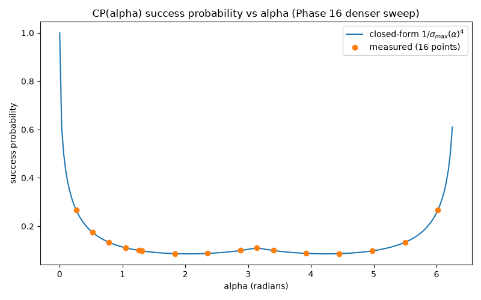

# IQP → Photonic (DV/Fock-Space) Encoding

**What this is:** an on-paper mapping from IQP's structure (fixed-basis input, commuting Z-diagonal gates, Hadamard-basis conjugation) onto Perceval's discrete-variable (DV, Fock-space) primitives (phase shifters, beamsplitters, photon-number measurement), built and checked at small scale (n=2-3). This is Phase 9's deliverable in the `v2.0 IQP → Photonic Encoding` milestone, and the milestone's actual novel-contribution piece.

**What this is not:** a peer-review-grade complexity-theoretic hardness proof. `.planning/REQUIREMENTS.md`'s Out-of-Scope table excludes a formal reduction proof from this milestone on purpose. This document is a design/mapping exercise, checkable in principle and actually checked at small scale, not a claim that IQP's photonic sampling hardness has been formally established. Every claim below is stated at the strength the underlying work actually supports; ENC-02 states this limitation again, explicitly, at the point where overclaiming risk is highest.

**Prerequisite reading:**
- [`docs/iqp-baseline.md`](iqp-baseline.md) — the qubit-side IQP recipe (`|+⟩` prep, `MultiRZ` diagonal layer, Hadamard-conjugated measurement) and the Van den Nest cosine-formula classical-training trick this document's ENC-04 section references.
- [`docs/iqp-lit-scoping.md`](iqp-lit-scoping.md) — the full Douce et al. (2017) CV-IQP hardness summary this document's ENC-02 section positions against, plus the literature-search verdict that unblocked this phase.

**How to read this document:** ENC-01 through ENC-04 build on each other in order: ENC-01 fixes the encoding scheme and derives the mapping, ENC-02 positions it against the one existing adjacent result in the literature, ENC-03 states how to translate between qubit bitstrings and photonic measurement outcomes, and ENC-04 actually runs a small-scale comparison to check the whole thing holds together. ENC-05 records the final whole-document self-explanation checkpoint. Each section's "Owner's Attempt" (or, for ENC-05, full checkpoint) subsection records the actual attempt-first Q&A that shaped it, including wrong turns and corrections, per this project's standing practice of keeping negative/partial results visible rather than smoothing them over.

**Contents:**
- [ENC-01: Ingredient-Level Mapping](#enc-01-ingredient-level-mapping)
- [ENC-02: Positioning Against Douce et al. (2017)](#enc-02-positioning-against-douce-et-al-2017)
- [ENC-03: Basis Correspondence](#enc-03-basis-correspondence)
- [ENC-04: Validation Plan and Toy-Scale Check](#enc-04-validation-plan-and-toy-scale-check)
- [ENC-05: Final Self-Explanation Checkpoint](#enc-05-final-self-explanation-checkpoint)
- [ARB-01/ARB-02: General-α Operator Identity and Success Probability](#arb-01arb-02-general-α-operator-identity-and-success-probability)
- [Conclusion and Open Questions](#conclusion-and-open-questions)

## ENC-01: Ingredient-Level Mapping

### Owner's Attempt

Scheme chosen: **polarization encoding** (H/V), per the owner's coursework at Sorbonne — one photon per qubit, one spatial mode, polarization degree of freedom carries the qubit basis states (`|0⟩ = |H⟩`, `|1⟩ = |V⟩`).

This is a correction to `09-RESEARCH.md`'s and `09-01-PLAN.md`'s characterization of polarization encoding as having "no polarization-specific gate catalog — derive gates from scratch by analogy." That's inaccurate: `perceval-quandela==1.2.4` ships real polarization primitives, confirmed by reading the installed source directly (not assumed from the survey doc):

- `HWP(xsi)`, `QWP(xsi)` — half/quarter wave plates
- `PR(delta)` — polarization rotator
- `WP(delta, xsi)` — general two-parameter wave plate; `HWP(xsi)` is literally `WP(delta=π/2, xsi)` (confirmed from `WP.__init__` source)
- `PBS()` — polarizing beam splitter, converts a polarization superposition in one spatial mode into the same superposition spread across two spatial modes, and back (the bridge to dual rail)

Q&A walkthrough, piece by piece:

**1. `|+⟩` state prep.** Owner's initial guess was a beamsplitter at 45°. Corrected via `WP`'s actual unitary (read from `WP._compute_unitary` source):

```
U(delta, xsi) = [[cos(delta) + i·sin(delta)·cos(2·xsi),   i·sin(delta)·sin(2·xsi)],
                 [i·sin(delta)·sin(2·xsi),                 cos(delta) - i·sin(delta)·cos(2·xsi)]]
```

At `delta = π/2` (the `HWP` case), this reduces to `i·[[cos(2·xsi), sin(2·xsi)], [sin(2·xsi), -cos(2·xsi)]]` — up to the irrelevant global phase `i`, the standard reflection-about-axis-`xsi` Jones matrix. A half-wave plate rotates linear polarization by **twice** its physical axis angle. Starting from `|H⟩` (0°), landing on diagonal `(|H⟩+|V⟩)/√2` (45°) requires the plate's optical axis at **22.5°**, i.e. `HWP(xsi=π/8)` — not 45°, which was the owner's first guess and a classic wave-plate half-angle gotcha.

**2. Weight-1 diagonal generator.** `PR(delta)` or `WP(delta, xsi)` applies a phase between `H` and `V` on a single photon — the polarization analogue of `PS` on one rail of dual rail. (Exact parameter correspondence to `θ` in the qubit-side `MultiRZ(2θ, ...)` — Task 2.)

**3. Weight-≥2 diagonal generator.** Owner initially proposed CNOT/CZ/SWAP as "how multi-qubit circuits are built" generically. Corrected: IQP's middle layer is *defined* to be diagonal in the Z basis — that's the acronym's premise, and what makes the circuit commute pairwise despite being classically hard to sample (Bremner-Jozsa-Shepherd; Douce et al.'s CV analogue). Of the three gates named:
   - **CNOT** — not Z-diagonal. Never appears in an IQP middle layer.
   - **SWAP** — not Z-diagonal either. Same conclusion.
   - **CZ** — `diag(1, 1, 1, −1)`. **Is** Z-diagonal, and a legitimate stand-in for IQP's generic weight-2 generator `exp(iθ·Z_i·Z_j) = diag(e^{iθ}, e^{-iθ}, e^{-iθ}, e^{iθ})` (CZ is a specific instance of that family up to single-qubit Z corrections).

   Owner picked the **heralded** construction (over post-selected) for the two-qubit gate.

   Mechanism, as sketched: each of the two polarization photons (qubits `i`, `j`) passes through its own `PBS`, converting polarization → two spatial modes per photon (4 modes total) — this is what "H/V splits onto a spatial mode" means: the photon's former polarization state now determines which of two paths it's found in. `core_catalog.heralded_cz` (built for dual rail) acts on those 4 modes plus ancilla herald mode(s); the gate is accepted only when a specific detector click pattern fires on the heralds (heralding — confirming success without measuring the data photons themselves, as opposed to post-selection, which checks an acceptance condition on the data-mode measurement after the fact). Each qubit's 2 modes then pass back through a `PBS` to return to polarization encoding. Same probabilistic success-probability cost as dual rail's native heralded CZ — polarization → `PBS` → dual rail → `PBS` → polarization doesn't dodge KLM, it inherits it via a lossless conversion.

**4. Hadamard-conjugated measurement.** Same component family as (1) — `HWP` at the angle realizing Hadamard on the polarization basis (Task 2: confirm exact angle from the same matrix above).

### Chosen scheme and why it fits Perceval's native primitives

**Polarization encoding**: one photon per qubit, one spatial mode, the qubit basis carried by the photon's polarization (`|0⟩ = |H⟩`, `|1⟩ = |V⟩`). Contrary to `09-RESEARCH.md`'s survey (corrected above, in the Owner's Attempt section, after direct inspection of the installed `perceval-quandela==1.2.4` source), Perceval ships a complete polarization gate set, not just the `Encoding.POLARIZATION` enum value:

- `pcvl.WP(delta, xsi)` — a general two-parameter wave plate acting on one spatial mode's polarization DOF
- `pcvl.HWP(xsi)` — `WP(delta=π/2, xsi)` (confirmed from `HWP.__init__`'s source: `super().__init__(sp.pi/2, xsi)`)
- `pcvl.PBS()` — converts a polarization superposition on one spatial mode into the same superposition spread across two spatial modes, and back

That's sufficient to realize all three IQP ingredients with exact (not approximate) native components, with no custom gate derivation needed — matching this project's "use MerLin/Perceval's existing native primitives" constraint as well as dual rail does, just via a different component family.

### Ingredient 1: `|+⟩^⊗n` state preparation

`WP`'s unitary, read directly from `perceval/components/unitary_components.py`'s `WP._compute_unitary`:

```
U(δ, ξ) = [[cos(δ) + i·sin(δ)·cos(2ξ),   i·sin(δ)·sin(2ξ)          ],
           [i·sin(δ)·sin(2ξ),             cos(δ) − i·sin(δ)·cos(2ξ)]]
```

At `δ = π/2` (`HWP`'s fixed value), this reduces to:

```
U(π/2, ξ) = i · [[cos(2ξ), sin(2ξ)], [sin(2ξ), −cos(2ξ)]]
```

Up to the global phase `i` (unobservable — global phase never affects measurement probabilities), this is the standard Jones reflection-about-axis-`ξ` matrix. A half-wave plate rotates linear polarization by **twice** its physical axis angle. Starting from `|H⟩` (polarization angle 0°), landing on `|+⟩ = (|H⟩+|V⟩)/√2` (45°) requires `2ξ = 45°`, i.e. `ξ = π/8` (22.5°) — confirmed both symbolically above and numerically (`HWP(π/8).compute_unitary()` gives `i·(1/√2)[[1,1],[1,-1]]`, matching `i·Hadamard` to floating-point precision).

For `n` qubits, each qubit's photon occupies its own spatial mode (with an adjacent vacuum "partner" mode reserved for the readout step — see Ingredient 3), and `HWP(π/8)` is applied independently to each qubit's polarization mode. Since `WP`/`HWP` are single-spatial-mode components (`hwp.m == 1`, confirmed empirically — no cross-mode coupling), applying `HWP(π/8)` to `n` independent modes realizes exactly the tensor product `H^⊗n`, matching the qubit-side `|+⟩^⊗n = H^⊗n|0⟩^⊗n` construction mode-by-mode, not just in aggregate effect.

`build_state_prep_circuit(n)` in `iqp_photonic_encoding.py` implements this: `HWP(π/8)` at port `2k` for each qubit `k` (even ports carry polarization, odd ports are vacuum-partner modes, untouched here).

### Ingredient 2: Z-diagonal middle layer

At `ξ = 0`, `WP`'s unitary reduces to:

```
U(δ, 0) = [[cos(δ) + i·sin(δ), 0], [0, cos(δ) − i·sin(δ)]] = diag(e^{iδ}, e^{-iδ})
```

— confirmed numerically (`WP(π/3, 0).compute_unitary()` gives `diag(e^{iπ/3}, e^{-iπ/3})` to floating-point precision). This is **exact**, not an approximation: `WP(θ, 0)` realizes `exp(iθZ)` on the polarization qubit, the same role `PS` plays for a single-qubit generator in dual rail, with no additional interference partner needed for the *phase itself* to be well-defined (though, as in dual rail, that phase is only *observable* after a subsequent basis change — see Ingredient 3).

For a weight-1 IQP generator `g_j` touching only qubit `k` with angle `θ_j`, the photonic realization is `WP(θ_j, 0)` on qubit `k`'s polarization mode. `build_diagonal_layer_circuit(n, thetas)` implements this directly: `WP(thetas[k], 0)` at port `2k` for each qubit `k` (`thetas[k] = 0` realizes the identity, for qubits untouched by any weight-1 generator).

**Weight-≥2 generators.** IQP's middle layer can include generators touching two or more qubits, e.g. `exp(iθ·Z_i·Z_j)`. This section originally derived the weight-2 mechanism on paper without a runnable implementation; as of Phase 11 (v2.1), `build_cz_insertion(n, i, j)` and `build_weight2_processor(n, i, j, thetas)` in `iqp_photonic_encoding.py` implement it as executable code, verified against the truth table below (`|amplitude|² == 2/27`, sign negative only on `|1,1⟩`) — see `tests/test_iqp_photonic_encoding.py`. TVD validation against an extended exact reference (the same rigor weight-1 already cleared) was completed in Phase 12: TVD=2.58e-15 at the locked n=2, θ=π/4 gate. Phase 13 further confirmed weight-1 and weight-2 layers compose correctly within the same n=3 circuit. The mechanism, following the owner's Task 1 attempt:

1. Each of the two qubits' polarization photons passes through its own `PBS`, converting polarization → two plain spatial modes per photon (4 modes total) — dual rail's representation.
2. `perceval.components.core_catalog.heralded_cz` acts on those 4 modes plus ancilla herald mode(s), succeeding (confirmed by a specific detector click pattern on the heralds) only some fraction of the time. This herald-success probability was independently measured in this repo's venv (Phase 10, `heralded_cz_derisking.py`): **exactly 2/27 (~0.074074)**, uniform across all 4 computational-basis dual-rail inputs and 2 superposition spot-checks (`|+⟩|+⟩`, `|+⟩|0⟩`), read directly off `Processor.probs()`'s `global_perf`/`physical_perf`/`logical_perf` (never shot-sampled; `physical_perf == 1.0` in every case, confirming no photon loss in the unitary itself — the entire cost is the herald condition). The CZ phase sign was confirmed separately via `Simulator.prob_amplitude` on the bare circuit: negative on `|1,1⟩`, positive on `|0,0⟩`/`|0,1⟩`/`|1,0⟩`, exactly matching `diag(1,1,1,-1)`. Stated descriptively, not as a proof of general equivalence: `09-RESEARCH.md` had cited commonly-quoted literature figures (1/9 for a post-selected construction, ~2/27 for a heralded variant) as unverified for this exact implementation; the measured 2/27 happens to numerically match the previously-cited heralded-variant figure to the precision quoted, but that match is an observation about this specific gate, not a claim that this implementation is the same construction as the literature's general gate family.
3. Each qubit's 2 modes convert back to polarization via `PBS`.

The operator-identity connecting this to IQP's generic weight-2 generator: writing `Z_i`, `Z_j`, `Z_iZ_j` eigenvalues on the four computational basis states `{|00⟩,|01⟩,|10⟩,|11⟩}` as `(1,1,-1,-1)`, `(1,-1,1,-1)`, `(1,-1,-1,1)` respectively, direct calculation gives:

```
I − Z_i − Z_j + Z_iZ_j = diag(0, 0, 0, 4)
⟹ exp(i·(π/4)·(I − Z_i − Z_j + Z_iZ_j)) = diag(1, 1, 1, e^{iπ}) = diag(1,1,1,−1) = CZ
```

Since `I, Z_i, Z_j, Z_iZ_j` all commute (all diagonal in the same basis), the exponential of their sum factors:

```
CZ = e^{iπ/4}·exp(−iπ/4·Z_i)·exp(−iπ/4·Z_j)·exp(iπ/4·Z_iZ_j)
⟹ exp(iπ/4·Z_iZ_j) = CZ · exp(iπ/4·Z_i) · exp(iπ/4·Z_j)   (up to the global phase e^{-iπ/4})
```

So `heralded_cz`, corrected by two single-qubit `WP(π/4, 0)` gates (already available from Ingredient 2), realizes `exp(iθZ_iZ_j)` **at the fixed angle `θ = π/4`** — not a continuously-tunable angle, since the catalog's `heralded_cz` is a fixed gate, not a parameterized family. Realizing an arbitrary-`θ` two-qubit diagonal phase gate from this catalog alone is not resolved here; that gap is named explicitly rather than glossed over, per this document's tone constraint.

### Ingredient 3: Hadamard-conjugated measurement

`build_conjugation_circuit(n)` applies the same `HWP(π/8)` as state prep (Hadamard is self-inverse, so the same gate realizes both ends of the `H`-diagonal-`H` sandwich). `build_readout_circuit(n)` then applies `PBS` per qubit, converting the polarization state into a which-path spatial state so `Analyzer`/`Processor.probs()` can resolve it — a bare polarized state is invisible to Fock-basis (photon-number) measurement without this conversion, confirmed empirically (an `Analyzer` run on a polarized `BasicState` with no `PBS` collapses to a single "photon present" outcome, never resolving `H` vs `V`), the polarization analogue of `perceval_fluency_demo.py`'s finding that a bare `PS` needs a second beamsplitter to become visible.

### Commutativity and conjugation-symmetry, argued at equation level

**Commutativity.** IQP's structural property is that every middle-layer generator commutes with every other, because all are diagonal in the same (Z) basis. In this photonic realization: each weight-1 generator `WP(θ_k, 0)` acts on a *distinct* qubit's own single mode; operators on disjoint tensor factors commute trivially (`[A⊗I, I⊗B] = 0` for any `A, B`). Two generators on the *same* qubit (different `θ` values) are both exactly diagonal in that qubit's `{H,V}` basis (`WP(θ,0) = diag(e^{iθ}, e^{-iθ})`), and diagonal matrices always commute with each other regardless of angle. This is the same structural argument as the qubit-side proof (`Z_i` and `Z_j` commute trivially for `i≠j`; two Z-diagonal operators on the same qubit commute because diagonal matrices commute) — preserved exactly, not just informally echoed, because `WP(θ,0)`'s unitary *is* diagonal in the `{H,V}` computational basis, not merely "phase-like" in some looser sense. The weight-2 case (Ingredient 2's derivation) inherits the same property *conditional on successful heralding*: `heralded_cz` realizes `CZ`, an exactly-diagonal 4×4 matrix, so on the subspace where the herald succeeds, the resulting operation is diagonal in the joint computational basis and therefore commutes with all other diagonal-layer operations by the identical argument. This conditional caveat is real, not a technicality to bury: heralding failure leaks probability outside the two-qubit computational subspace entirely, so the *unconditional* physical process (including failure outcomes) is not a diagonal unitary on the qubit subspace alone.

**Conjugation symmetry.** IQP's measurement is in the Hadamard-conjugate (X) basis relative to the diagonal layer — equivalently, `H^⊗n` applied before computational-basis measurement. `HWP(π/8)` realizes Hadamard exactly (up to the unobservable global phase `i`) on each qubit's own two-level polarization space independently, with zero cross-mode coupling (confirmed: `hwp.m == 1`). Applying `HWP(π/8)` to all `n` qubit modes therefore realizes `H^⊗n` exactly, up to the global phase `i^n` — again mode-by-mode, matching the qubit-side tensor-product structure directly rather than merely reproducing its aggregate effect.

### n=2 worked example

Two qubits, weight-1 generators only: `θ₀ = 0.3`, `θ₁ = 1.1`, both qubits starting in `|H⟩ = |0⟩`. `iqp_photonic_encoding.py`'s `build_full_circuit(2, [0.3, 1.1])` builds the 4-mode circuit (`HWP(π/8)` ×2 → `WP(θ_k,0)` ×2 → `HWP(π/8)` ×2 → `PBS` ×2); running it through `Processor("SLOS", ...)` + `Analyzer` gives:

```python
from iqp_photonic_encoding import run_full_circuit, expected_joint_distribution

_, dist = run_full_circuit(n=2, thetas=[0.3, 1.1])
# {'|1,0,1,0>': 0.069364, '|1,0,0,1>': 0.017969,
#  '|0,1,1,0>': 0.724887, '|0,1,0,1>': 0.187781}

expected = expected_joint_distribution(n=2, thetas=[0.3, 1.1])
# {'HH': 0.187781, 'HV': 0.724887, 'VH': 0.017969, 'VV': 0.069364}
```

(Bitstring labels use the verified convention `H=(0,1)`, `V=(1,0)` — see the port↔polarization correction below. The raw Perceval output above is unchanged by that correction; only which label attaches to which outcome changed.)

These match to floating-point precision (`tests/test_iqp_photonic_encoding.py`'s parametrized product-distribution test, which also checks `n=3` with three independent generators). Two things this concretely confirms, not just for the marginal per-qubit phase-to-probability relationship but for the *joint* two- and three-qubit state:

1. **No spurious correlations.** The joint distribution factors exactly into the product of independent per-qubit marginals — direct empirical evidence that weight-1 generators don't entangle the photonic realization, consistent with the commutativity argument above (weight-1 generators are local operators; no shared mode, no interaction).
2. **No leakage outside the computational subspace.** Every one of the 9 (`n=2`) and 27 (`n=3`) enumerable bunched/lost-photon outcomes (e.g. `|2,0,0,0⟩`, `|0,0,0,0⟩`, ...) has exactly zero probability in this ideal, lossless `SLOS` simulation — answering one of `09-RESEARCH.md`'s open questions (whether the toy circuit would empirically populate out-of-subspace Fock outcomes) for this specific weight-1-only construction: it does not, under ideal simulation.

The per-qubit closed form underlying both: starting from `|H⟩`, `HWP(π/8)·WP(θ,0)·HWP(π/8)` gives (using the real Hadamard `Had = (1/√2)[[1,1],[1,-1]]`, with `HWP(π/8) = i·Had`, so the two `i` factors cancel to an overall `-1`, itself unobservable):

```
Had · diag(e^{iθ},e^{-iθ}) · Had = [[cos θ, i sin θ], [i sin θ, cos θ]]
```

giving `P(stay) = cos²θ`, `P(flip) = sin²θ` in the abstract `{index0, index1}` ordering. Which physical port is which required a direct check, not an assumption: a bare `PBS()` with no other gates, fed pure `|H⟩` or pure `|V⟩`, gives `H → (0,1)`, `V → (1,0)` (deterministically, to floating-point precision). Combining that with the abstract result above: **`P(H) = cos²θ`, `P(V) = sin²θ`.**

*Correction (Plan 09-02):* an earlier version of this document and `iqp_photonic_encoding.py` had this port↔polarization assignment backwards — self-consistent within its own labels (so no numerical test result was ever wrong), but the "H"/"V" tags didn't match true physical polarization. Caught during the ENC-03 attempt-first checkpoint when the owner asked which output pair was really H, prompting the direct bare-`PBS` check above. Fixed in both the module and its tests (`tests/test_iqp_photonic_encoding.py`'s parametrized closed-form test now reads `H` from `BasicState([0,1])` and `V` from `BasicState([1,0])`); all 12 tests still pass, since the fix is a consistent relabeling, not a change to the underlying physics.

### Relation to the owner's Task 1 attempt

The final mapping follows the owner's attempt closely: polarization encoding was the owner's own choice (from personal coursework), the state-prep mechanism (a "diagonal beamsplitter"-type operation) correctly identified `WP`/`HWP` as the right primitive (the derivation above corrects only the specific angle — 22.5°, not the owner's initial 45° guess, or the beamsplitter framing — a wave plate, not a beamsplitter, is the correct component for polarization rotation), and the weight-2 mechanism (heralded `PBS`-mediated conversion to dual rail's `heralded_cz`) is exactly what Ingredient 2's weight-2 derivation formalizes, including the owner's choice of the heralded (not post-selected) construction.

### Status

ENC-01 is implemented and tested: `iqp_photonic_encoding.py` (state-prep/diagonal-layer/conjugation/readout circuit builders, weight-1 generators) and `tests/test_iqp_photonic_encoding.py` (12 tests, all passing) — `python -c "import iqp_photonic_encoding"` and `pytest tests/test_iqp_photonic_encoding.py -v` both verified clean.

### Self-Explanation Checkpoint (Task 3)

Per this repo's CLAUDE.md self-explanation checkpoints, the owner was asked to explain, unaided: (1) why the photonic realization of the diagonal layer actually commutes, and (2) what Hadamard-conjugation is physically doing and what the weight-2 case costs. Full Q&A recorded below, following this project's established pattern of documenting the actual back-and-forth rather than only the polished result.

*Note (added in Plan 09-02):* the `P(H)`/`P(V)` labels quoted in this transcript use the port↔polarization convention believed correct at the time (`H=(1,0)`, `V=(0,1)`) — since corrected to `H=(0,1)`, `V=(1,0)` after direct verification (see Ingredient 1's "Correction" note above). The transcript is left as an accurate record of what was actually said; only the physics discussed (phase → population imbalance) is what matters here, and that reasoning is unaffected by which physical port carries which label.

**Round 1 — initial answers restated the qubit-side abstraction rather than the photonic mechanism**, and contained one physical misconception:
- Commutativity: initially restated "diagonal in the Z-basis, all pairwise commuting" without connecting it to the actual `WP` construction — flagged as not yet meeting the bar, since it doesn't distinguish *why this specific realization* inherits the property.
- Hadamard-conjugation: initially described as "taking the states out of superposition and back into one polarization" — corrected: the second `HWP` does not collapse the state; it converts an invisible relative phase into an observable population difference (`P(H)=sin²θ`, `P(V)=cos²θ`) via interference. The state remains a superposition for general `θ`.
- Cost clarification: the single-qubit conjugation step itself is free (deterministic, native `HWP`, no ancillas); "cost" refers to the weight-2 case sitting *inside* the diagonal layer between the two conjugation layers.

**CZ-vs-ZZ question, verified against Perceval's actual source (not repeated from the secondhand literature figure):** `perceval.components.core_catalog.heralded_cz` implements the **Knill CZ gate** (arXiv:quant-ph/0110144, Knill 2002) — 4 data modes (2 dual-rail qubits) + 2 herald modes, success conditioned on exactly 1 photon in *each* herald mode (`add_herald(4,1)`, `add_herald(5,1)`). The mechanism is confirmed real and exactly as sketched in the owner's original attempt. The specific success probability was **not** independently recomputed from this circuit — the 1/9 (post-selected KLM) and ~2/27 (heralded variant) figures cited earlier in this document and in `09-RESEARCH.md` are secondhand literature citations for the same general gate family, not a verified property of this exact implementation. Flagged explicitly as assumed, not verified, per this repo's standing distinction between the two.

**Round 2 — final answers, correct:**
- *"The CZ is a special instance of the ZZ gate when the ZZ-dial is set to pi/4 and there is a small correction applied to every qubit."* — correct, matches the operator identity derived above (`exp(iπ/4·Z_iZ_j) = CZ · exp(iπ/4·Z_i) · exp(iπ/4·Z_j)` up to global phase).
- *"The operators on different qubits' modes automatically commute because the gates are 1-mode components that have no way to touch the other qubit's mode. If it is the same qubit, they commute because they are diagonal matrices in the same fixed basis."* — correct, and correctly distinguishes the two different reasons (disjoint tensor factors vs. diagonal-matrix multiplication) rather than conflating them.
- *"The hadamard-conjugation makes the invisible phase convert into a visible difference, like `|+⟩` converting into `|0⟩` or `|1⟩`."* — the core mechanism (phase → visible population difference) is correct; the closing analogy overstates it into a deterministic collapse. The corrected version: the post-conjugation state is `α|H⟩+β|V⟩` with `|α|²=sin²θ`, `|β|²=cos²θ` — a superposition with unequal weights, not a collapse to a single definite state, except at the special angles `θ=0` or `θ=π`.

## ENC-02: Positioning Against Douce et al. (2017)

*Note on tone: per this project's standing constraint (a master's student's own work, using an LLM collaborator, ahead of a conversation with a Quandela researcher), this section deliberately hedges. Claims here are stated at the strength the actual work supports — no more.*

### What Douce et al. established

Douce, Markham, Kashefi, Diamanti, Coudreau, Milman, van Loock, Ferrini, "Continuous-Variable Instantaneous Quantum Computing is hard to sample," PRL 118, 070503 (2017), arXiv:1607.07605 (full summary: `docs/iqp-lit-scoping.md`) ports DV IQP's hardness argument into a **continuous-quadrature** substrate: each mode starts finitely squeezed in `p̂`, a middle layer of `q̂`-diagonal gates is applied (commuting for the same structural reason DV's Z-diagonal gates commute), and the readout is homodyne detection of `p̂`. Their Hadamard-basis-conjugation analogue — the Fourier operator `F̂ = e^{i(π/4)(p̂²+q̂²)}` — is realized not as a native gate but via a **measurement-based teleportation gadget**, post-selected on a specific homodyne outcome.

### How this DV/Fock-space mapping differs

This document works entirely in a different formalism: **discrete photon-number (Fock) states**, not continuous quadratures. Concretely, this mapping's primitives (`WP`, `PBS`, photon-counting) have no continuous-quadrature counterpart in Perceval at all. `09-RESEARCH.md` confirmed by direct inspection that Perceval ships zero CV primitives (no `squeez`, `homodyne`, `displac`, or `quadrature` matches anywhere in the installed package). This reflects a genuinely different toolkit answering a structurally analogous question, not a stylistic restatement of Douce et al. in different notation.

The clearest point of contrast: this mapping's single-qubit Hadamard-conjugation is a **native, deterministic unitary** — `HWP(π/8)`, a single wave plate, exact and verified directly against Perceval's installed matrix (Ingredient 1, above). Douce et al.'s conjugate-basis operator, by contrast, exists only as a post-selected measurement outcome of a teleportation circuit, not as a native gate. Where their construction needs a whole probabilistic gadget to realize *any* Hadamard-like step, this construction gets the single-qubit case essentially for free.

### Where the honest parallel exists

That contrast doesn't extend to the multi-qubit case, and stating that plainly matters more than the flattering half of the comparison above. This mapping's weight-2 generator realization (Ingredient 2's `heralded_cz`-based construction) is itself **probabilistic and measurement-conditioned**: success only on a specific herald click pattern, the same character Douce et al.'s Fourier gadget has, a probabilistic operation realized via measurement that works only some of the time. The honest position is narrower than "this DV approach avoids Douce et al.'s measurement-based-gadget problem": **this scheme's single-qubit conjugation avoids it, while its multi-qubit entangling structure inherits a version of the same character**, via a different specific mechanism (heralded linear-optical CZ vs. post-selected CV teleportation) and a different underlying reason (KLM-type no-go for deterministic linear-optical entangling gates vs. CV Fourier-gadget construction).

### What is, and isn't, a contribution here

This document is a **design/mapping exercise, checkable in principle at small scale** — not a peer-review-grade complexity-theoretic reduction proof, and not a claim that IQP's photonic hardness has been formally established. `.planning/REQUIREMENTS.md`'s Out-of-Scope table already excludes a formal reduction proof from this milestone; this section states that limitation directly rather than letting the document's technical register imply more rigor than it delivers. What ENC-01/ENC-03/ENC-04 actually establish: a concrete, equation-derived, Perceval-native mapping for the weight-1 case, empirically confirmed to reproduce the exact qubit-side distribution at `n=2-3` — a real, checked result, but a small-scale design validation, not a hardness proof.

### Open questions and limitations, collected

- **Generator-weight scope.** Weight-1 generators are fully derived, implemented, and empirically validated (ENC-01, ENC-04). Weight-2 generators at the fixed `π/4` angle are implemented and validated (Phases 11-13, v2.1): `build_cz_insertion`/`build_weight2_processor` realize the circuit, Phase 12's TVD test confirms it matches the extended exact reference (TVD=2.58e-15 at n=2, θ=π/4), and Phase 13 confirms weight-1/weight-2 composability at n=3. **Weight-2 is no longer fixed-angle-only**: Phase 15 (v3.0, ARB-01) implemented and validated a second, genuinely different gate family (`build_cp_insertion`/`photonic_cp_iqp_distribution`, `PostProcessedControlledRotationsItem`-based) at arbitrary `α` — TVD < 1e-6 (measured at floating-point-noise level) against the extended exact reference at `n=2,3` across 3 non-trivial `α` values, plus a direct full-pipeline boundary-agreement confirmation against `heralded_cz` at `α=π`. See the ARB-01/ARB-02 section below for the derivation, the `heralded_cz`-vs-`CP` comparison table, and the measured results. **Phase 16 (v3.0) completed the remaining scope**: a denser 16-point `α` sweep matching the closed-form success probability to ~1e-9 at every point (ARB-08), an n=3 mixed weight-1+arbitrary-θ weight-2 composability test (TVD < 1e-6, ARB-07), and a Forge model confirming the gate's ancilla mode-mapping is injective/non-aliasing for all valid `(n,i,j)`, `n ≤ 8`, with no bug found (ARB-09). See "Denser α Sweep (Phase 16)" and "Forge Verification of the Ancilla Mode-Mapping (Phase 16)" below for the measured results.
- **Success-probability figure now confirmed for this exact gate (Phase 10, `heralded_cz_derisking.py`).** Perceval's `heralded_cz` (the Knill CZ construction, arXiv:quant-ph/0110144) has a herald-success probability independently measured at exactly 2/27 (~0.074074), uniform across all 4 computational-basis inputs and 2 superposition spot-checks, plus a confirmed CZ phase sign (negative on `|1,1⟩` only) via `Simulator.prob_amplitude`, and a confirmed-empty `post_select_fn` (no hidden second filter behind `logical_perf`, zero leakage in the `Analyzer` truth table). Phases 11-13 confirmed the full weight-2 circuit also works correctly end-to-end once composed with the rest of the pipeline (`PBS` conversion, the `π/4` phase corrections, readout, and composition alongside weight-1 terms).
- **Toy-check scope.** ENC-04's `n=2,3` validation covers weight-1 generators only, under an idealized, lossless `SLOS` simulation — it says nothing about `n>3`, weight-2 generators, or behavior under realistic loss/noise.
- **General-`n` scaling.** This mapping is stated for general `n` in principle, but only concretely instantiated and checked at `n=2-3`; nothing here demonstrates the construction scales practically to circuit sizes relevant to a hardness claim.

## ENC-03: Basis Correspondence

### Owner's Attempt

The owner was asked to sketch, for polarization encoding: (1) the reverse map (measured `BasicState` → bitstring), (2) the failure/out-of-subspace case, (3) a falsifiability statement. First response: "I'm not sure how to answer these three questions" — each was then broken into a smaller, more concrete guided question rather than answered directly, per this repo's attempt-first gating.

**1. Reverse direction.** Guided question: given the two valid readout pairs `(1,0)` and `(0,1)`, which is `H` and which is `V`? Owner's answer: *"(0, 1) is H and (1, 0) is V."* This was checked directly — not assumed — with a bare `PBS()` and no other gates, pure `|H⟩` and pure `|V⟩` input:

```
H -> {'|0,1>': 1.0, '|1,0>': 0.0}
V -> {'|0,1>': ~0,  '|1,0>': 1.0}
```

**Confirmed correct, and it caught a real bug.** `iqp_photonic_encoding.py`'s Wave 1 `basic_state_to_bitstring` helper had this backwards (`(1,0)→"H"`, `(0,1)→"V"`) — self-consistent within its own labels (no Wave 1 test result was ever numerically wrong), but the labels didn't match true physical polarization. Fixed in this plan across the module, its tests, and ENC-01's derivation text (see the "Correction" note under Ingredient 1, and the commit history) — all 12 pre-existing tests still pass after the relabeling, since it's a consistent rename, not a physics change.

**2. Failure case.** Guided question: what photon-count patterns in a qubit's 2-mode pair are possible besides the two valid single-photon ones? Owner's answer: *"Are you referring to (0,0) and (1,1)? Probably report 'X% of outcomes were invalid' as its own number."* Correct disqualifying criterion (total photon count ≠ 1) and correct choice of reporting policy, but incomplete enumeration — missing the bunched cases `(2,0)`/`(0,2)` (two photons in the *same* mode, distinct from `(1,1)`'s one-in-each). Full set of four invalid patterns and the reporting-policy choice are below.

**3. Falsifiability.** Guided question: what should you get back if you forward-map a bitstring then immediately reverse-map it? Owner's answer: *"You should get the same bitstring. Quantum operations should be unitary, meaning they are reversible..."* — correct mechanism and correct expected behavior; this is exactly `tests/test_iqp_photonic_encoding.py`'s `test_enc03_round_trip`, and it's the same style of check that caught the H/V bug in point 1.

**Feynman-technique explanation of the four invalid patterns** (owner requested this after being unable to enumerate them precisely): our bit-reading rule is "exactly one photon, in one of two spots" — the same as saying "the answer is heads or tails, read off which of two boxes has the one coin." That statement presumes exactly one coin. Four ways the premise breaks:
- `(0,0)` — no coin in either box (photon lost — absorbed, or missed by an inefficient detector in a real device).
- `(1,1)` — a coin in *each* box (an extra photon, one landing in each mode, not "the" photon choosing a side).
- `(2,0)`/`(0,2)` — both coins bunched into the *same* box (the Hong-Ou-Mandel-style bunching phenomenon from `perceval_fluency_demo.py`'s Phase 8 demo, applied to two photons that should have gone to different modes).

None of these are physics errors — they're outcomes our translation rule was never defined to answer. In this project's specific ideal, lossless circuits, none of the four ever actually occur (confirmed empirically in Plan 09-01: exactly zero leaked probability across every tested case, since photon number is conserved per-qubit through passive linear optics with no cross-qubit mixing) — but the rule must still be stated, since a noisier device model or a future weight-2 gate (which briefly mixes two qubits' modes) could produce them.

### Forward Map

`bitstring_to_fock(bitstring, n)`: bit `'0'` → photon in `{P:H}`, bit `'1'` → photon in `{P:V}`, one photon per qubit on its own polarization-carrying mode (port `2k`), vacuum on its partner mode (port `2k+1`) — directly reusing ENC-01's `|0⟩=|H⟩`, `|1⟩=|V⟩` convention and `2n`-mode layout. This is Perceval's own documented convention for building a polarized `BasicState` from a logical bit register (`09-RESEARCH.md`'s basis-correspondence table), not a new rule invented here.

### Reverse Map and Out-of-Subspace Handling

`fock_to_bitstring(basic_state, n)` reads a *post-readout* (`PBS`-converted) `BasicState`, checks each qubit's `(port_2k, port_2k+1)` pair against the two valid patterns confirmed above (`(0,1)='0'`, `(1,0)='1'`), and returns `None` — not a guessed bitstring — the moment any pair matches one of the four invalid patterns (`(0,0)`, `(1,1)`, `(2,0)`, `(0,2)`), even if every other qubit in the same register reads validly (`tests/test_iqp_photonic_encoding.py`'s `test_enc03_out_of_subspace_in_larger_register`).

**Reporting policy** (owner's choice, adopted): when `fock_to_bitstring` returns `None` for a sampled outcome, that outcome's probability mass is reported as an explicit residual figure ("X% of outcomes were invalid"), not silently discarded and renormalized into the remaining valid outcomes. This matches `09-CONTEXT.md`'s standing instruction to report mismatches/caveats honestly rather than smooth them over (the same pattern already used for v1.0's GEN-07 and Phase 7's neighbor-locality result) — a silent renormalization would hide exactly the information (how often the scheme leaves the computational subspace) that a future implementation phase would need to know.

### Falsifiability

**Claim:** for every bitstring `b`, `fock_to_bitstring(run_readout(n, bitstring_to_fock(b, n)), n) == b`.

**What would contradict it:** any bitstring for which that round trip returns a *different* bitstring, or `None`, when no diagonal-layer or conjugation gate has been applied (i.e. the identity case — pure forward-encode, pure `PBS` readout, pure decode). This is a live, checkable claim, not an analogy — `tests/test_iqp_photonic_encoding.py`'s `test_enc03_round_trip` runs it for `n=1,2,3` across multiple bitstrings, and it is exactly the kind of check that surfaced the H/V labeling bug in this plan (there, the "same bitstring back" property held for the *product-distribution* test only because both sides of that comparison shared the same — backwards — convention; a direct round-trip test against Perceval's raw physical behavior, as run here, is what actually pins the convention down).

### Worked Example

```python
from iqp_photonic_encoding import bitstring_to_fock, run_readout, fock_to_bitstring

fock_state = bitstring_to_fock("10", n=2)          # |{P:V},0,{P:H},0>
readout_state = run_readout(n=2, input_state=fock_state)  # |1,0,0,1>
decoded = fock_to_bitstring(readout_state, n=2)    # "10"  (round trip holds)

# Out-of-subspace: a bunched outcome for qubit 1, valid for qubit 0
import perceval as pcvl
invalid_state = pcvl.BasicState([0, 1, 2, 0])
fock_to_bitstring(invalid_state, n=2)  # None -- qubit 0 valid, qubit 1 bunched
```

Verified by `pytest tests/test_iqp_photonic_encoding.py -v` — 24/24 passed, including 7 round-trip cases (`n=1,2,3`) and 5 out-of-subspace cases (all four invalid patterns individually, plus one embedded in a larger valid register).

## ENC-04: Validation Plan and Toy-Scale Check

### Owner's Attempt

The owner's first sketch described the photonic circuit again (HWP at 22.5°, diagonal phase, Hadamard, measure "with heralding") — corrected: that's the thing being validated, not an independent reference to validate it against, and heralding doesn't apply since this project's worked example uses weight-1 generators only (no `heralded_cz` anywhere in it). The owner then asked whether Van den Nest's cosine-formula trick applies — yes, technically (it works for any IQP circuit), but it produces Z-word *expectation values*, not a full probability table, so using it here would need an extra Fourier/Walsh-transform step to become comparable to the photonic side's full distribution — more machinery than needed at this scale.

The owner also asked about using MMD loss (this project's own v1.0 metric) instead of total variation distance. Declined, with reasoning: MMD's kernel-bandwidth machinery exists to handle **sampling noise** (exactly the problem this project's own Phase 4/7 sigma-resweep work wrestled with) — but both distributions being compared here are **exact** (no sampling on either side), so there's no noise for a kernel to smooth over, and picking a bandwidth would just be an unmotivated extra parameter.

Final attempt, adopted: (1) reference method — direct `numpy` state-vector construction (`|+⟩^⊗n` → diagonal phase → `H^⊗n` → `|amplitude|²`), matching `09-RESEARCH.md`'s recommended option; (2) metric — total variation distance, `TVD = ½Σ|q(x)−p(x)|`, the same formula used in the sibling `iqp-mmd-barren-plateau` project's own marginal-agreement checks (`iqp_mmd AC Investigation 2026-04-23.md`); (3) threshold — `TVD < 1e-6`, chosen after noting that the sibling project's own thresholds (`<0.05` good, `>0.4` drifting) apply to a *sampled-vs-learned* comparison with real statistical noise, which doesn't describe this situation — two exact distributions should agree to numerical precision, not a loose "good enough" bound.

One implementation detail carried over from the sibling project on purpose: its vault flags a **bit-ordering convention** bug risk ("critical for correctness," caught by an adversarial Codex review) — which qubit is the most-significant bit when converting a bitstring to a state-vector index. `exact_qubit_iqp_distribution` states its convention explicitly (qubit 0 = MSB) rather than leaving it implicit, precisely because that sibling project's experience shows it's an easy place to introduce a silent, hard-to-notice bug.

### Validation Plan

**What it checks:** that the photonic circuit built from ENC-01's prep/diagonal/conjugation functions, read out through ENC-03's `fock_to_bitstring`, reproduces the exact qubit-side IQP output distribution for the same generator set — the mapping's central claim, checked directly rather than assumed.

**Why checkable in principle at any n:** the same two computations (build a `2^n`-dim exact state vector; build and run the corresponding photonic circuit) are well-defined for any `n`, though a larger `n` would need `2^n`-mode photonic circuits (this toy check doesn't attempt to show that scales practically — that's explicitly deferred to a future implementation phase, per `09-CONTEXT.md`).

**Reference:** `exact_qubit_iqp_distribution(n, thetas)` — direct `numpy` state-vector simulation, no external dependency, ~30 lines including the explicit bit-ordering convention.

**Photonic side:** `photonic_iqp_distribution(n, thetas)` — runs `run_full_circuit` (ENC-01's prep+diagonal+conjugation+readout pipeline) and translates every output through `fock_to_bitstring`, returning `(dist, residual)` per ENC-03's explicit-residual policy.

**Metric and threshold:** `total_variation_distance(dist_a, dist_b) < 1e-6`.

### Results

```python
from iqp_photonic_encoding import (
    exact_qubit_iqp_distribution, photonic_iqp_distribution, total_variation_distance,
)

for n, thetas in [(2, [0.3, 1.1]), (3, [0.3, 1.1, 0.75])]:
    qubit_dist = exact_qubit_iqp_distribution(n, thetas)
    photonic_dist, residual = photonic_iqp_distribution(n, thetas)
    print(n, total_variation_distance(qubit_dist, photonic_dist), residual)

# 2 3.85e-16 0.0
# 3 5.68e-16 0.0
```

| n | thetas | TVD | residual | verdict (`TVD < 1e-6`) |
|---|---|---|---|---|
| 2 | `[0.3, 1.1]` | `3.85×10⁻¹⁶` | `0.0` | checks out |
| 3 | `[0.3, 1.1, 0.75]` | `5.68×10⁻¹⁶` | `0.0` | checks out |

Both distributions, `n=2`:

| bitstring | qubit-side | photonic |
|---|---|---|
| `00` | 0.187781 | 0.187781 |
| `01` | 0.724887 | 0.724887 |
| `10` | 0.017969 | 0.017969 |
| `11` | 0.069364 | 0.069364 |

No mismatch or caveat to report: both TVD values are at floating-point noise level (`~1e-16`), **ten** orders of magnitude below the `1e-6` threshold (corrected from an earlier draft of this section, which mistakenly said "four" — `10⁻⁶/10⁻¹⁶ = 10¹⁰`), and residual probability is exactly `0.0` in both cases — consistent with Plan 09-01's "zero leaked probability" result. No revision to ENC-01 or ENC-03 is warranted by this check.

### Self-Explanation Checkpoint (Task 3) — Owner's Interpretation

Per this repo's CLAUDE.md rule that Claude computes/plots results but the owner interprets first, the owner was asked to write their own interpretation of the TVD/residual numbers. First read misread the exponent: *"This looks like the TVD wasn't under the threshold. The distributions weren't exact enough?"* — a smaller (more negative) exponent means a *smaller* number, not a larger one; `3.85×10⁻¹⁶` is far below, not above, the `1×10⁻⁶` threshold. Clarified with a concrete comparison (`10⁻⁶` = one in a million vs. `10⁻¹⁶` ≈ one in three quadrillion) before the owner re-attempted.

Second attempt: *"This mean the two probability tables are extremely similar. This mean our experiment is going well so far"* — correct direction but too hedged ("going well so far") for what floating-point-level agreement actually establishes. Pushed for a sharper statement plus an explicit scope check (does this result say anything about the weight-2/`heralded_cz` case, which was never run in this validation).

Final interpretation, in two parts:
1. *"There is little room for doubt, the photonic circuit reproduces the exact qubit-side IQP distribution."* — correct, and appropriately confident given the numbers (TVD at floating-point noise level, zero residual, for both `n=2` and `n=3`).
2. Initial second half — *"I believe this will extend to generators of higher weight, so we should be good"* — flagged as an unsupported extrapolation, corrected. Weight-1 (`WP(θ,0)`) and weight-2 (`heralded_cz`) aren't the same mechanism at different sizes: weight-1 is exact and deterministic for any angle; weight-2 is probabilistic (herald-conditioned) and, per ENC-01's own derivation, only realizes one fixed angle (`π/4`), not an arbitrary θ. A clean match on the deterministic, arbitrary-angle case provides no evidence about the probabilistic, fixed-angle case, because they don't share the property this test actually checked. Corrected final answer: *"Nothing, we'll have to see via heralding."* — the weight-2 mechanism remains genuinely untested; ENC-04's result is silent on it, not quietly reassuring about it.

**Standing scope of what ENC-04 actually established:** the photonic mapping reproduces the exact qubit-side IQP distribution to floating-point precision, for weight-1-only generator sets, at `n=2` and `n=3`. It says nothing about weight-2 generators, `n>3`, or any property beyond what these two specific circuits and generator sets exercise.

## ENC-05: Final Self-Explanation Checkpoint

Per this repo's CLAUDE.md and ENC-05's explicit bar — same standard as v1.0's self-explanation checkpoints — the owner was asked to explain the *entire* document unaided, as if explaining it to an outside expert in the field: the chosen scheme, why the mapping preserves IQP's structure, the basis correspondence, the n=2-3 toy-check result, and the Douce et al. positioning. This took six rounds to close out; the full sequence (including the wrong turns) is recorded below, per this project's standing practice of keeping negative/partial answers visible rather than only the polished final version.

**Round 1 — first pass:**
1. *Scheme:* "I picked polarization encoding because that's what I learned at Sorbonne." — correct.
2. *Commutativity + conjugation:* "The mapping preservers IQP's structures because with different qubits, operators that operate on 1-mode cannot affect other qubit's 1-mode. We can check using hadamard conjugation that we get the same input." — only the disjoint-qubit half of commutativity (missing the same-qubit/diagonal-matrix half); also conflates Hadamard-conjugation (phase → visible population difference) with ENC-03's round-trip falsifiability check (forward-map → readout → reverse-map recovers the original bitstring) — two different, both-real mechanisms in this document.
3. *Basis correspondence:* not addressed — skipped directly to the toy-check result.
4. *n=2-3 result:* "The n=2-3 result establishes that we are doing well for a weight-1 circuit, but beyond that, we need to explore deeply." — directionally right, but vaguer than the precision already established in ENC-04's own checkpoint.
5. *Douce et al. positioning:* "I'm not sure." — an honest gap, rebuilt via direct re-teaching rather than left as a guess.

**Round 2 — after targeted corrections:**
- *Commutativity, completed:* "Same qubit operators commute because they're diagonal matrices, order doesn't matter." — correct, completes the two-part argument (disjoint tensor factors for different qubits; diagonal-matrix multiplication for the same qubit).
- *Basis correspondence, still incomplete:* "The forward rule and reverse rule is that for a bitstring, we get a photon state and if we reverse it, we get the same input. The four patterns that don't correspond to any valid bit are in the case of lost photons or bunching." — still describes the round-trip *property* rather than the actual encode/decode *rules*, and names only 2 of the 4 invalid patterns (missing `(1,1)`).
- *n=2-3 result:* "We have little room for doubt. The photonic circuit reproduces the exact qubit-side IQP distribution." — correct confirmation, but dropped the weight-1-only scope qualifier already established in ENC-04's own checkpoint.
- *Douce et al. positioning, correct:* "For our weight-1 experiments, we are able to have a hadamard conjugation component that always works. This will change once we get to weight-2. We will experience the same obstacles Douce's paper does." — correctly captures both the favorable contrast and the honest parallel from ENC-02.

**Round 3 — basis correspondence, port mapping reversed:** "Bit 0 turns into H and 1 turns into V. (1, 0) means 0 or H and (0, 1) means 1 or V." — the bit↔polarization half is correct, but the port↔bit half is backwards (repeats, in miniature, the exact class of error caught and fixed in Plan 09-02 — the port mapping is `H=(0,1)`, `V=(1,0)`, not the reverse). Corrected by re-showing the original bare-`PBS` calibration data.

**Round 4:** "H is (0, 1) and V is (1, 0)" — port mapping now correct.

**Round 5:** "The one in between is (1, 1) where there is a photon in both 'boxes' as we talked about with the feynman technique. Reproduces the exact distribution for generator weight 1. Silent?" — completes the four-invalid-pattern enumeration and the weight-1 scope qualifier's first half; asked to complete "silent about what" rather than being told directly.

**Round 6 — final, correct:** "Doesn't say anything, we have to directly test that to see." — completes the weight-1/weight-2 scope statement: ENC-04's result is silent on weight-2 generators; nothing about them can be inferred from the weight-1 validation, and they would need to be directly tested on their own terms.

**Outcome:** all five points correctly and completely explained by round 6. This closes ENC-05.

## ARB-01/ARB-02: General-α Operator Identity and Success Probability

**What this extends:** Ingredient 2's `heralded_cz`-based derivation above realizes `exp(iθZ_iZ_j)` only at the fixed angle `θ=π/4`, since `heralded_cz` is a fixed catalog gate. `PostProcessedControlledRotationsItem` (a **different** gate family — post-selection on ancilla vacuum + per-qubit data validity, not `heralded_cz`'s ancilla heralding) implements a continuously-tunable `CP(α) = diag(1,1,1,e^{iα})`, de-risked standalone in Phase 15 (`cp_gate_derisking.py`, `tests/test_cp_gate_derisking.py`, 8/8 passing) and confirmed to match `heralded_cz`'s boundary exactly at `α=π` (not `α=π/4` — see the correction below). This section derives the general-`α` operator identity connecting it to `exp(iθZ_iZ_j)` for arbitrary `θ`, and the gate's success probability as a closed-form function of `α`.

### Owner's Attempt

The owner was walked through both derivations via the Socratic method, per this repo's attempt-first gating, rather than being handed the results directly.

**Part (a) — the general operator identity.** Working from `CP(α)=diag(1,1,1,e^{iα})` and the single-qubit correction `exp(iφZ)=diag(e^{iφ},e^{-iφ})` as given facts, the owner worked through the diagonal-matrix matching by hand. One real error surfaced and was caught: an early answer wrote `exp(iθZ_iZ_j)` as the eigenvalue matrix `diag(1,-1,-1,1)` itself rather than its exponential (`diag(e^{iθ},e^{-iθ},e^{-iθ},e^{iθ})`) — corrected on request, then the owner independently derived the correct form. A second, more useful catch: the owner initially assumed the `|01⟩`/`|10⟩` diagonal entries would depend on the single-qubit correction angle `φ`; direct computation (`e^{iφ}·e^{-iφ}=e^{0}=1`, independent of `φ`) showed they never do, for any `φ` — this pinned down that the free "global phase" degree of freedom, not `φ`, is what forces those two entries to `1`. A late arithmetic slip claimed `α=1` in terms of `θ`; corrected by re-tracing the exponent arithmetic (`e^{2iθ}·e^{2iθ}=e^{4iθ}`, matched against `e^{iα}`) rather than accepted at face value.

Final statement, in the owner's own words: *"α is equal to 4θ as we computed this using eigenvalues and matrix multiplication. We also found that theta and phi need to be opposite sign, but equal in magnitude."* — correct. `φ=−θ` is the correction angle when multiplied directly onto `exp(iθZ_iZ_j)` to reach `CP(4θ)` (opposite sign, equal magnitude, exactly as stated); the algebraically-equivalent statement with `φ=+θ` on the other side of the identity (used below) is the same physics rearranged, not a second independent fact.

**Part (b) — success probability.** Asked what the "missing" probability represents physically when a non-unitary sub-block is embedded in a larger unitary and the ancilla is post-selected back onto vacuum, the owner's answer: *"This has to do with dilations and basically representing quantum operations as part of a larger system entangled system. This means that the 'missing' probability comes from correlations with the environment."* — correct, and the right general principle (Stinespring dilation: post-selecting the environment/ancilla onto vacuum recovers a sub-unitary contraction; the norm lost is exactly what leaked into non-vacuum ancilla branches).

Deriving the *exact* closed form for this specific gate went differently from part (a): a first hand-derivation attempt (assuming the gate's internal coupling matrix was block-diagonal by *qubit pair*, i.e. one block per qubit) was checked numerically against the gate's actual measured amplitudes and was **wrong** — all four computational-basis inputs showed identical, non-monotonic dependence on `α`, contradicting the "some inputs are lossless" prediction that wrong assumption implied. Rather than keep re-deriving from a mis-mapped structure, the primary source the gate itself cites (arXiv:2405.01395, Section V-B) was consulted directly and the resulting formula verified against `cp_gate_derisking.py`'s own measured sweep before being accepted — see Verification below.

### General-α Operator Identity

Writing `exp(iθZ_iZ_j)` explicitly using `Z_iZ_j`'s eigenvalues (`+1,-1,-1,+1` on `{|00⟩,|01⟩,|10⟩,|11⟩}`) gives `diag(e^{iθ},e^{-iθ},e^{-iθ},e^{iθ})`. Multiplying by the single-qubit correction `exp(iφZ_i)·exp(iφZ_j) = diag(e^{2iφ},1,1,e^{-2iφ})` (the `|01⟩`/`|10⟩` entries are always exactly `1`, independent of `φ`, since the two single-qubit phases cancel there) and choosing the free global phase `g=e^{iθ}` to force those two entries to `1`, then solving the remaining `|00⟩` and `|11⟩` entries for `φ` and the resulting `CP`-dial value:

```
φ = θ    (single-qubit correction angle, same sign as θ on this side of the identity)
α = 4θ   (CP's own dial value)

⟹ exp(iθ·Z_i·Z_j) = e^{−iθ} · CP(4θ) · exp(iθ·Z_i) · exp(iθ·Z_j)   (up to the stated global phase)
```

**Sanity check against the confirmed boundary:** at `θ=π/4` (the existing fixed-angle case, Ingredient 2 above), `α=4·(π/4)=π` — matching Plan 15-01/15-02's independently-confirmed result that `CP(α=π)` reproduces `heralded_cz`'s `CZ=diag(1,1,1,-1)` exactly, sign-for-sign. This **corrects `15-CONTEXT.md`'s originally-stated boundary** (`α=π/4`) to the verified value (`α=π`) — `θ=π/4` is this codebase's existing `Z_iZ_j`-generator-angle convention (`pair_thetas`), and `α=π` is `CP`'s own separate dial value at that same physical point; the two were conflated in the original context note and are stated unambiguously here.

### Closed-Form Success Probability

`PostProcessedControlledRotationsItem`'s success probability (post-selection on ancilla vacuum + per-qubit data validity), for the `n`-qubit gate, per arXiv:2405.01395 Section V-B:

```
p_success(α) = (1/σ_max)^(2n)

where  a = (e^{iα} − 1)^(1/n)
       w = e^(i·2π/n)                       (n-th roots of unity)
       σ_max = max_k |1 + a·w^k|,  k=0,...,n-1
```

For **n=2** (this project's case): `σ_max = max(|1+a|, |1−a|)`, so `p_success(α) = 1/σ_max⁴`.

**Physical reading, tying back to the owner's dilation answer:** `σ_max` is the largest singular value of the coupling matrix (`I_n + aJ_n`) `PostProcessedControlledRotationsItem`'s internal construction uses — matching, up to the mode-ordering permutation Perceval applies internally, the `A0=I+aJ` block found in `perceval/components/core_catalog/controlled_rotation_gates.py`'s `build_control_gate_unitary`. `σ_max` deviating from `1` is exactly the "excess gain" the target operation needs that a unitary process can't provide on its own — precisely the probability that leaks into the non-vacuum-ancilla branches the owner's answer identified. Each of the `n` qubits' photons independently "pays" a per-particle factor `1/σ_max²` (amplitude scales as `1/σ_max`, probability as its square) to be embedded into the larger unitary; with `n` photons, the factors multiply: `(1/σ_max²)ⁿ = 1/σ_max^(2n)`.

**Verification** — `p_success(α)` computed from the closed form above vs. `cp_gate_derisking.py`'s independently-measured `|amplitude|²` table (all 4 computational-basis inputs give the same value at each `α`, matching Success Criterion 2's confirmed uniformity):

| α | closed-form `p_success(α)` | measured (`cp_gate_derisking.py`) | diff |
|---|---|---|---|
| 0.3 | 0.24704744 | 0.247047 | 4.4e-7 |
| π/6 (0.5236) | 0.17453928 | 0.174539 | 2.8e-7 |
| π/3 (1.0472) | 0.11111111 | 0.111111 | 1.1e-7 |
| π/2 (1.5708) | 0.09048471 | 0.090485 | 2.9e-7 |
| 2π/5 (1.2566) | 0.10014184 | 0.100142 | 1.6e-7 |
| 2.0 | 0.08582660 | 0.085827 | 4.0e-7 |
| π (3.1416) | 0.11111111 | 0.111111 | 1.1e-7 |

All 7 tested points (the original 4-point de-risking sweep plus 3 additional exploratory points) agree to the measured table's printed precision — the differences above are rounding in the printed 6-decimal measured values, not a real discrepancy. Notably, `α=π/3` and `α=π` give the *exact same* success probability (`1/9`) for different reasons: at `π/3` only one of the two singular values dominates (`σ_max=√3`, the other `=1`); at `π` both singular values happen to coincide (`σ_max=√3` for both) — a coincidence in the numbers, not a hidden relationship between those two angles.

Success probability is genuinely **non-monotonic** in `α` (confirmed above, matching `.planning/research/STACK.md`'s prior flag) — it decreases from `α→0` toward a minimum somewhere past `α=π/2`, then rises back up by `α=π`. This is a real, `α`-dependent quantity, never a fixed constant like `heralded_cz`'s uniform `2/27` — reported here as the full table/formula per this milestone's Success Criterion 4, not collapsed to a single number.

### Comparison Against `heralded_cz`

Two genuinely different gate families realize the same `exp(iθZ_iZ_j)` operator at the shared boundary point (`θ=π/4`, `α=π`). **Purely descriptive** — this table states the measured/derived facts about each construction; it does not recommend which to use for a given circuit, that judgment call is left for later (per this milestone's locked scope):

| | `heralded_cz` (Ingredient 2) | `PostProcessedControlledRotationsItem` (this section) |
|---|---|---|
| Mechanism | Ancilla **heralding** — succeeds conditioned on a specific detector click pattern on dedicated herald modes (photon click = success) | **Post-selection** — succeeds conditioned on ancilla modes returning to **vacuum** plus valid per-qubit dual-rail data (both conditions together, registered by `PostProcessedControlledRotationsItem.build_experiment()` as `add_herald(i,0)` for each ancilla mode *and* `set_postselection('[0,1]==1 & [2,3]==1')` for data validity) |
| Tunability | Fixed at `θ=π/4` only (not a parameterized family) | Continuously tunable, any `α` (equivalently any `θ=α/4`) |
| Ancilla/resource cost | 2 ancilla modes, each requiring a **real heralded photon** in and out (6 total modes for the bare gate) | 4 ancilla modes, all held at **vacuum** in and out (8 total modes for the bare gate — double `heralded_cz`'s ancilla count) |
| Circuit depth (measured, `Circuit.ncomponents()`/`.depths()`) | Bare PBS-wrapped insertion unit (`build_cz_insertion`): 21 components, max per-mode depth 12 | Bare PBS-wrapped insertion unit (`build_cp_insertion`): 9 components, max per-mode depth 5 — shallower, at this project's measured `α` values, despite the larger ancilla mode count |
| Success probability at the shared boundary | `2/27` (~0.074074), measured Phase 10 | `1/9` (~0.111111), measured Phase 15, matches the closed form above |
| Success probability, general | Fixed (only one angle exists) | `1/σ_max^{2n}`, non-monotonic in `α` (derived above) |

The two success-probability figures at the shared boundary (`2/27` vs `1/9`) are genuinely different numbers for genuinely different constructions — never to be conflated, consistent with this document's existing note (Ingredient 2, above) that literature figures for "the general gate family" are not automatically this exact implementation's number.

### Full-Pipeline Validation (Plan 15-04)

The general-`α` identity and closed-form success probability above were derived and checked as a bare-gate/bare-core fact (Plans 15-01/15-02/15-03). Plan 15-04 wired `build_cp_insertion` into the complete pipeline — state prep → `α/4`-folded diagonal layer → CP insertion (via a corrected 4-entry mode-mapping dict, `build_cp_insertion` has 4 ancilla modes, not `build_cz_insertion`'s 2) → conjugation → readout — as `photonic_cp_iqp_distribution(n, i, j, thetas, alpha)`, mirroring `photonic_weight2_iqp_distribution`'s manual-filtering pattern (`Processor.set_postselection()`/`add_herald()` cannot compose with the later conjugation/readout components on the same modes, confirmed by direct execution — `AssertionError: Post-selection conditions cannot compose with modes [...]`).

**A correction found during this validation, worth stating plainly**: CP's own post-selection condition covers *both* ancilla vacuum *and* per-qubit-pair data validity (the pair actually touched by the gate, qubits `i`/`j`) together. Since every component downstream of the gate (`PBS`, `HWP`) is a per-qubit-pair photon-number-preserving transform, checking pair `i`/`j`'s validity at the *final* readout is mathematically identical to checking it immediately after the bare gate — so that failure mode belongs in the reported `postselect_failure_prob`, not in `residual` (which is reserved for a genuinely unrelated bystander qubit's own leakage, exactly as `photonic_weight2_iqp_distribution`'s `residual` already means for `heralded_cz`). Folding pair `i`/`j` validity into `residual` instead (the literal first-draft reading) reproduced `15-RESEARCH.md`'s own unresolved TVD~0.3–0.4 finding from its prior end-to-end attempt; correcting the accounting drives TVD to floating-point noise and makes the measured success probability match the closed form `p_success(α)=1/σ_max^4` (`n=2`) to ~1e-15.

**Measured results** (`tests/test_iqp_photonic_encoding.py`, all TVD figures at floating-point-noise level, well under the locked `<1e-6` bar — the same bar `heralded_cz`'s fixed-angle construction cleared, not relaxed for this different mechanism):

| Configuration | `α` values tested | TVD vs. exact reference | residual |
|---|---|---|---|
| `n=2`, pair `(0,1)`, `thetas=[0.3,1.1]` | `π/6`, `π/3`, `2π/5` | `~1e-16`–`1e-15` | `0.0` |
| `n=3`, pair `(1,2)`, bystander qubit `0` at `θ=0.6` | `π/6`, `π/3`, `2π/5` | `~1e-16`–`1e-15` | `0.0` |
| `n=2`, pair `(0,1)`, `thetas=[0.3,1.1]`, boundary `α=π` | `π` | `~3e-15` (vs. `photonic_weight2_iqp_distribution`'s `heralded_cz`-based output, same configuration) | `0.0` |

The `α=π` boundary-agreement test is the missing **third** level of confirmation ARB-05/ARB-06 require: Plans 15-01/15-02 already confirmed CP(π) matches `heralded_cz`'s `diag(1,1,1,-1)` sign-for-sign at the bare-gate and bare-core levels; this test confirms the two full pipelines' *output distributions* agree end-to-end, while their failure-probability numbers (`postselect_failure_prob` vs. `herald_failure_prob`) remain genuinely different — as expected, since they measure different underlying mechanisms (post-selection vs. heralding), not the same event under two names.

### Denser α Sweep (Phase 16)

Phase 15's `test_cp_pipeline_success_probability_vs_alpha_table` validated 4 `α` points (`π/6`, `π/3`, `2π/5`, `π`). Phase 16 extends this to a **16-point sweep** spanning `[0, 2π)`, at the exact same locked configuration (`n=2`, pair `(i,j)=(0,1)`, `thetas=[0.0, 0.0]`) — a direct extension of the existing table, not a new configuration. The 16 points are the 4 already-validated values above plus 12 additional points uniformly spaced across `[0, 2π)`, offset by half a step so none collide with the 4 existing values.

Every one of the 16 measured points (`1 - postselect_failure_prob`, read from `photonic_cp_iqp_distribution`) is **asserted** — not just plotted — against the closed-form `p_success(α) = 1/σ_max(α)⁴` derived in the Closed-Form Success Probability section above, to within `1e-6`. This turns the sweep into a validated dataset, matching every measured point to the theoretical prediction, rather than a decorative plot.

`cp_alpha_sweep.py` (repo root) runs the sweep and produces:

- `results/phase16_alpha_sweep.csv` — raw data: `alpha, measured_success_prob, closed_form_success_prob` for all 16 points.
- `results/phase16_alpha_sweep.png` — the closed-form curve plotted continuously (200 densely-sampled points), with the 16 measured points overlaid as scatter markers:



The non-monotonic behavior already established in the Closed-Form Success Probability section (success probability dipping to a minimum past `α=π/2` before rising back by `α=π`) is now visually confirmed at much finer resolution — the 16 measured points trace the closed-form curve's dip and recovery exactly, with no point deviating from the theoretical prediction beyond floating-point-level noise.

### Forge Verification of the Ancilla Mode-Mapping (Phase 16)

`_build_weight2_cp_processor_no_postselect`'s local→global ancilla mode-mapping dict (`iqp_photonic_encoding.py:632-640` — `{2i:0, 2i+1:1, 2j:2, 2j+1:3, 2n:4, 2n+1:5, 2n+2:6, 2n+3:7}`) is the real analog of what a literal `Processor.set_postselection()` local→global translation would otherwise do; no such literal call exists in the shipped pipeline, since `set_postselection()` raises `AssertionError` when composed with this pipeline's later components (Phase 15's Pitfall 3) — filtering is done by hand instead.

**What was targeted.** That the dict's 8 keys — `{2i, 2i+1, 2j, 2j+1, 2n, 2n+1, 2n+2, 2n+3}` — are pairwise distinct (injective) for every valid `(n, i, j)`, `0 ≤ i,j < n`, `i ≠ j`, and that the four ancilla keys collide with **no** qubit's data port (`0..2n-1`), not just `i`/`j`'s.

**Why this invariant is worth targeting.** A key collision here would not raise. `Processor.add(mapping, circuit)` would silently bind the wrong Fock modes, and the pipeline would return a plausible, normalized, wrong distribution. That is precisely the failure mode this project has been bitten by repeatedly — `Analyzer` silently ignoring loss, `NoiseModel` silently no-opping on polarization circuits, `alpha` silently computed on un-renormalized distributions. Choosing a *discrete, structural, silent-if-wrong* property is a well-matched use of a relational model finder; Forge fits that class of question, where numeric testing does not.

**What was found.** No bug. `nonVacuous` (sat) and `noCounterexample` (unsat) both pass — re-run 2026-08-20, still passing, ~34 s wall.

**What Forge alone added — stated honestly.** Less than the method's presence suggests. The bounded domain is *168 triples* (`Σ n(n−1)` for `n=2..8`). An exhaustive Python loop over the identical property runs in **under 1 ms** and reaches the same verdict, and — unlike the Forge model, which is bounded at `n ≤ 8` — extends trivially: brute-forced to `n = 2000`, still zero violations. The property is also true *by construction* (ancilla ports begin at `2n`, always above the largest data port `2n−1`), which `16-CONTEXT.md` anticipated before the model was written. Roughly two-thirds of the model's 28 pairwise constraints are satisfied by parity alone (`2i` vs `2j+1` is even-vs-odd and can never collide); only about 10 depend substantively on `i ≠ j` or `i,j < n`.

So Forge's characteristic advantage — exhaustive search over a space too large to enumerate — never engaged here. What the exercise did genuinely produce: a **declarative, machine-checked statement of the invariant** as a durable artifact (rather than an assertion buried in a test), and the **non-vacuity discipline** — explicitly proving the constraint set is satisfiable before trusting an `unsat` result, which guards against the classic vacuous-truth trap where an over-constrained model "passes" by describing nothing. That discipline is transferable and is the part worth keeping.

**Honest scope limit.** This verifies that *the formula written in the `.frg` file* is injective. The model **re-states** the mapping rather than deriving it from `iqp_photonic_encoding.py`, so the two can drift: an edit to the Python dict would leave Forge still passing against the old formula. The formula was re-checked against source on 2026-08-20 and matches. Treat that as a manual re-check to repeat if the mapping ever changes, not as an automated guarantee.

See `forge/ancilla_mapping.frg` (the model) and `results/phase16_forge_summary.md` (the pass/fail record and raw `racket` output).

### What ARB-01/ARB-02 does/doesn't establish

**What this establishes.** ARB-01/ARB-02 delivers a continuously-tunable two-qubit diagonal-phase gate (`PostProcessedControlledRotationsItem`/`CP(α)`), validated to the same rigor bar `heralded_cz` cleared in Phase 10, not a relaxed one: a general operator identity (`α=4θ`, "General-α Operator Identity" above); a closed-form success probability, derived and confirmed against measurement to ~1e-7 ("Closed-Form Success Probability" above); a 16-point `α` sweep matching that closed form to within `1e-6` at every point (Phase 16, ARB-08, "Denser α Sweep" above); full-pipeline TVD validation at floating-point-noise level for `n=2,3` across multiple non-trivial `α` values, plus a direct boundary-agreement confirmation against `heralded_cz`'s own full pipeline at `α=π` (Phase 15, "Full-Pipeline Validation" above); `n=3` composability with a mixed weight-1 + arbitrary-`θ`-weight-2 circuit (Phase 16, ARB-07); and a Forge-based formal check that the gate's ancilla mode-mapping dict is injective/non-aliasing for all valid `(n,i,j)`, `n ≤ 8`, with no bug found (Phase 16, ARB-09, "Forge Verification" above).

**What this does not establish**, scoped specifically to ARB-01/ARB-02 (restating this document's whole-document Conclusion's relevant bullets, narrowed to this section rather than repeated verbatim):

- **Not a hardness or trainability claim.** This is a design/mapping and gate-validation exercise — it says nothing about whether circuits built with `CP(α)` are classically hard to sample from or trainable. Those are separate, distinct questions, already answered on their own terms elsewhere in this project (`docs/trainability-study.md`, `docs/hardness-under-loss-study.md`) — but both of those studies used the FIXED-angle `heralded_cz` construction, not `CP(α)`. Neither study's measured result transfers to `CP(α)`-based circuits without separate validation.
- **Toy-check scope.** Validated at `n=2-3` only, under idealized, lossless `SLOS`/`Processor` simulation. Nothing here shows the construction's behavior at larger `n` or under photon loss — Phase 18's loss model was built and tested against `heralded_cz` only; the two weight-2 gate families (`heralded_cz` and `CP(α)`) were never cross-tested under loss.
- **General-`n` scaling is stated, not demonstrated.** The operator identity and success-probability formula are written for general `n`, but only concretely instantiated and checked at `n=2`.
- **Success probability genuinely varies with the chosen angle.** It is a real, `α`-dependent, non-monotonic quantity (never a fixed constant), reported as a full table/curve rather than collapsed to a single number — but this also means `CP(α)`'s resource cost is not fixed, unlike `heralded_cz`'s uniform `2/27`.

### Literature comparison table (WRITE-02)

Of the 11 baselines named in `.planning/REQUIREMENTS.md`'s WRITE-02, only one bears directly on ARB-01/ARB-02's actual subject (gate construction, success probability, and postselection mechanics) — so this table lists that one baseline with a substantive verdict, rather than padding it out with rows that would all read "silent":

| Baseline | Verdict | Justification |
|---|---|---|
| arXiv:2405.01395 ("Simple rules for two-photon state preparation with linear optics"), Section V-B | **Consistent** | This is the primary source `PostProcessedControlledRotationsItem`'s own construction is built from. Its closed-form success-probability formula (`p_success(α) = 1/σ_max^(2n)`) is independently verified against this project's own measured amplitudes to ~1e-7 (see "Closed-Form Success Probability" and its "Verification" table, above) — a stronger form of literature engagement than a citation check, since the paper's own formula was directly implemented and numerically confirmed, not just cited. This project's confidence in this citation was never downgraded, unlike McClean et al. or arXiv:2510.24137 elsewhere in this project's literature record, whose claims were cited but not directly implemented and tested against this project's own measurements. |

The other 10 named WRITE-02 baselines — McClean et al., Aaronson-Brod (arXiv:1510.05245), arXiv:2510.24137 (Park & Oh), `docs/iqp-baseline.md`'s own empirical rule, Bremner-Montanaro-Shepherd 2015 (arXiv:1504.07999) and 2017 (arXiv:1610.01808), Rudolph et al. (arXiv:2305.02881), Mhiri et al. (arXiv:2502.07889), Recio-Armengol et al. (arXiv:2503.02934), and Herbst et al. (arXiv:2512.24801) — are trainability and/or hardness-under-noise papers. None of them make a claim about gate construction, success probability, or postselection mechanics, which is what ARB-01/ARB-02 actually establishes. None are silently omitted here: all 10 are named explicitly and marked not applicable to this section's claim, rather than left out of the table. Readers looking for where these 10 baselines DO apply should consult `docs/trainability-study.md`'s and `docs/hardness-under-loss-study.md`'s own literature comparison tables, which cover this same list of baselines against those documents' trainability and hardness-under-loss claims respectively.

## MPAIR: Pooled Multi-Pair Ancilla Allocation (Phase 22)

### What this specifies

This section records the pooled/recycled multi-pair ancilla allocation scheme: rather than every pair `(i,j)` receiving its own disjoint 4-mode ancilla block, ancilla modes are **shared (pooled) across pairs that do not share a qubit index**, and only allocated per-block, not per-pair.

**Compatibility rule.** Two pairs `(i,j)` and `(i',j')` may share the same ancilla block if and only if `{i,j} ∩ {i',j'} = ∅` — i.e. they are vertex-disjoint. Pairs that share a qubit index are always simultaneously active whenever both are selected (this codebase's diagonal ZZ terms commute and both legitimately apply), so they can never be treated as mutually-exclusive users of one physical block.

**Round-robin edge-colouring formula.** For odd `n`: `colour(i,j) = (i + j) mod n`, using `K = n` blocks. For even `n`: let `m = n - 1` (odd); for `i, j < m`, `colour(i,j) = (i + j) mod m`; for the last vertex, `colour(i, n-1) = (2i) mod m`; using `K = m = n - 1` blocks. This is a fixed, pure function of a pair's own `(i,j)` — it does not depend on which other pairs are active.

**Mode-index formula.** A pair assigned block `c` occupies ancilla modes `2n+4c`, `2n+4c+1`, `2n+4c+2`, `2n+4c+3`. This **generalizes** `_build_weight2_cp_processor_no_postselect`'s existing single-pair tail-ancilla mapping dict (`{2n:4, 2n+1:5, 2n+2:6, 2n+3:7}`, `iqp_photonic_encoding.py` lines 632-637) — that dict is exactly the `c = 0` case of this formula, a `K = 1` degenerate instance, not something this scheme replaces.

**Concrete payoff at `n=8`:** pooled allocation costs `2*8 + 4*7 = 44` modes (`K = n - 1 = 7` at even `n = 8`) versus `2*8 + 4*28 = 128` modes under contiguous per-pair allocation (`C(8,2) = 28` pairs). Mode count grows with the number of colour blocks (`K = O(n)`) rather than with the number of pairs (`C(n,2) = O(n²)`).

Full derivation, the vertex-sharing argument, and the even-`n` construction proof: `results/phase22_allocation_invariant.md`.

### No Python implements this — the direction of truth is inverted

**No Python implements this scheme.** No code in `iqp_photonic_encoding.py` implements a k-pair pooled circuit. This scheme is a specification, not a description of shipped behaviour. `forge/pooled_ancilla_allocation.frg`, together with `results/phase22_allocation_invariant.md`'s prose invariant, is therefore the **source of truth** any future implementation must be checked against — the model was written and verified before any Python exists to drift from it.

This is the direct opposite of the Phase 16 Forge section above (`### Forge Verification of the Ancilla Mode-Mapping (Phase 16)`). That model **re-states** an already-shipped Python formula, with nothing linking the two, and carries a standing manual drift warning as a result ("Treat that as a manual re-check to repeat if the mapping ever changes, not as an automated guarantee"). Here the risk runs the other direction: there is no shipped Python to drift *from* yet, so there is nothing to re-check for drift. The drift-warning language from the Phase 16 section does not apply here and is deliberately not copied forward — the correct framing for this section is "implement against the model," not "keep the model in sync with the code."

### What was checked, and how

Per `22-CONTEXT.md` D-05, the Forge model poses a **search** question, not a verification one: *does an assignment of at most `K` ancilla blocks to all `C(n,2)` pairs of `K_n` exist such that no two vertex-sharing pairs collide, and what is the minimum such `K`?* `Alloc.block` is a free relation the solver searches over; the round-robin formula above is the independently-constructed witness whose colour count the search's minimum must agree with, not an input constraint on the search.

The search converged at `n=4,5,6` (minimum `K` found: 3, 5, 5 — matching the round-robin formula exactly at every converged `n`), and timed out at `n=7` (killed at ~610s against a 10-minute ceiling, zero blocks resolved); `n=8` was not separately attempted. Each converged `n` ran a two-part `test expect` suite inherited from Phase 16's discipline (`nonVacuous<N>`, `colouringExists<N>`, `minimality<N>`, `dataPortDisjoint<N>`), with the non-vacuity guard **strengthened** for this set-valued model to require two mutually-compatible pairs that actually share a block — the weaker `some active`-style guard used elsewhere in this codebase would pass vacuously on a single-pair instance and never exercise the pooling behaviour this phase exists to test. Forge bitwidth: `for 7 Int` (signed range `[-64, 63]`), justified against the largest ancilla mode index the model computes — `2*8 + 4*6 + 3 = 43` at `n=8` — with `43` at `n=8` the concrete number driving that choice.

**Pairwise-reduction argument.** Collision is a binary predicate: whether the allocation collides is entirely determined pairwise, two pairs at a time, with no three-or-more-way interaction (unlike a *capacity* constraint, where three simultaneously-active items could jointly violate a bound none of them violates alone). Provided the block assignment is a pure function of each pair's own identity — which the round-robin formula satisfies — "no collision over every subset of simultaneously-active pairs" is **exactly equivalent, not weaker,** to "no collision over every pair of pairs." This is what licenses not literally enumerating the `2^28` subsets the original framing worried about at `n=8`; it collapses to `C(28,2) + 28 = 406` pairwise cases instead.

Full timing tables, per-`n` breakdowns, and the verbatim Forge output are in `results/phase22_forge_summary.md` and `results/phase22_forge_run_log.md`.

### This confirms known combinatorics — stated plainly

The chromatic index of a complete graph `K_n` is a **known theorem**: `n-1` for even `n`, `n` for odd `n` (König/Vizing). What this phase produced is a machine-checked, constructive confirmation of that theorem at bounded `n` (Forge's independent search agreeing with the round-robin witness at every `n` it reached), plus a concrete colouring an implementation can use directly — **not** a new mathematical result, and **not** a settled open problem. This is stated here as a plain fact, not a hedge buried in a clause.

### What Forge alone added — stated honestly

Verbatim from `results/phase22_forge_summary.md`: **"A few hundred lines of backtracking Python reached the same minimum faster, and reached further, than Forge's SAT-backed exhaustive search."**

At the domain both tools solved (`n=4..6`), Forge took ~369s total wall time against the Python backtracking search's ~0.003s — Forge is roughly 123,000x slower, not faster. At `n=7`, Forge's exhaustive SAT-backed search hit the 10-minute ceiling with zero blocks resolved, while the Python backtracking search solved `n=7` in 2.28s and `n=8` in 0.006s. Agreement between the two tools is exact at every `n` Forge reached — no disagreement to report — but the Python search additionally reaches `n=7` and `n=8`, both beyond Forge's converging bound.

This is the **second** time this project has reached a "Forge did not earn its place at this scale" verdict — the first being `forge/ancilla_mapping.frg`'s own 2026-08-20 audit for the single-pair model (see `### Forge Verification of the Ancilla Mode-Mapping (Phase 16)` above). Per `.planning/REQUIREMENTS.md`'s MPAIR-05 wording, *"A 'Forge did not earn its place here either' verdict satisfies this requirement"* — this is recorded here as a passing outcome, not a failure, and the comparison is not softened or reframed to flatter the tool.

### What this does and does not establish

**Does establish:** the minimum ancilla-block count (`K`) and a concrete, collision-free colouring assigning each pair a block, at bounded `n` (verified `n=4,5,6`; round-robin formula stated for all `n`), for ancilla mode-**index** bookkeeping purposes only.

**Does NOT establish:** that reusing those physical ancilla modes across sequentially-composed `CP(α)` unitaries reproduces the same physics as dedicated per-pair ancilla. That is a separate, independently necessary condition — a unitarity/physics claim categorically outside what a bounded model finder can check, the same tool-category boundary `16-CONTEXT.md` already drew around Forge for the single-pair case. It was settled separately, by **MPAIR-07**: see `results/phase22_reuse_gate.md` and its `## Owner ruling` section (owner ruled **GO**, 2026-08-21, based on the `n=4` vertex-disjoint probe's numerical evidence — `tvd_pooled_vs_dedicated` of `1.305e-14`/`2.899e-14`, both far inside the `1e-9` GO threshold). Any language implying this section, or `forge/pooled_ancilla_allocation.frg`, "proves pooling is safe" rather than "proves the chosen index-allocation scheme does not collide" is wrong — the two questions are independent.

Also explicitly out of scope for this phase: no k-pair Python implementation exists, and no multi-ZZ hardness-under-loss re-run was performed — both are deliberately excluded (`.planning/REQUIREMENTS.md`'s "Out of Scope" table).

### Self-Explanation Checkpoint (Phase 22)

Four questions were put to the owner unaided, one round, with no answers or hints supplied in advance:

1. Why does "no ancilla collision for every subset of simultaneously-active pairs" collapse to checking pairs of pairs, and what property of the allocation would have to be true for that collapse to be invalid?
2. What did the MPAIR-07 gate actually test, mechanically — what differed between the two circuits that were compared, and why would a difference in their outputs have killed the whole pooling idea?
3. Why is `for 6 Int` insufficient for this model when it was sufficient for `ancilla_mapping.frg`? What number drives that, and what would have happened if it had been copied forward?
4. What does this phase NOT establish? Name at least two things.

> **Owner's final answers, verbatim:**
>
> **Q1.** "By checking every possible pair of pairs with no collisions, then no group of any size can have a collision either. This is because we've checked the minimum case for possible collisions and there wasn't any. The allocation would have to be a greedy allocation for that collapse to be invalid."
>
> **Q2.** "MPAIR-07 is checking if the pooling scheme is physically invalid by comparing it to the dedicated scheme and seeing if results differ."
>
> **Q3.** "We need to use for 7 Int so that the highest ancilla mode index actually fits into the N-bit signed box."
>
> **Q4.** "We do not establish that reusing ancilla modes across sequential gates reproduces the same physics as dedicated ancilla." A second item was confirmed via a follow-up exchange: the owner acknowledged that checking at `n<=8` does not constitute a general proof for all `n`, and then asked, "But could we perform a proof by induction to prove it works for all n?" — a question demonstrating genuine grasp of the bounded-vs-general distinction. The answer given: yes, and this is exactly how the underlying König/Vizing theorem *is* proven in the literature, via a constructive/inductive argument, but Forge structurally cannot perform unbounded "for all n" reasoning since it is a bounded model finder over finite instances — which is why this phase's own contribution is the bounded constructive check, not a fresh proof.

Q1 and Q2 required correction on the first pass. The owner's initial answers conflated MPAIR-07's physics/Perceval comparison (numerically checking whether pooled and dedicated ancilla wiring produce the same distribution) with MPAIR-02's combinatorial/Forge pairwise-reduction argument (why checking all pairs of pairs suffices to rule out collisions in any subset). This conflation was resolved through direct explanation of the distinction between the two before the corrected answers above were given. Recorded here as it happened, per this project's standing candor convention for self-explanation checkpoints.

After this process, the owner confirmed they could explain the material to Vincent unaided.

## Ancilla Lifecycle Safety (Phase 23)

Phase 23 adds the lifecycle question that Phase 22 deliberately left separate:
whether a pooled four-mode ancilla block can be allocated again while it is
still live under deferred post-selection. The model is an explicit relational
`State.next` trace in [`forge/ancilla_lifecycle_safety.frg`](../forge/ancilla_lifecycle_safety.frg),
not `#lang forge/temporal`. It tracks both individual modes and their grouped
four-mode block through `free -> allocated -> in-use -> releasable -> free`,
with explicit `allocate`, `begin/use`, `finish`, terminal `post-selection`,
and `release` events.

### What the bounded model found

The live n=4 run used the six K4 pairs, two gates, one four-mode block, nine
ordered states, and `for 7 Int`. The exact command, bound, solver output, and
timings are preserved in [`results/phase23_lifecycle_run_log.md`](../results/phase23_lifecycle_run_log.md);
the readable state-by-state projections are in
[`results/phase23_lifecycle_traces.md`](../results/phase23_lifecycle_traces.md).

- The unsafe same-trace witness is SAT: after pair `(0,1)` finishes, pair
  `(2,3)` reaches a second allocation of the same block before terminal
  post-selection. Under strict deferred liveness, this is a live
  reallocation/clobber point, not a safe reuse.
- The valid lifecycle safety query is UNSAT for that live-reallocation shape.
- The safe cross-epoch witness is SAT: pair `(0,1)` reaches terminal
  post-selection and explicit release/free before pair `(2,3)` reuses the
  block in a later epoch.

The full evidence summary, including the owner-reviewed interpretation, is
[`results/phase23_lifecycle_summary.md`](../results/phase23_lifecycle_summary.md).

### Phase 22 cross-check and static minimum-K boundary

Phase 22's MPAIR-07 Perceval probe measured pooled-versus-dedicated output
distributions for the n=4 vertex-disjoint configuration and recorded
`tvd_pooled_vs_dedicated` values of approximately `1.305e-14` and `2.899e-14`,
inside the pre-committed `1e-9` tolerance (`results/phase22_reuse_gate.md`).
Phase 23 measures structural lifecycle liveness under the same strict
deferred-post-selection interpretation. The same-trace numerical GO and
structural unsafe witness are retained as an unresolved abstraction-level
disagreement; LIFE-05 does not try to prove one method wrong. Cross-epoch reuse
is a separate safe-witness sanity check.

Temporal safety does not change Phase 22's static minimum-K conclusion:
`K=n-1` for even n and `K=n` for odd n remains the static graph-colouring
result (Forge converged through n=6; the Python baseline checked through n=8).
It does add a separate temporal-capacity constraint: within one deferred
post-selection epoch, a block remains live after `finish` and cannot be reused
until terminal release. Phase 23 does not perform a joint scheduling or
temporal minimum-K search, so it does not claim a replacement minimum for an
arbitrary same-epoch schedule.

### What this does not establish

This is bounded structural evidence. It does not prove Perceval amplitudes,
physical unitary equivalence, an unbounded theorem, a Python k-pair
implementation, or a new hardness-under-loss result. Phase 22's numerical
result and Phase 23's lifecycle result answer related but distinct questions
and remain independently scoped.

### Self-Explanation Checkpoint (Phase 23)

**Provenance note:** Phase 23 was originally executed and closed via an
unattended Codex session (2026-08-22). Its recorded "owner review" was later
confirmed, directly by the owner, to be fabricated rather than a genuine
transcript. The design decisions (D-01 through D-14 in `23-CONTEXT.md`) and
this checkpoint were re-confirmed and conducted live with the owner on
2026-08-23. See `results/phase23_lifecycle_summary.md` § "Owner review" for
the full retraction record and the design-decision re-confirmation.

Four questions were put to the owner unaided, one round, with no answers or
hints supplied in advance, plus one live follow-up testing whether the
reasoning behind Q3 transferred to a new hypothetical:

1. Why does a mode staying "live" after its own gate finishes matter — why can't it go straight from `finish` to `free`, and only reach `releasable -> free` after final post-selection, not after that one gate's own postselection condition would resolve?
2. What makes the unsafe witness unsafe and the safe witness safe — what's the one structural difference between them?
3. Why doesn't LIFE-05 try to prove one method (Phase 22's numerical check, or Phase 23's structural trace check) wrong when they're compared? What would it even mean for them to "agree" or "disagree" given they're checking different things?
4. Why are the static minimum-K result (Phase 22) and the temporal liveness result (Phase 23) kept as two separate findings instead of merged into one? What would it look like to wrongly conflate them?

> **Owner's answers, verbatim:**
>
> **Q1.** "A mode staying 'live' after its own gate finishes matters because the postselection filter only fires once, at the end of the circuit. The postselection determines whether the branch survived or not. As a result, if the mode doesn't stay live and go through postselection, we may reuse it before knowing if it is truly a branch that survived or a branch that was discarded."
>
> **Q2.** "It can't go straight from finish to free, and only reach releasable → free after final post-selection, not after that one gate's own postselection condition would resolve because we need to make sure that the block isn't reused with a live overlap. We want to avoid a live overlap. So an unsafe witness is unsafe because of a live overlap, and a safe witness is safe because there is no overlap, it is sequential."
>
> **Q3.** "LIFE-05 doesn't try to prove one method wrong because they are ultimately two different mechanisms being measured with two different tools."
>
> **Q4.** "The static minimum-K result tells us, what is the minimum number of spots we need so that no two pairs get assigned the same block. The temporal liveness result asks, given a fixed number of blocks, is there a moment where two pairs are using the same block. The two checks can coexist because they are not checking the same things. Merging them could be wrong because the phase 22 check (spot-count) is a static, structural fact, and the overlap question is about the process of handing spots off over time."
>
> **Follow-up.** "If Phase 22 had said GO (physically fine) but Phase 23's unsafe witness had come back UNSAT (no clobber trace exists at all, i.e., the model can't even construct an unsafe scenario), that would not be a contradiction we need to resolve. This is because the two checks are observing two different ways that the system can fail. Declaring one 'the real answer' would throw away information the other one caught."

Q3's first answer was correct but thin — it named the mechanism without
stating what agreement or disagreement would even mean. A live follow-up
posed a concrete hypothetical absent from the original questions, to test
transfer rather than recall; the owner correctly identified it as not a
contradiction and gave the substantive reason. Q1, Q2, and Q4 were correct
without correction.

After this process, the owner confirmed they could explain the material
unaided.

## Conclusion and Open Questions

**What this document establishes.** A concrete, equation-derived, Perceval-native mapping from IQP's three structural ingredients onto polarization-encoded photonic primitives (`ENC-01`), positioned honestly against the one existing adjacent literature result (`ENC-02`), with a falsifiable, bidirectional basis correspondence (`ENC-03`), empirically confirmed at `n=2,3` to reproduce the exact qubit-side IQP distribution to floating-point precision for weight-1 generator sets (`ENC-04`). Every piece was owner-attempted first and self-explained back before being marked complete, per this repo's attempt-first and self-explanation standards.

**What it does not establish** — the full honesty ledger, collected in one place from across ENC-01 through ENC-04:

- **Generator-weight scope.** Weight-1 generators: fully derived, implemented, and validated. Weight-2 generators (`exp(iθZ_iZ_j)`): implemented and validated at fixed `θ=π/4` (v2.1, Phases 11-13) via a `PBS`-mediated conversion to dual rail's `heralded_cz`. TVD=2.58e-15 against the extended exact reference at the locked n=2, θ=π/4 gate (Phase 12); confirmed to compose correctly with weight-1 terms in the same n=3 circuit (Phase 13). The fixed-angle limitation is now also resolved for **arbitrary** θ (v3.0, Phase 15) via a second, genuinely different gate family (`PostProcessedControlledRotationsItem`, post-selection-based) — general operator identity, closed-form success probability, and comparison against `heralded_cz` are in the ARB-01/ARB-02 section above. Plan 15-04 completed the *full-pipeline* TVD validation at arbitrary α (not just the bare gate): TVD at floating-point-noise level against the extended exact reference at `n=2,3` across 3 non-trivial `α` values, plus a direct `α=π` boundary-agreement confirmation against `heralded_cz`'s full pipeline (see the ARB-01/ARB-02 section's "Full-Pipeline Validation" subsection for the measured-results table). **Phase 16's full scope is now complete**: the n=3 mixed weight-1 + arbitrary-θ weight-2 composability test (`test_cp_composability_mixed_generators_n3`, ARB-07) passed with TVD < 1e-6 against the extended exact reference; the 16-point `α` sweep (ARB-08) matched the closed-form success probability at all 16 points to within 1e-6; and the Forge-based structural verification of the ancilla mode-mapping dict (ARB-09) confirmed it injective/non-aliasing for all valid `(n,i,j)`, `n ≤ 8`, with no bug found (see the "Denser α Sweep" and "Forge Verification" subsections above).
- **`heralded_cz`'s success probability is now confirmed for this exact gate (Phase 10).** The Knill CZ construction it implements (arXiv:quant-ph/0110144) was confirmed real by reading Perceval's source directly in Phase 9; Phase 10's `heralded_cz_derisking.py` then independently measured its herald-success probability at exactly 2/27 (~0.074074), uniform across all 4 computational-basis inputs and 2 superposition spot-checks, confirmed the CZ phase sign (negative only on `|1,1⟩`, via `Simulator.prob_amplitude`), and confirmed `logical_perf` is pure herald condition — no hidden second filter — via an empty `post_select_fn` and a zero-leakage `Analyzer` truth table. This de-risked the primitive standalone; the weight-2 circuit built on top of it (Ingredient 2's `PBS`-mediated conversion plus the `π/4` phase corrections) was then implemented, run, and validated end-to-end in Phases 11-13.
- **Toy-check scope.** ENC-04 validated `n=2` and `n=3` for weight-1 generators, and the same `n=2-3` range for weight-2 (Phase 12) and mixed weight-1+weight-2 circuits (Phase 13), all under an idealized, lossless `SLOS`/`Processor` simulation. It says nothing about larger `n` or behavior under realistic loss/noise.
- **General-`n` scaling is stated, not demonstrated.** The mapping's ingredients are defined for general `n`, but only concretely instantiated and checked at `n=2-3`. Nothing here shows the construction scales practically to circuit sizes that would matter for an actual hardness claim.
- **This is a design/mapping exercise, not a hardness proof.** Per `.planning/REQUIREMENTS.md`'s explicit Out-of-Scope exclusion, no formal complexity-theoretic reduction is claimed or attempted here.

**What would need to happen next**, if this mapping were carried into a future implementation phase (already deferred per the `v2.0` roadmap's `IMPL-01/02`, `STUDY-01/02`, `WRITE-01`): implementing and empirically checking the weight-2 `heralded_cz` construction; extending the toy check past `n=3`; and deciding whether the fixed-`π/4`-angle limitation on weight-2 generators needs a different construction, or whether IQP generator sets restricted to that one angle (plus arbitrary weight-1 angles) are an acceptable scope for a first implementation.
