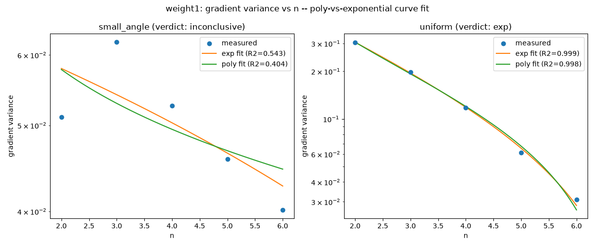
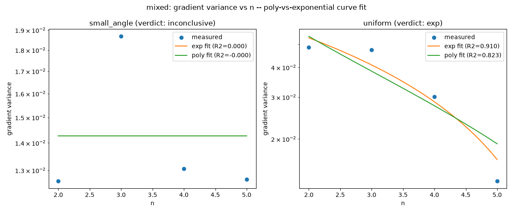

# Trainability / barren-plateau study (Phase 17)

The phase's canonical reference document: methodology, generator scope,
init/normalization convention, curve-fit results, honest max-n statement,
and the cross-reference against `docs/iqp-baseline.md`'s qubit-side
empirical plateau rule. Phase 20 (Technical Write-Up) draws on this
document rather than re-deriving any of it.

## Methodology

Gradients are computed by **exact parameter-shift** (`shift = pi/4`, no
division) directly on `photonic_iqp_distribution` /
`photonic_weight2_iqp_distribution` (`iqp_photonic_encoding.py`) — **not**
MerLin `QuantumLayer` autograd. `QuantumLayer` categorically rejects this
project's polarization-annotated `BasicState`s
(`ValueError: BasicState with annotations is not supported`, confirmed
live and recorded in `.planning/STATE.md`'s Accumulated Context), so
autograd through it is structurally unavailable for this circuit family —
this is not a style preference, it's the only mechanism that works here.
`trainability/param_shift.py` implements the shift; `trainability/rng.py`
provides deterministic, reorder-safe RNG substreams so adding an n-value or
init scheme never reshuffles another cell's random draws.

The loss whose gradient is measured is **MMD² between the circuit's output
distribution and v1.0's K=2^n-generalized target distribution**
(`trainability/target_grid.py`, Plan 17-03) — a fresh `2^n`-bin grid built
at every sweep point, cross-validated bit-faithfully against v1.0's
original `compute_p_real` at its own K=462 shape. MMD² is computed via the
**exact closed form** (`trainability/mmd_exact.py`, a numpy port of
`generator/mmd.py`'s quadratic form `pᵀKp + qᵀKq − 2pᵀKq`), with no Monte
Carlo sampling anywhere in this pipeline. A Monte-Carlo fallback was
deliberately **not implemented**: exact enumeration is tractable across
this project's entire reachable n range (the photonic-simulation cost
itself, not the `2^n`-sized kernel matrix, is what bounds how far n can go
— see the Honest max-n statement below), so a fallback path would have
been unused code.

## Parameter-initialization and normalization (TRAIN-03)

Two initialization regimes were swept, matching the split
`docs/iqp-baseline.md`'s empirical rule is conditioned on:

- **`small_angle`**: `theta ~ Uniform(-0.1, 0.1)` per parameter.
- **`uniform`**: `theta ~ Uniform(0, 2*pi)` per parameter.

**Normalization convention:** this circuit's gates (phase shifters, `WP`,
beamsplitters) are all passive/unitary — total photon number is conserved
by construction, with no separate energy-normalization parameter anywhere
in the pipeline. `theta` is a bare phase-gate angle in radians, used
directly as the `WP(theta, 0) = exp(i*theta*Z)` generator's argument; there
is no rescaling, clipping, or per-circuit energy budget applied to it.

## Generator scope (TRAIN-04)

Two generator scopes were swept:

- **`weight1`**: one weight-1 `WP(theta_k, 0)` phase gate per qubit, `k = 0..n-1`.
- **`mixed`**: the same `n` weight-1 gates, plus **one fixed weight-2
  `Z_i * Z_j` pair at `(i, j) = (0, 1)`**, composed via
  `photonic_weight2_iqp_distribution` — Phase 13's validated
  weight-1+weight-2 composability path.

**Why this split, and why exactly this mix:** `photonic_weight2_iqp_distribution`
is the *only* already-shipped, already-validated multi-generator
composition this project has (Phase 13, `test_wt2_composability_mixed_generators_n3`
and related tests). Rather than inventing a new circuit topology or mix
ratio for this study, Phase 17 reuses that exact composition as-is — one
weight-2 pair added to the full weight-1 layer, at the lowest-index pair
`(0,1)` so the same circuit shape generalizes unchanged across every swept
`n >= 2`.

## Results





| generator_scope | init_scheme | n range | winning model | exp R² | exp AIC | poly R² | poly AIC |
|---|---|---|---|---|---|---|---|
| weight1 | small_angle | 2–6 (5 pts) | inconclusive | 0.543 | -47.11 | 0.405 | -45.79 |
| weight1 | uniform | 2–6 (5 pts) | exp | 0.999 | -53.43 | 0.998 | -48.53 |
| mixed | small_angle | 2–5 (4 pts) | inconclusive | 0.000 | -41.76 | -0.000 | -41.76 |
| mixed | uniform | 2–5 (4 pts) | exp | 0.910 | -37.56 | 0.823 | -34.85 |

Full per-cell numbers (including fitted parameters) are in
`results/phase17_curve_fit_summary.csv`.

**A fit-quality caveat, reported honestly rather than smoothed over:** two
of the "exp"-winning fits (`weight1/uniform`'s R²=0.999 fit and, more
severely, `mixed/uniform`'s R²=0.910 fit) show a large-magnitude,
near-cancelling `a`/`c` pair (e.g. `mixed/uniform`: `a=153.6, c=-153.5`) —
`scipy.optimize.curve_fit` reported `Covariance of the parameters could not
be estimated` for at least one cell during this run, a symptom of a
poorly-identified (not just poorly-fit) parameterization at only 4-5 data
points. The AIC-based verdict still holds (delta-AIC exceeds the
2.0 threshold in both "exp"-winning cells), but the specific fitted decay
rate `b` in these near-degenerate cases should be read as "an exponential
shape fits the data better than a power law," not as a precisely
determined decay constant.

## Honest max-n statement (TRAIN-05, TRAIN-08)

**Actual n range reached, CORE data (complete and final):**
- `weight1`: n = 2..6, both init schemes, 100 draws/cell.
- `mixed`: n = 2..5, both init schemes, 100 draws/cell.

**Relative to `docs/iqp-baseline.md`'s n≥6 qubit-baseline threshold:**
reached for `weight1` (n_max=6 satisfies n≥6 exactly at the boundary), **not
reached** for `mixed` (n_max=5, one short of the threshold — mixed's
per-call cost, driven by the weight-2 heralded-CZ/CP(alpha) postselection
overhead, made n=6 substantially more expensive than n=6 weight-1; see
`17-RESEARCH.md`'s measured per-n costs).

**Relative to the N=20-24 literature fit-flip threshold (arXiv:2605.11879,
the N=2-10-vs-N=24 poly-vs-exp fit flip this project's own pitfalls
research flagged): not reached, for either generator scope.** This is a
compute-cost fact, not a scheduling shortfall: this repo's photonic
Fock-space output enumerates every photon-number-conserving Fock state
across `2n` (or `2n+2`) modes — a space of size `C(3n-1,n)` (weight-1) or
`C(3n+3,n+2)` (weight-2) — not `2^n`. Stirling's approximation puts
`C(3n-1,n) ~ (27/4)^n/sqrt(n) ~ 6.75^n`, a materially faster-growing
function of `n` than the qubit-side literature's `2^n`. `17-RESEARCH.md`'s
directly-measured single-call costs in this repo's own venv confirm the
growth is real, not a theoretical worst case: weight-1 goes from 0.033s at
n=2 to 247s at n=8 (single distribution call); weight-2 from 0.041s at n=2
to 71s at n=6. At the ≥100-draws x ~3-tracked-params x 2-shifts-per-param
cost structure this sweep uses, n=7 weight-1 was estimated at ~5 hours and
n=8 weight-1 at ~3 days of compute for a single init scheme — well past
what fits inside this phase's timeline without becoming the open-ended
compute struggle this project's `CLAUDE.md` explicitly warns against
(the PennyLane-stall pattern).

**Stretch attempt status, final outcome:** a background job targeting n=7
(weight-1) and n=6 (mixed) was launched during Plan 17-06 with no
time-box, per this phase's locked no-time-box decision. Weight-1 n=7
failed 4/4 consecutive chunked attempts with an identical `MemoryError` on
the very first circuit evaluation of each attempt — including when
isolated in a completely fresh process with ~14GB free RAM immediately
beforehand — indicating a genuine single-call memory ceiling on this
hardware at n=7 weight-1, not a fixable cross-call leak (contrast the
mixed n=5 CORE cell earlier in this phase, where chunking *did* resolve a
real cross-call leak). The owner manually stopped the job rather than let
it continue failing. No stretch CSVs were produced; the n=2..6 (weight1) /
n=2..5 (mixed) CORE range above is the actual measured range this
document's verdict is based on. This gap between the reached range (n<=6)
and the literature's N=20-24 fit-flip threshold is real and is reported
here plainly, not reframed as "future work." (A subsequent, independent
dual-rail/MerLin cross-check *did* reach n=7-8 without hitting this same
ceiling — see the new section below — but that used a different physical
circuit and computational method, not a fix to this pipeline.)

## Cross-reference verdict (TRAIN-07)

`docs/iqp-baseline.md`'s empirical rule, applied directly to this project's
own measured n range (its `not complete_graph_like` escape-hatch clause is
a qubit-side structural notion this project's weight-1/mixed photonic
circuits have no established mapping onto — treated as inapplicable here,
not silently assumed to hold, since this project's circuits were never
constructed with "complete-graph-like" as a design axis one way or the
other):

```
plateau if init_scheme == small_angle
or plateau if init_scheme == uniform and max(n) >= 6
```

| generator_scope | init_scheme | baseline rule predicts | measured fit verdict | agreement |
|---|---|---|---|---|
| weight1 | small_angle | plateau | inconclusive (weak fit both ways, R²≈0.4-0.5) | inconclusive |
| weight1 | uniform | plateau (n_max=6 >= 6) | plateau (exp wins, R²=0.999, decaying) | **agree** |
| mixed | small_angle | plateau | inconclusive (both R²≈0, no discernible trend) | inconclusive |
| mixed | uniform | no_plateau (n_max=5 < 6) | plateau (exp wins, R²=0.910, decaying) | **disagree** |

> Owner interpretation: [pending]

## Independent cross-check: dual-rail encoding + MerLin native autograd

**Scope note, stated up front:** everything in this section is supplementary
work done *after* Phase 17 was already complete and verified (8/8
must-haves, `.planning/phases/17-trainability-barren-plateau-study/17-VERIFICATION.md`).
It is not tracked as a phase requirement in `ROADMAP.md`/`REQUIREMENTS.md`
and does not change Phase 17's own verdict above — it is an independent
second measurement of the same underlying question, using a different
circuit and a different computational method, kept here because it bears
directly on TRAIN-05/TRAIN-08's max-n question.

### Why this is possible at all

The Methodology section above states plainly that MerLin `QuantumLayer`
autograd is unavailable for this project's polarization-annotated circuits.
That remains true. What changed: `dual_rail_merlin_encoding.py` (added
after Phase 17 closed) re-implements the same abstract weight-1/weight-2
IQP generator family in a **polarization-free spatial dual-rail basis** —
`BS()` in place of `HWP(pi/8)`, `PS(theta)` in place of `WP(theta,0)`, no
`PBS()` needed since the circuit is already dual rail throughout. MerLin's
restriction is specifically on polarization annotations, not on dual rail
itself, so `QuantumLayer` accepts this circuit with no issue. This is a
**different physical encoding of the same abstract circuit**, not a fix or
optimization of the polarization pipeline above — the two are independent
measurements, not before/after versions of one pipeline.

`trainability/dual_rail_autograd_sweep.py` computes the same MMD² loss
against the same per-n target grid (`trainability/target_grid.py`, reused
unmodified), but keeps the entire computation — MerLin's raw output, the
bin-mapping to the target grid, the MMD² quadratic form — in torch tensors
throughout, so `.backward()` yields exact gradients for **all** n circuit
parameters from one forward+backward pass. This is structurally different
from parameter-shift's 2-evaluations-per-tracked-parameter cost, and this
sweep tracks all n parameters (no `max_tracked_params` cap), since
autograd's cost doesn't scale with how many parameters are tracked.

### Reached n range and why it's larger

| generator_scope | this phase's CORE range (parameter-shift) | dual-rail/autograd range |
|---|---|---|
| weight1 | n = 2..6 | n = 2..8 |
| mixed | n = 2..5 | n = 2..7 |

Two sizes further in each case, reached without hitting the `MemoryError`
ceiling described above. Two compounding, distinct reasons, not one:

1. **Fewer circuit evaluations per draw** (inherent to the method, not an
   implementation detail): parameter-shift needs 2 Perceval evaluations
   *per tracked parameter* — at n=8 tracking all 8 params, 16 evaluations
   per draw. Reverse-mode autograd gets every parameter's gradient from one
   forward + one backward pass, regardless of parameter count.
2. **Cheaper per-evaluation cost, via reuse** (partly a fixable gap in how
   the polarization pipeline above is written, partly inherent to
   supporting autograd at all): `run_full_circuit`/`photonic_iqp_distribution`
   bake theta in as a concrete float and rebuild a fresh `pcvl.Processor` +
   `Analyzer` from scratch on every single call. MerLin's `QuantumLayer`
   builds its differentiable computation graph once per circuit topology
   and reuses it across draws — only parameter *values* change between
   calls. Measured directly: at n=8, `QuantumLayer` construction takes
   ~40s (one-time), then each subsequent forward+backward pass on that
   same layer takes ~0.2s — cheaper than a *single* `Analyzer` call was at
   the smaller n=6 in this phase's own CORE sweep (~1.57s, backed out from
   that sweep's logged per-cell timings: ~950s / 600 calls).

Net effect on wall-clock time: the full dual-rail sweep (weight1 n=2..8 +
mixed n=2..7, both init schemes, 100 draws/cell, all n parameters tracked)
completed in **~10.5 minutes** of actual compute, run overnight locally to
avoid competing with the owner's other active work for RAM.

### Results

| generator_scope | init_scheme | n range | winning model | exp R² | exp AIC | poly R² | poly AIC |
|---|---|---|---|---|---|---|---|
| weight1 | small_angle | 2–8 (7 pts) | **exp** | 0.838 | -110.17 | 0.714 | -106.20 |
| weight1 | uniform | 2–8 (7 pts) | **exp** | 0.983 | -74.59 | 0.973 | -71.33 |
| mixed | small_angle | 2–7 (6 pts) | inconclusive | 0.570 | -70.64 | 0.570 | -70.64 |
| mixed | uniform | 2–7 (6 pts) | inconclusive | 0.840 | -69.16 | 0.814 | -68.26 |

Full numbers: `results/phase17_dual_rail_curve_fit_summary.csv`.

**Comparison against this phase's own CORE verdict, stated plainly —
agreements and disagreements both:**

| generator_scope | init_scheme | CORE verdict (n<=6, polarization) | dual-rail verdict (n<=7/8) | agreement |
|---|---|---|---|---|
| weight1 | small_angle | inconclusive | **exp** (R²=0.838) | extends — more data points (7 vs 5) resolve what was inconclusive at n<=6 |
| weight1 | uniform | exp (R²=0.999) | exp (R²=0.983) | **agree** |
| mixed | small_angle | inconclusive | inconclusive | **agree** |
| mixed | uniform | exp (R²=0.910) | **inconclusive** (R²=0.840, AIC margin < 2) | **disagree** |

The `mixed/uniform` disagreement is reported exactly as found, not
resolved or explained away here — it could reflect the extra 2 data points
changing the fit, a real difference between the two physical encodings, or
both. Distinguishing between those requires the owner's own analysis, not
an assertion in this document.

> Owner interpretation: [pending]

**What this cross-check does/doesn't establish, beyond the section below's
general caveats:** agreement between two *different physical circuits*
answering the same abstract question is stronger evidence than either
alone, but the two encodings are not guaranteed to have identical
trainability behavior even if they realize "the same" IQP generator
family — dual rail and polarization differ in gate composition, ancilla
structure (weight-2), and every other implementation detail below the
abstract operator level. A disagreement (as seen in `mixed/uniform`) is
therefore genuinely ambiguous between "thin-data artifact" and "encoding
matters," and this document does not resolve which.

## What this does/doesn't establish

This is an empirical measurement at this project's own small, compute-bound
n range (n<=6), not a proof of any asymptotic trainability property. A
measured exponential-decay signature at n=2..6 does not, by itself,
establish that this photonic realization inherits the qubit-side rule's
behavior at hardware-relevant scale (n in the tens to hundreds) — the same
caution `docs/iqp-baseline.md` itself raises about average-case barren-plateau
statements applies here too. Nor does the one measured disagreement
(`mixed/uniform`) establish that the qubit-side rule fails to transfer to
photonic encodings in general — it establishes that, at this specific small
n range, with this specific mixed weight-1+weight-2 circuit and this
specific target distribution, the rule's prediction and the measured
gradient-variance trend disagreed. Extending this measurement toward the
literature's N=20-24 range, or testing other circuit topologies/target
distributions, would be required before drawing any stronger conclusion.
